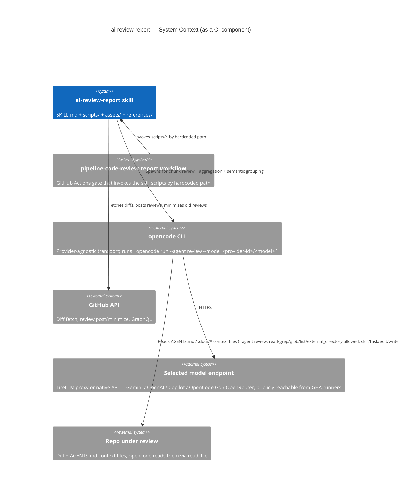

# ai-review-report — Editor's Context

## TL;DR

`ai-review-report` is the **generator** half of the PR code-review skill pair (paired with `/ai-review`, the consumer). It runs as a GitHub Actions gate (`.github/workflows/pipeline-code-review-report.yml`), reviews PRs in chunks via the `opencode` CLI transport, and posts a structured review. SKILL.md is the runtime contract the review model follows; this file is the edit-time companion — LADR history, env-var provenance, confirmed-FP PR references, and the skill layout the gate resolves via `$REVIEW_SKILL_DIR`.

## Non-Negotiables

- **Workflow ↔ script paths are coupled.** Every script invocation in the gate goes through `$REVIEW_SKILL_DIR` (LADR-037), which resolves to the literal `.agents/skills/ai-review-report` when the skill is in the checkout, else to the `.smooth-ai-review-tools/` side checkout. Moving or renaming a script, the skill folder, or the workflow file (`pipeline-code-review-report.yml`) silently breaks the gate in all modes. Change the workflow YAML and the scripts in the same commit.
- **Skill frontmatter is required for skill activation.** `SKILL.md`'s YAML frontmatter (`name` + `description`, plus repo-standard invocation metadata such as `switches`) is what Claude Code / Codex / Copilot read to decide *when* and *how* to load the skill. Don't strip the frontmatter to "clean up markdown"; the `description` field is the activation trigger and `switches` documents supported entrypoints.
- **Agent Skills format is the same across all three loaders.** The skill is a directory containing `SKILL.md` (frontmatter + body) and optional `assets/`, `references/`, `scripts/` subfolders — per [agentskills.io](https://agentskills.io). Keep runtime behavior in the body/scripts rather than loader-specific frontmatter; what differs is *where* the skill folder lives, not how it's authored.
- **History of decisions lives in references/CHANGELOG.md**, not here. This file is the **narrative** of why current behaviour looks the way it does (LADRs, FP PR refs, supersede chains); references/CHANGELOG.md is the **dated audit trail** of every commit. Don't duplicate it.
- **`AGENTS.md` per-skill is a Claude Code / Codex / Copilot project-doc convention**, not an Agent Skills field. The Agent Skills spec does not define an `AGENTS.md` file inside a skill — the convention this repo adopts is that a sibling `AGENTS.md` is loaded by Claude Code's `AGENTS.md` discovery, by Codex's `AGENTS.md` discovery, and by Copilot's `.github/instructions/*.instructions.md` discovery. Keep that in mind if the Agent Skills spec ever diverges.

## System Context

`ai-review-report` is a CI gate that, when triggered, fetches the PR diff, splits it into chunks, dispatches each chunk to the selected provider's model through the `opencode` CLI transport, then aggregates the per-chunk reviews into a single posted PR review. The model is selected by `OPENCODE_REVIEW_REPORT_PROVIDER` (`GEMINI` / `COPILOT` / `OPENAI` / `OPENCODE-GO-OPENAI` / `OPENCODE-GO-ANTHROPIC` / `OPEN_ROUTER`). The scripts under `scripts/` are the only entry points the workflow calls; the `assets/` folder holds runtime config the scripts install; the `references/` folder holds edit-time docs (this file, CHANGELOG.md, and the quality standards).

## Skill Layout

The skill folder is **referenced by hardcoded path** from the workflow and the scripts themselves. Don't reorganize it without a paired workflow change.

| Path | Type | Loaded by | Purpose |
|------|------|-----------|---------|
| `SKILL.md` | runtime | Claude Code / Codex / Copilot skill loader (frontmatter `description`); also read by the reviewer model via opencode's read tools | The runtime contract — frontmatter, what the model must do, current Decision + Consequences of every accepted LADR, Key Behaviors, decision matrix. |
| `AGENTS.md` (this file) | edit-time | Claude Code / Codex / Copilot project-doc loader | The editor's companion — LADR history with full Context, env-var provenance, confirmed-FP PR refs, supersede chains, skill layout, what the model doesn't need to read every review. |
| `assets/opencode.json` | runtime | `lib/setup-opencode-config.sh` installs into `~/.config/opencode/opencode.json` (global scope, precedence 2) at job start; `setup-opencode-config.sh`'s `is_ours` predicate keys on the managed shape and self-heals drifted personal installs | Provider config — `gemini`, `github-copilot`, `openai`, `go-openai`, `go-anthropic`, `openrouter`; locked-down `review` agent (LADR-029); `permission.external_directory: allow` (LADR-025). |
| `assets/review-config.json` | runtime | `scripts/filter-excluded-files.sh` | File-exclusion patterns (lock files, generated code like `*.Designer.cs`). |
| `scripts/` | runtime | The workflow invokes these by hardcoded path | Shell: `review-in-chunks.sh`, `aggregate-reviews.sh`, `find-context-files.sh`, `filter-excluded-files.sh`, `minimize-previous-reviews.sh`, `local-review.sh`, `validate-agents-md.sh`, `test-minimize-reviews.sh`, `test-review-chunk-threshold.sh`, `test-chunk-prompt-budget.sh`, plus `eval/` (LADR-033) and `lib/` helpers (`resolve-provider.sh`, `setup-opencode-config.sh`, `opencode-with-fallback.sh`, `opencode-health.sh`). |
| `references/CHANGELOG.md` | edit-time | Coder reading history | **Dated audit trail** of every commit to the skill. Load when updating the skill or auditing past decisions; not needed for routine execution. Contains the imported history pre-2026-06-01 (legacy names like `.ai/`, `gemini-code-review`, `manual-gemini-cli-code-review.yml` — these do not exist in this repo, preserved as record). |
| `references/knowledge-conventional-contexts-quality.instructions.md` | edit-time | Coder authoring or updating `*_AGENTS.md` files | The repo-wide AGENTS.md quality standards the review/validation prompts apply. |

## Environment Variables — Provenance

The full env-var table the model must follow is in SKILL.md. **What lives here is the provenance and the *why* of the renaming rules** — the per-Variable rules that govern how to add a new provider or change a key.

**Variables vs Secrets — the iron rule.** Gateway **API keys** are credentials → GitHub **Secrets** (never Variables — Variables are plaintext and printable in logs). Gateway **URLs**, the `OPENCODE_REVIEW_REPORT_PROVIDER` selector, the `OPENCODE_REVIEW_REPORT_MODEL_*` ids, the `OPENCODE_REVIEW_REPORT_HEALTH_TIMEOUT`, `OPENCODE_REVIEW_REPORT_MAX_FILE_COUNT`, and `OPENCODE_REVIEW_REPORT_DISABLE_AGENTS_MD_CHECK` are non-sensitive config → **Variables**, so they can be retuned without editing the workflow. The exceptions that prove the rule: **OpenCode Go's fixed public base `https://opencode.ai/zen/go/v1`** (LADR-027), **OpenRouter's fixed public base `https://openrouter.ai/api/v1`** (LADR-039), and **Anthropic's fixed public base `https://api.anthropic.com`** (LADR-040) are hardcoded in `opencode.json` — all three are single SaaS endpoints with no per-deployment URL to retune, so there is no `OPENCODE_GO_*_URL`, `OPENCODE_REVIEW_REPORT_OPENROUTER_URL`, or `OPENCODE_REVIEW_REPORT_ANTHROPIC_URL` Variable. The API-key Secrets (`OPENCODE_GO_OPENAI_API_KEY`, `OPENCODE_GO_ANTHROPIC_API_KEY`, `OPENCODE_OPENROUTER_API_KEY`, `OPENCODE_ANTHROPIC_API_KEY`) remain env-injected. Each env-driven provider's gateway URL is **consumed at install time**: `lib/setup-opencode-config.sh` injects `OPENCODE_REVIEW_REPORT_
_URL` (when set) as that provider's `options.baseURL` in the installed `opencode.json` (LADR-034) — the committed config carries no `baseURL`, and an unset URL leaves the provider on its native SDK base. (The generic derived `OPENCODE_REVIEW_REPORT_GATEWAY_URL` below is a separate copy used only for the credential presence check.)

**Renaming rule — the LADR-032 `OPENCODE_*` → `OPENCODE_REVIEW_REPORT_*` rename.** A non-key config var uses the `OPENCODE_REVIEW_REPORT_` prefix. API-key Secrets keep their `OPENCODE_<PROVIDER>_API_KEY` names — they're provider credentials, not review-report config. When adding a new non-key Variable, the prefix is mandatory; when the repo's GitHub Variables aren't renamed to match, the gate reads them empty and falls back to defaults (Secrets are unaffected). Historical changelog/LADR mentions of old/removed var names are left intact as record.

**Derived Variables.** Two Variables are **derived at runtime** by `lib/resolve-provider.sh` and not user-set: `OPENCODE_REVIEW_REPORT_PROVIDER_ID` (the opencode.json provider key prefixed onto the model — `gemini` / `github-copilot` / `openai` / `go-openai` / `go-anthropic` / `openrouter`) and `OPENCODE_REVIEW_REPORT_GATEWAY_URL` / `OPENCODE_GATEWAY_API_KEY` (the selected provider's creds copied to generic names for the credential presence check — note the API-key Secret name does **not** take the `OPENCODE_REVIEW_REPORT_` prefix because it stays a Secret). The provider-agnostic health check is against opencode's `/global/health` (LADR-028), not per-provider gateway probes — so `OPENCODE_GATEWAY_HEALTH_URL`, `OPENCODE_GATEWAY_AUTH_STYLE`, and `OPENCODE_API_HEALTH_OVERRIDE` were removed.

**`OPENCODE_REVIEW_REPORT_DISABLE_CLAUDE_CODE` and `OPENCODE_DISABLE_CLAUDE_CODE`.** The first is a GitHub Variable; the second is derived from it. They disable all `.claude` support in opencode to prevent conflicts with Claude Code's `.claude` directory features. Default `1` (disabled). Set `OPENCODE_REVIEW_REPORT_DISABLE_CLAUDE_CODE=0` to re-enable `.claude` support.

**`workflow_dispatch` overrides.** The `model_preset` `choice` input and the free-text `model` input both live in the workflow `env:` block. `model_preset` is the **first `||` term** in each expression so it wins over the free-text `model` input and the `OPENCODE_REVIEW_REPORT_*` Variables. Adding/renaming a `model_preset` option requires editing both the `options:` list and the five `env:` expressions (PROVIDER, PROVIDER_ID, three model tiers) in the same commit — they are coupled by the literal option strings — plus the duplicated `model_preset` dropdown in `.docs/examples/code-review-caller.yml` (reusable-workflow callers own their own `choice` list). The dropdown currently has nine non-default options (GPT-5.5, four OpenCode Go, four OpenRouter).

**Local runs.** Bare skill-level `--local` is fully specified: run `scripts/local-review.sh` with no extra arguments, reviewing HEAD/current branch against `main`, not posting, using `OPENCODE_REVIEW_REPORT_PROVIDER` if set and otherwise `GEMINI`, and using script model defaults unless explicit overrides are supplied. Do not ask for a PR, provider, post mode, or base unless the user asks for a non-default. `local-review.sh` accepts `--provider` / `OPENCODE_REVIEW_REPORT_PROVIDER`, harvests every provider's credentials from the shell rc files (URL + key for Gemini/Copilot/OpenAI; API key only for the two OpenCode Go surfaces, whose base URL is hardcoded), sources `lib/resolve-provider.sh` to pick + validate the selected pair, and runs the provider-agnostic opencode health check. GHA Variables are CI-only; locally the primary review model is the `--model` arg and the secondary/orchestrator fall back to script defaults (which must be overridden for non-GEMINI providers).

## Architecture Decisions (LADRs)

The LADRs are the **decisions an AI coder would plausibly re-litigate if they didn't read them**. Full Date/Status/Context/Decision/Consequences for each; what survives in SKILL.md is the *Decision + Consequences* in compressed form, with the *Context* stripped because the model doesn't need it at runtime. LADR numbering is append-only — superseded entries (LADR-008, 014, 017, 018) and partially-superseded entries (LADR-023, 024) stay in this file with their full Date/Status/Context/Decision/Consequences/Supersede-by chain. Don't renumber.

### LADR-001: Chunked Review Processing

- **Date**: 2025-10-28
- **Status**: Accepted
- **Context**: Large PRs caused JavaScript heap exhaustion and EventEmitter memory leaks in Gemini CLI.
- **Decision**: Split diffs into chunks (<100KB each) grouped by directory, each as a separate Gemini API call, with final aggregation.
- **Consequences**: Memory-efficient and scalable; multiple API calls increase cost; needs cross-chunk holistic analysis (now runs for every PR per LADR-030).
- **See also**: LADR-010 (adaptive split on large dirs), LADR-011 (semantic grouping for 15+ files), LADR-030 (holistic aggregation now unconditional).

### LADR-002: Two-Tier Review Model Chain

- **Date**: 2025-12-19 (Updated: 2026-05-29)
- **Status**: Accepted
- **Context**: Gemini models may be unavailable due to quota exhaustion, rate limits, or regional issues. Deep chunk review needs a capable model; cheap orchestration (grouping/summary) is split out to its own model (LADR-022).
- **Decision**: Deep chunk-review chain is two-tier: `OPENCODE_REVIEW_REPORT_MODEL_PRIMARY` (default `gemini-3.1-pro-preview`) → `OPENCODE_REVIEW_REPORT_MODEL_SECONDARY` (default `gemini-2.5-pro`). No third tier — the old `auto`/Flash last-resort reviewer was removed; a degraded Flash review is worse than an honest "models down". If BOTH review models fail the startup probe, soft-fail per LADR-021. Models come from GitHub **Variables** (literal defaults); `workflow_dispatch` input overrides the primary. The startup probe tests only these two review models (the orchestrator is not probed — LADR-022). Error detection includes quota/rate-limit patterns.
- **Consequences**: High reliability for the substantive review; slightly longer startup due to model testing. Independent of the orchestrator tier, which can be retuned without touching the review chain.

### LADR-003: Context-Aware Review with On-Demand File Access

- **Date**: 2025-11-15
- **Status**: Accepted
- **Context**: Including full `*AGENTS.md` contents in prompts caused size bloat and false positives (Gemini flagged issues without seeing full context).
- **Decision**: Use `--yolo` flag (legacy: gemini-cli) → now realized as the `review` agent's read/grep/glob/list/external_directory allow-list (LADR-025/029). Pass file paths only, instruct Gemini to READ files before flagging Critical/High issues.
- **Consequences**: No prompt size increase; reduced false positives; slightly slower when many files need verification.

### LADR-004: Incremental Reviews Must Never Approve

- **Date**: 2025-11-20
- **Status**: Accepted
- **Context**: Bug where incremental reviews approved PRs, bypassing blocking states from full reviews (PR #3946 — the original confirmed-FP incident).
- **Decision**: Incremental reviews MUST always use `--comment`, never `--approve`. Only full reviews can approve.
- **Consequences**: Prevents bypassing unresolved Critical/High issues; requires manual approval when incremental finds no new issues.
- **Confirmed false positive if violated**: PR #3946.

### LADR-005: Two-Part Aggregation Output

- **Date**: 2025-11-28
- **Status**: Accepted
- **Context**: Single aggregation mixed executive summary with detailed analysis, creating visual clutter.
- **Decision**: Split using `DETAILED_SECTION_MARKER` delimiter. Part 1 = executive summary (always visible). Part 2 = holistic cross-chunk analysis (collapsible with chunk details).
- **Consequences**: Clean overview for decision-makers; requires the model to follow the two-part format.

### LADR-006: Test File Pairing with Implementation Files

- **Date**: 2025-12-05
- **Status**: Accepted
- **Context**: Tests and implementation reviewed in separate chunks, making coverage verification difficult.
- **Decision**: Map test files to implementation files (`.NET: *Test.cs→*.cs`, `Frontend: *.spec.ts→*.ts`) and group them in the same chunk.
- **Consequences**: Tests reviewed alongside code they validate; slightly larger chunks.

### LADR-007: Markdown-Based Separator Instead of JSON

- **Date**: 2025-12-01
- **Status**: Accepted
- **Context**: JSON output from the model frequently had schema violations (unescaped quotes, trailing commas).
- **Decision**: Use markdown with `DETAILED_SECTION_MARKER` delimiter, parsed with `sed`/`grep`.
- **Consequences**: Reliable parsing; less structured than JSON but works well for LLM outputs.

### LADR-008: Unified Concurrency Group (Superseded)

- **Date**: 2026-01-02
- **Status**: **Superseded by LADR-009**.
- **Context**: Race condition where manual and automated reviews ran concurrently on the same commit.
- **Decision**: All events use the same concurrency group.
- **Why superseded**: Caused `/ai-review` comments to cancel in-progress automated reviews.

### LADR-009: Selective Concurrency

- **Date**: 2026-01-02
- **Status**: Accepted
- **Context**: LADR-008 caused reviews to be cancelled mid-execution.
- **Decision**: Only `pull_request` events share concurrency group `ai-review-{pr_number}`. Other events (`issue_comment`, `workflow_dispatch`) use unique `{run_id}-{run_attempt}` per run. `pull_request_target` trigger was removed (caused duplicate runs on PR creation).
- **Consequences**: Automated reviews always complete; manual triggers run independently; rapid commits still cancel each other.

### LADR-010: Adaptive Chunk Splitting by Directory Depth

- **Date**: 2026-02-17
- **Status**: Accepted
- **Context**: Large directories (e.g., ProsmarBunkering.Web with 13 files, ~130KB diff) exceeded Gemini API limits. `MAX_CHUNK_SIZE` was declared but never enforced.
- **Decision**: After initial grouping, calculate cumulative diff size per group. If exceeding 100KB, re-group by next directory level, up to 5 iterations. Single-file groups kept as-is.
- **Consequences**: Prevents API failures on large groups; uses natural directory structure; adds minor `git diff | wc -c` overhead.

### LADR-011: Semantic Business Context Grouping via LLM

- **Date**: 2026-02-17 (Threshold raised 2026-05-28)
- **Status**: Accepted
- **Context**: Directory-based chunking splits cross-cutting features into isolated chunks (e.g., IMOS change across 3 directories reviewed separately). Threshold was raised from 8 → 15 on 2026-05-28 after PR #5326 (10 files) over-split into 6 chunks with tiny per-chunk output, hitting GitHub's 65KB review-body limit.
- **Decision**: LLM pre-processing groups files by business context for PRs with 15+ files. 60-second timeout, strict validation (every file exactly once), falls back to directory grouping on failure. Includes "logic moved" detection: when code is removed from one file and similar code added in another, both are grouped together.
- **Consequences**: Cross-cutting features reviewed together for medium-to-large PRs; small PRs (<15 files) skip the extra semantic-grouping API call (~10-30s saved) and use cheaper directory grouping. Non-deterministic grouping above the threshold; LADR-010 applies as safety net.
- **Confirmed false positive if threshold is too low**: PR #5326 (10 files, 6 tiny chunks).

### LADR-012: Confidence Tagging and Verification-Incomplete Suppression

- **Date**: 2026-03-10
- **Status**: Accepted
- **Context**: The model frequently flagged test coverage or implementation concerns for files it never received in its chunk, producing false positives. Downstream tooling (`/ai-review:analyse`) had no way to distinguish verified findings from speculative ones.
- **Decision**: (1) Chunk prompts instruct the model to suppress findings for files not in the chunk at Critical/High/Medium — only Low (informational) allowed. (2) Every finding must be tagged `[VERIFIED]` (code seen in diff or via `read_file`) or `[SPECULATIVE]` (inferred from partial context). (3) Aggregation prompt preserves tags and prevents elevating speculative findings.
- **Consequences**: Reduces false positives from partial-context inference; enables downstream auto-downgrading of speculative findings; adds ~2 tokens per finding for the tag.
- **Grammar reference** (used by the eval harness, LADR-033): only `[VERIFIED]` Critical/High/Medium count; `[SPECULATIVE]` and "None found" never count.

### LADR-013: Migration/Schema Chunk Detection

- **Date**: 2026-03-11
- **Status**: Accepted
- **Context**: EF Core migration files and raw SQL scripts have fundamentally different review concerns than application code (reversibility, existing data handling, nullable column safety, index locking) — but previously received the standard code review prompt, causing the model to focus on correctness and security instead of migration-specific risks.
- **Decision**: Detect chunks containing `*.sql`, `*_Migration.cs`, or `*/Migrations/*.cs` files and route them to a migration-focused prompt. Migration detection takes priority over doc-only detection in the three-way branch.
- **Consequences**: Migration PRs get actionable feedback on rollback paths and data safety. Standard code review items (performance, security, test coverage) are intentionally replaced — if a chunk mixes migration and application code, migration review applies.

### LADR-014: RTK Token Optimization for Gemini CLI

- **Date**: 2026-03-24
- **Status**: **Superseded by LADR-023** (RTK Gemini hook is specific to `@google/gemini-cli`; opencode transport is incompatible with it).
- **Context**: Gemini CLI `--yolo` mode reads files via tool calls that return full uncompressed content, consuming tokens on large files. RTK proxies these tool outputs through intelligent filtering and compression.
- **Decision**: Install RTK in CI pipeline and configure the Gemini hook (`rtk init -g --gemini --auto-patch --hook-only`). RTK intercepts Gemini's `read_file` and shell tool calls, compressing outputs before they reach the model context.
- **Consequences** (at the time): 60-90% token reduction on tool outputs; adds ~5s install overhead; single Rust binary with zero runtime dependencies; transparent to review scripts.
- **Why superseded**: After the LADR-023 transport migration the workflow no longer invokes `@google/gemini-cli`. RTK's Gemini hook only intercepts that binary's tool I/O — opencode handles its own tool calls outside RTK's interception path. The chunked architecture (LADR-001) already bounds prompt size to <100KB per chunk, which is what RTK's compression was protecting; per-PR token cost is monitored after the migration to confirm spend stays bounded.

### LADR-015: Strengthened Critical/High Verification and Diff Integrity Checks

- **Date**: 2026-03-23
- **Status**: Accepted (extended 2026-06-11 to cover claim-correctness for external platform/framework semantics — see DR-015)
- **Context**: PR #4787 review produced false positives: (1) corrupted/large diff caused the model to flag "review blocked" as Critical, (2) the model flagged a symbol as still present despite it being removed in an earlier commit on the same branch — `read_file` would have shown its absence. Extended after PR #36 review 4473891333: the gate hallucinated 2 Criticals + 1 High about GitHub Actions `workflow_call` semantics (`github.event_name` and `github.event.pull_request.*` are never empty in a reusable workflow — the caller's context is inherited) and a third about regex-escaping dots in `on.push.tags` (GHA filters are globs, not regex). The original LADR-015 only covered *symbol existence*; seeing `github.event.*` in the diff was enough to earn `[VERIFIED]` even when the *claim about the platform* was wrong.
- **Decision**: Two changes: (a) Chunk prompt now requires Critical/High verification to confirm the flagged symbol exists in the **current file state** via `read_file`, not just in the diff hunk. (b) Per-file diff integrity check warns the model when a file's diff exceeds `MAX_CHUNK_SIZE`, instructing it not to raise Critical/High without `read_file` verification. Additionally, `/ai-review:analyse` auto-recommends skip for `[SPECULATIVE]`-tagged findings. Extension (DR-015): the same `[VERIFIED]` discipline is applied to **platform/framework-behavior claims** — if a finding depends on a claim about how GitHub Actions contexts/triggers, npm/registry, git, or SDK contracts behave (not just on the diff code), that claim must itself be verified via `webfetch` of official docs or downgraded to `[SPECULATIVE]`. Seeing the code in the diff does NOT verify the platform claim. Locked in by eval fixture `DR-015-gha-workflow-call-context` (must-not-flag, zero-tolerance at Crit/High/Med).
- **Consequences**: Reduces false positives from stale diff context, large/truncated diffs, and fabricated platform semantics; adds minor per-file size check overhead and one `webfetch` round-trip on the uncommon path where the model wants to flag Critical/High on a platform-behavior basis (the model can always downgrade to `[SPECULATIVE]` at no cost); speculative findings no longer require manual triage.
- **Confirmed false positive if violated**: PR #4787 (symbol-existence class); PR #36 (platform-semantics class).

### LADR-016: Release Branch Sync Review Mode

- **Date**: 2026-04-07
- **Status**: Accepted
- **Context**: Release branch sync PRs (`chore/bnk[uir]-001-sync-*`) aggregate already-reviewed code from multiple PRs. Standard review flagged style, test coverage, and performance on code that was already reviewed — generating noise and wasting reviewer time.
- **Decision**: Detect sync branches by head ref prefix (case-insensitive). Pass `REVIEW_MODE=sync` to chunk and aggregation scripts. Sync mode narrows chunk prompts to merge conflict errors, cross-PR breaking combinations, config drift, and migration ordering conflicts. Aggregation holistic analysis is similarly narrowed. Severity threshold raised: only Critical and High used, everything else is Low (informational).
- **Consequences**: Sync PRs get focused, actionable reviews instead of noise. Trade-off: genuine issues in already-reviewed code won't be caught (acceptable because original PR review should have caught them).

### LADR-017: Single-Chunk Aggregation Short-Circuit

- **Date**: 2026-05-12
- **Status**: **Superseded by LADR-030** (the holistic aggregation now runs for every PR, including single-chunk ones).
- **Context**: For PRs that produce a single chunk, the aggregation step still ran the full "Holistic Cross-Chunk Analysis" call — a Pro-tier model with `--yolo` `read_file` access and a ~430-line prompt template. Observed cost on PR #5179 (1 chunk): chunk review 8 min, aggregation 15 min (total 25 min). With one chunk there is by definition no *cross-chunk* surface to analyse, so the holistic pass is pure overhead and re-derives findings that already exist in the chunk review.
- **Decision**: When `TOTAL_CHUNKS=1`, skip the full holistic-aggregation call. Instead: (1) parse `🔴 [VERIFIED] Critical:` and `🟠 [VERIFIED] High Priority:` lines from the chunk review to determine the decision programmatically; (2) make one small targeted call on the ORCHESTRATOR model (LADR-022) — with a minimal prompt asking for 2-3 sentences describing what the PR changes and why. This fills `## 📋 Overall Summary` with a real narrative instead of a canned message. If the targeted call fails, fall back to the canned message. Placeholder filter uses case-insensitive regex that handles quoted, bolded, and period-terminated "None found" variants. Only `[VERIFIED]` findings can block — `[SPECULATIVE]` cannot promote to a blocking decision (consistent with LADR-012/LADR-015). LADR-004 enforcement preserved: incremental reviews always resolve to `COMMENT`, never `APPROVE`.
- **Consequences** (at the time): Eliminated the ~15-min holistic call for single-chunk PRs while preserving the readable summary.
- **Why superseded**: The cost premise no longer held once LADR-022 moved aggregation onto the cheap orchestrator/Flash model (~30 s, not 15 min on Pro), and skipping the holistic pass left small PRs without the aggregated Overall Summary / Issues Summary / Suggested Fixes high-level report users expected. See LADR-030.
- **Confirmed false positive if reverted**: PR #5179 (cost); PR #10 (3 files → single chunk via `OPENCODE_REVIEW_MIN_FILE_COUNT_BEFORE_CHUNCKING=10` produced placeholders only).

### LADR-018: Flash Model for Aggregation Step

- **Date**: 2026-05-12
- **Status**: **Superseded by LADR-022** (aggregation now uses the explicit `OPENCODE_REVIEW_REPORT_MODEL_ORCHESTRATOR`).
- **Context**: LADR-002 specifies a Pro-tier model for the review job. The same model was used for both chunk reviews (analytical) and the aggregation summary (summarisation). Aggregation is summarising chunk reviews into a PR-level overview and emitting a recommendation — not deep analysis. Pro-tier latency on the aggregation step (~15 min observed) is wasted on a task a Flash model can do in 2-3 min.
- **Decision**: Derive an `AGGREGATION_MODEL_ID` from `OPENCODE_MODEL_ID` inside `aggregate-reviews.sh`: `gemini-3*-pro*` → `gemini-3-flash-preview`, `gemini-2.5-pro*` → `gemini-2.5-flash`, anything else → pass-through. Chunk-review model selection (LADR-002 fallback chain) is unchanged. The `**Model:**` field in the posted review comment continues to show the chunk-review model (Pro), since chunk reviews drive the substantive findings — the Flash aggregation model is an implementation detail.
- **Consequences** (at the time): ~3-5× faster aggregation on multi-chunk PRs. No quality loss because aggregation is structured summarisation, not analysis. If the Flash variant is not available the LADR-002 fallback chain doesn't apply at the aggregation step — failure hits the `❌ Summary generation failed - using fallback` path.
- **Why superseded**: The `auto` derivation was replaced by an explicit, independently-tunable orchestrator Variable; the proxy-router dependency was removed.

### LADR-019: No `read_file` Access at Aggregation Step

- **Date**: 2026-05-12
- **Status**: Accepted
- **Context**: LADR-003 grants `read_file` access to *all* model calls. The aggregation prompt invited the model to `read_file` during the holistic pass to "verify concerns before flagging" and to "upgrade `[SPECULATIVE]` tags to `[VERIFIED]`". In practice this caused duplicate file reads: chunk reviews already performed `read_file` verification for every Critical/High finding (per Key Behavior "Critical/High symbol verification"), so the aggregation re-reads the same files to re-check the same findings. Multiple tool-call round-trips at Pro-tier latency contributed substantially to the 15-min aggregation time.
- **Decision**: Strip `read_file` invitations from the aggregation prompt template. The prompt instructs the model that file-system verification is not its job. Confidence-tag promotion (`[SPECULATIVE]` → `[VERIFIED]`) is removed from the aggregation responsibilities — chunk reviews own it.
- **Consequences**: Fewer agentic round-trips at aggregation. Quality preserved because the *verification* layer is unchanged — chunk reviews still do the file-state checks per LADR-015. Trade-off: if a chunk review missed a verification opportunity, the aggregation can no longer rescue it. Acceptable: missing verification at chunk level is a chunk-review prompt bug to fix at that layer, not papered over downstream.

### LADR-020: Skip Integration / DI / Test-Coverage Sections on Small PRs

- **Date**: 2026-05-12
- **Status**: Accepted
- **Context**: The holistic aggregation prompt unconditionally requested Integration, Dependency Injection Analysis, and Test Coverage Analysis sections for `full` reviews. These are intra-chunk concerns — chunk-review prompts already evaluate them per chunk for the changed files. Asking the aggregation model to re-derive them for 1-2 chunk PRs is duplicate work with low marginal value.
- **Decision**: Gate the Integration / DI / Test Coverage sections of the holistic prompt on `REVIEW_TYPE=full AND TOTAL_CHUNKS > 2`. Combined into a single guarded block (previously two adjacent `if` statements with identical condition).
- **Consequences**: Smaller prompt and faster aggregation on small PRs. For 3+ chunk PRs the sections still run, because cross-chunk integration/DI consistency is a genuine concern when changes span many files. No loss of coverage on 1-2 chunk PRs because the underlying chunk review already evaluated those concerns on the changed files.

### LADR-021: All-Models-Failed Posts Request-Changes Instead of Failing Workflow

- **Date**: 2026-05-25
- **Status**: Accepted
- **Context**: When both review models (primary + secondary per LADR-002) failed during the startup probe — typically due to upstream token quota exhaustion, key/billing problems, or a regional outage — the workflow exited with `exit 1`. The resulting red ❌ gate check blocked merges even though the failure was infrastructure-side, not a code defect. Observed in run 26387093767: every model returned a quota/auth error and the job failed with no review posted.
- **Decision**: On all-models-failed, the model-test step sets `all_models_failed=true` (and `selected_model=none`) and completes successfully. A new step `Post Request Changes - All Gemini Models Failed`, gated on `steps.gemini_model_test.outputs.all_models_failed == 'true'`, posts a `--request-changes` review naming the failed models and pointing to the workflow logs. All downstream side-effect steps (`Validate AGENTS.md`, `Block PR if AGENTS.md Validation Failed`, `Skip Review Due to Blocking Review`, `Review PR in Chunks`, `Aggregate Reviews`, `Minimize Previous Gemini Reviews`, `Post Review Comment`, `Post Error Comment`) are gated with `steps.gemini_model_test.outputs.all_models_failed != 'true'` so they no-op on this path. The job exits green.
- **Consequences**: Quota / API-key incidents surface as a request-changes review (the existing "Failed → request-changes" branch of the decision matrix in Key Behaviors) rather than a red workflow check. Re-running once the upstream issue is resolved (via `/ai-review`) clears the request-changes state through a fresh full review. Trade-off: a green workflow check no longer guarantees a Gemini review ran — reviewers must read the posted review body to see whether substantive findings or an infrastructure failure produced the request-changes verdict.
- **Confirmed run**: 26387093767.

### LADR-022: Explicit Orchestrator Model for Non-Analytical Calls

- **Date**: 2026-05-26 (Updated: 2026-05-29)
- **Status**: Accepted (supersedes LADR-018)
- **Context**: Every PR runs two non-analytical calls — semantic grouping (`review-in-chunks.sh`) and aggregation/summary (`aggregate-reviews.sh`). Both are classification/summarisation, not code analysis, so they belong on a cheap model. The original design used an `auto` logical label derived from the review model via `get_aggregation_model()`, which hid the actual model behind proxy-router behaviour and coupled the cheap tier to the review tier.
- **Decision**: Replace the `auto` derivation with an explicit, independently-tunable `OPENCODE_REVIEW_REPORT_MODEL_ORCHESTRATOR` (default `gemini-3-flash-preview`, a GitHub Variable). All non-chunk-review calls run on it. Its fallback is the **resolved review model** (the chunk chain's winner), so if the orchestrator is down the summary still runs on a known-healthy model. The orchestrator is intentionally **not** probed at startup (its fallback is already proven by the LADR-002 probe). Removed: the `auto` logical name, `resolve_model()`'s `auto`→flash mapping, and `get_aggregation_model()`.
- **Consequences**: Lower per-PR cost without changing review quality (analysis stays on the Pro review chain). The `**Model:**` field shows the resolved review model. Deterministic — no reliance on a proxy router to interpret `auto`. Orchestrator and review tiers tune independently.

### LADR-023: opencode as Transport for Gemini Models

- **Date**: 2026-05-28
- **Status**: Accepted (now partially superseded by LADR-029 — chunk review now passes `--agent review` rather than the default `build` agent)
- **Context**: Google's public-tier Gemini CLI (`@google/gemini-cli`) stops serving Pro/Ultra/free accounts on 2026-06-18. Enterprise Gemini Code Assist licences are exempt; we use the public-tier endpoint behind an internal LiteLLM proxy, so the deadline applies to us. Antigravity CLI (Google's official replacement) is OAuth-only with no `--model` flag in print mode — not viable for headless CI on self-hosted runners. Pi (`@earendil-works/pi-coding-agent`) was viable but smaller ecosystem. opencode (`opencode-ai`, MIT, 166k stars, 900 contributors) was chosen.
- **Decision**: Use `opencode` as the CLI transport. Gemini *models* unchanged — LADR-002 two-tier review chain and LADR-022 (explicit orchestrator) preserved at the call-site level. The provider was originally declared in `assets/opencode.json` with a static `baseURL={env:OPENCODE_REVIEW_REPORT_GEMINI_URL}` placeholder + `apiKey={env:OPENCODE_GEMINI_API_KEY}`; the `litellm-gemini` name was later renamed to `gemini` (BNKI-001 PR #1) and the static `baseURL` placeholders removed. **Current state (LADR-034):** the committed config carries **no** `baseURL` (DR-009); the gateway `baseURL` is injected at install time from `OPENCODE_REVIEW_REPORT_GEMINI_URL` when set, else the native API base is used. Originally passed NO `--agent` flag — that stance was superseded by LADR-029 (custom `review` agent with no pinned `model` field, so `--model` still wins). The `gemini` provider registers four physical model ids (`gemini-3.1-pro-preview`, `gemini-2.5-pro`, `gemini-3-flash-preview`, `gemini-2.5-flash`). The old `auto` logical name and its `resolve_model()` mapping were removed (LADR-022) — every call site now passes an explicit model id.
- **Consequences**: Unblocks the 2026-06-18 EOL deadline. Posted review still surfaces the chunk-review model id in `**Model:**`. The workflow filename is `pipeline-code-review-report.yml` (the comment trigger is `/ai-review`). LADR-015 file-state verification works via the `review` agent's read tool.

### LADR-024: Single Gateway Provider + Local Reachability Preflight

- **Date**: 2026-05-29
- **Status**: **Partially superseded by LADR-026 (single-provider → env-based selection) and LADR-028 (the local gateway reachability preflight is replaced by the opencode-server health check)**. Only the `timeout`-shim part remains in force.
- **Context**: Both CI and local reviews originally ran through the internal LiteLLM gateway (`litellm-gemini` provider) on `OPENCODE_REVIEW_REPORT_GEMINI_URL` + `OPENCODE_GEMINI_API_KEY`. The gateway is on a private network: off-VPN, every `opencode run` hung indefinitely (the macOS `timeout` shim killed only the bash wrapper, orphaning opencode) — a silent multi-minute "deadlock".
- **Decision**: One provider everywhere — `litellm-gemini`. `local-review.sh` (a) harvested `OPENCODE_GEMINI_*` from the shell rc files, and (b) ran an 8s gateway `/health` preflight before any review work, aborting with a "connect to VPN" message if unreachable. The `timeout` shim was rewritten to run each call in its own process group and `kill -KILL` the group on expiry, so genuine hangs are bounded (60s grouping / 300s chunk) and no orphans leak.
- **Consequences** (still in force for the `timeout`-shim half): Local runs need network access to the resolved endpoint. Genuine hangs are bounded; no process orphans.
- **Why partially superseded**: The "one provider everywhere" stance was reversed by LADR-026 — the provider is now env-selectable and the endpoint can be a LiteLLM proxy *or* a provider's native API. The per-provider reachability preflight was itself later removed by LADR-028 in favour of the provider-agnostic opencode-server `/global/health` check (which does **not** pre-empt a private-network/VPN hang — the process-group `timeout` shim still bounds any hang during the actual model calls).

### LADR-025: Allow `external_directory` reads (headless `--yolo` equivalent)

- **Date**: 2026-06-01
- **Status**: Accepted
- **Context**: Chunks intermittently failed with `## ⚠️ Review Failed for Chunk`. The chunk prompt lists context-file paths and instructs the model to `read_file` each; context includes in-repo dot-paths (`.github/*AGENTS.md`, `.docs/nfr/*`, `.agents/rules-scoped/*`). opencode's `read` permission defaults to `allow`, but **`external_directory` defaults to `ask`** — and in non-interactive `opencode run` there is no responder, so opencode **auto-rejects** those reads → the model call errors/empties → the chunk is marked failed → the fail-closed net forces REQUEST_CHANGES even on clean PRs. The old `@google/gemini-cli` used `--yolo` (unconditional FS access) and had no such gate — this regressed in LADR-023.
- **Decision**: Add a top-level `"permission": { "external_directory": "allow" }` block to `assets/opencode.json` — the headless equivalent of `--yolo` for the one gate that was failing. Applies to the default `build` agent used in `run` mode. `setup-opencode-config.sh`'s self-heal `is_ours` predicate was widened to treat `permission` as part of our managed-config shape. The review pipeline only reads — never edits or runs bash — so allowing reads is safe.
- **Consequences**: Chunks reliably load context files; LADR-015 verification reads work; clean PRs can resolve to APPROVE again (as pre-migration). Trade-off: the model may read any in-repo path during a review — acceptable (same effective access as the prior `--yolo`).
- **Update (LADR-029)**: `external_directory: allow` is now ALSO set on a read-only `review` agent (`--agent review`) that additionally denies skill/task/edit/bash. The original "tighter scoping later" suggestion was realized.

### LADR-026: Env-Selected Provider (GEMINI / COPILOT / OPENAI)

- **Date**: 2026-06-06
- **Status**: Accepted (supersedes the single-provider stance of LADR-024; extended by LADR-027 for OpenCode Go)
- **Context**: `assets/opencode.json` already *declared* three providers (`litellm-gemini`, `github-copilot`, `openai`) but only `litellm-gemini` was ever routed to. Teams wanted to retarget the gate at Copilot/OpenAI gateways — or at a provider's native API rather than a LiteLLM proxy — without editing the workflow.
- **Decision**: Promote the providers from config-only to runtime-selectable via the `OPENCODE_REVIEW_REPORT_PROVIDER` Variable (default `GEMINI`). `lib/resolve-provider.sh` is the single source of truth: it maps the selector → `OPENCODE_REVIEW_REPORT_PROVIDER_ID` (the opencode provider key prefixed onto the model), copies the selected provider's URL/key into generic `OPENCODE_REVIEW_REPORT_GATEWAY_URL`/`_API_KEY` (for the credential presence check), and **fails fast** when the selected provider's creds are missing or the `OPENCODE_REVIEW_REPORT_MODEL_*` chain doesn't match the provider's model family (GEMINI → `gemini-*`, others → `gpt-*`). (Health checking was later moved out of the resolver to the provider-agnostic opencode server — LADR-028.) All call sites prefix `${OPENCODE_REVIEW_REPORT_PROVIDER_ID}/<model>`; the workflow exports all three credential pairs at job scope; `local-review.sh` harvests all three pairs and sources the same resolver.
- **Consequences**: One gate, any of three providers, switchable by a Variable + that provider's URL/key/model Variables — no workflow edit. opencode is genuinely provider-agnostic transport: the endpoint may be a LiteLLM proxy or a native API. Trade-off: the model-chain defaults are Gemini IDs, so a non-GEMINI run MUST set `OPENCODE_REVIEW_REPORT_MODEL_*` to that provider's models or the resolver aborts (intentional, prevents confusing downstream `opencode run` failures).
- **See also**: LADR-027 for OpenCode Go (two surfaces, hardcoded base URL).

### LADR-027: OpenCode Go Providers — split by SDK surface (`go-openai` + `go-anthropic`)

- **Date**: 2026-06-06
- **Status**: Accepted (extends LADR-026)
- **Context**: LADR-026 made the provider env-selectable across `gemini` / `github-copilot` / `openai`. We additionally want to route the gate at OpenCode's own hosted gateway — [OpenCode Go / OpenCode Zen](https://opencode.ai/docs/go/) — which serves non-Google/non-OpenAI families (Qwen, DeepSeek, Kimi, GLM, MiniMax). The catch: OpenCode Go is **dual-surface**. Some models speak the OpenAI Chat Completions API (`@ai-sdk/openai-compatible`, endpoint `…/v1/chat/completions`) and others speak the Anthropic Messages API (`@ai-sdk/anthropic`, endpoint `…/v1/messages`). A single `opencode.json` provider block can pin only one `npm`, so one block cannot serve both surfaces.
- **Decision**: Split OpenCode Go into **two** providers rather than one, each with its own `npm` + `baseURL` + credential namespace:
  - **`go-openai`** — `npm: "@ai-sdk/openai-compatible"`, `baseURL: "https://opencode.ai/zen/go/v1"` (hardcoded), `apiKey={env:OPENCODE_GO_OPENAI_API_KEY}`. Models: `deepseek-v4-flash`, `deepseek-v4-pro`, `glm-5.1`.
  - **`go-anthropic`** — `npm: "@ai-sdk/anthropic"`, `baseURL: "https://opencode.ai/zen/go/v1"` (hardcoded), `apiKey={env:OPENCODE_GO_ANTHROPIC_API_KEY}`. Models: `minimax-m3`, `minimax-m2.7`, `qwen3.7-plus`, `qwen3.6-pro` (current at the time of writing).

  Both `baseURL`s are the shared base `https://opencode.ai/zen/go/v1` — the respective SDK appends `/chat/completions` vs `/messages` to reach the two documented endpoints. The base is a **fixed public endpoint, hardcoded** (not env-driven) — OpenCode Go is a single SaaS gateway with no per-deployment URL to retune, so there is **no `OPENCODE_GO_*_URL` Variable**; only the API key (Secret) is configurable, and the same OpenCode Zen key works for both surfaces. Two selectors map in: `OPENCODE_REVIEW_REPORT_PROVIDER=OPENCODE-GO-OPENAI` → provider-id `go-openai`, `OPENCODE-GO-ANTHROPIC` → `go-anthropic` (resolved in `lib/resolve-provider.sh`, the workflow `OPENCODE_REVIEW_REPORT_PROVIDER_ID` map + bootstrap creds case, `local-review.sh` cred harvest). `setup-opencode-config.sh`'s `is_ours` predicate widened to providers `["gemini","github-copilot","go-anthropic","go-openai","openai"]` (jq-sorted) and to accept the hardcoded `https://opencode.ai/zen/go/…` baseURL. The model-family fail-fast still applies (non-GEMINI must not carry a `gemini*` id). (Health is checked provider-agnostically via the opencode server — LADR-028 — not per-surface.)
- **Consequences**: Two switchable providers covering both OpenCode Go surfaces; no workflow edit to enable (key = Secret, models = Variables — no URL to set). A run picks ONE surface — its model chain must be all-OpenAI-surface or all-Anthropic-surface ids (mixing won't resolve). Explicit `npm`/`baseURL` means we don't depend on opencode's catalog knowing the provider ids. Reaching usage beyond plan limits is handled OpenCode-side via the "Use balance" console toggle (Zen balance fallback) — not a pipeline concern.

### LADR-028: Health via the opencode server (`/global/health`), not per-provider gateway probes

- **Date**: 2026-06-06
- **Status**: Accepted (supersedes the per-provider health derivation in LADR-026 and the reachability-preflight half of LADR-024)
- **Context**: Health was checked by probing each provider's gateway endpoint — a per-surface path (`/v1/models`, `/v1beta/models`, `/models`, `<baseURL>/models`) with a per-surface auth header (Bearer vs `x-goog-api-key`), plus an `OPENCODE_API_HEALTH_OVERRIDE` escape hatch. That logic was duplicated in three places (the workflow's pre-checkout bootstrap, `lib/resolve-provider.sh`, and `local-review.sh`) and had to grow a new branch for every provider/surface added. It was also brittle: a healthy `/models` on one surface didn't guarantee the surface opencode actually calls.
- **Decision**: Replace all per-provider gateway probes with a single provider-agnostic check against opencode itself. New `lib/opencode-health.sh` runs `opencode serve` (which prints `opencode server listening on http://127.0.0.1:<port>`), parses that URL, polls `<url>/global/health` until 200, then tears the server down. Identical for every provider, so `resolve-provider.sh` no longer derives `OPENCODE_GATEWAY_HEALTH_URL` / `OPENCODE_GATEWAY_AUTH_STYLE`, and `OPENCODE_API_HEALTH_OVERRIDE` is removed. Wired in: the workflow runs it as a non-blocking step (`|| true`) right after opencode is installed + configured; `local-review.sh` runs it (fatal) after `setup-opencode-config.sh`. The resolver still resolves + presence-checks the provider's URL/key (`OPENCODE_REVIEW_REPORT_GATEWAY_URL`/`_API_KEY`).
- **Consequences**: One health path for all providers; adding a provider/surface needs no health-branch edit. Trade-off: `/global/health` confirms opencode is up but does NOT validate the upstream gateway's reachability or the API key — so (a) the local preflight no longer pre-empts a private-network/VPN hang (the process-group `timeout` shim still bounds hangs during real calls, LADR-024), and (b) a present-but-invalid key surfaces only at the real model call ("Assert Review Model Selection Works" in CI). Both are acceptable: the health step is a smoke test, and the functional model-call gate is unchanged.

### LADR-029: Run chunk review on a locked-down `review` agent (`--agent review`)

- **Date**: 2026-06-07
- **Status**: Accepted (realizes the read-only `review` agent anticipated by LADR-025; supersedes the "pass NO `--agent` flag" stance of LADR-023 and LADR-025)
- **Context**: On a PR that touched this gate's own files, chunk #2 (`.github/workflows/pipeline-code-review-report.yml`, 1 file) came back as `## ⚠️ Review Failed` with **0 bytes** while chunks #0/#1 succeeded on the same model (`qwen3.7-plus`). The marker blamed "silent provider failure", but the chunk stderr told the real story: `> build · qwen3.7-plus` → `→ Skill "ai-review-report"` → `→ Read .github/workflows/pipeline-code-review-report.yml` → end-of-turn, empty stdout. opencode's default **`build`** agent auto-discovers repo skills and exposes them as tools; the skill's own activation description ("use when modifying the `pipeline-code-review-report` workflow") matched the chunk *being reviewed*, so the model **executed the skill instead of writing a review** and spent its turn on tool calls. This only bites when the gate reviews its own repo (or a repo that vendors this skill), but it forces a fail-closed REQUEST_CHANGES every time. Compounding it: `opencode-with-fallback.sh` keyed its fallback chain on exit code only — opencode exited 0 with empty output, so the secondary model was never tried.
- **Decision**: Stop using the default `build` agent for reviews. Define a custom **`review`** agent in `assets/opencode.json` (`mode: primary`, **no `model` field** so `--model` still wins — verified: `--agent review --model X` reports `> review · X`, the precedence trap LADR-023 hit with `build`'s pinned model does not apply) with `skill`/`task`/`edit`/`write`/`bash` disabled (both via the deprecated `tools` map *and* `permission: deny`, belt-and-suspenders) and `read`/`grep`/`glob`/`list`/`external_directory`/`webfetch`/`websearch` allowed (LADR-025 access preserved). `bash` is denied specifically so a prompt-injected PR diff cannot run arbitrary commands on the runner; `webfetch`/`websearch` stay enabled so the review model can verify references during review. `opencode-with-fallback.sh` now passes `--agent review` and, additionally, captures stdout and **returns non-zero when output is < 200 bytes**, so an exit-0-but-empty result advances the fallback chain (matching the empty-output floor in `review-in-chunks.sh`) instead of short-circuiting as a hollow success. The empty-chunk failure marker wording was corrected to name agent tool-misfire as a cause, not only provider failure.
- **Consequences**: The review model can no longer self-activate this (or any vendored) skill — the `.github` chunk reviews as text. Reviews remain read-only (no new write/bash/skill surface; arguably *tighter* than `build`). Aggregation also runs through `--agent review` (it only reads stdin + markdown). Trade-off: `assets/opencode.json` now carries a managed `agent` block — `setup-opencode-config.sh`'s `is_ours` self-heal predicate already keys on provider shape, so a personal config without `review` will be left intact with the standard warning (CI always overwrites). Reviewing this repo's own PRs is the canonical trigger, so keeping the `review` agent is required for the gate to certify its own changes.
- **Confirmed trigger PR**: #5 (0-byte `.github` chunk → fail-closed REQUEST_CHANGES).
- **Self-referential class**: also LADR-031 (a different self-referential failure: the `## ⚠️ Review Failed` marker string in repo docs is quoted by the chunk model, grep'd by the fail-closed net, and overrides APPROVE → REQUEST_CHANGES — observed on PR #15).

### LADR-030: Holistic Aggregation Runs for Every PR (incl. Single-Chunk)

- **Date**: 2026-06-07
- **Status**: Accepted (supersedes LADR-017)
- **Context**: LADR-017 short-circuited the holistic aggregation for `TOTAL_CHUNKS=1`, emitting placeholder text ("No cross-chunk aggregation applies — this PR was reviewed as a single unit." / "Holistic Cross-Chunk Analysis: Not applicable"). Because LADR-010's default threshold (`OPENCODE_REVIEW_MIN_FILE_COUNT_BEFORE_CHUNCKING=10`, PR #10) routes most small PRs into a single chunk, the *common* case lost the high-level report entirely — users saw only raw per-file chunk findings and a programmatic decision. LADR-017's cost rationale (a ~15-min Pro-tier pass) was stale: LADR-022 already moved aggregation onto the cheap orchestrator/Flash model (~30 s).
- **Decision**: Remove the single-chunk short-circuit from `aggregate-reviews.sh`. The holistic / high-level aggregation LLM call now runs for every PR regardless of chunk count, producing the full `## 📋 Overall Summary`, `## ✅ Positive Highlights`, `## 🔍 Issues Summary`, `## 📝 Suggested Fixes`, `## 🎯 Recommendation`, and `## 🔄 Holistic Cross-Chunk Analysis` sections. The prompt phrasing adapts to chunk count (a 1-chunk PR is described as "reviewed in a single chunk", not "multiple chunks"). The two safety properties the short-circuit used to enforce are unchanged because they already live downstream and are chunk-count-agnostic: (1) the fail-closed net (per LADR-031, an out-of-band `chunk_<n>.failed` flag file) catches any chunk that could not be reviewed; (2) the workflow forces incremental reviews to `--comment`/never-`APPROVE` (LADR-004). The empty/tiny-output aggregation fail-safe (REQUEST_CHANGES on <50-byte summary) also applies to single-chunk PRs. The LADR-020 guard (skip Integration/DI/Test-Coverage holistic sections when `TOTAL_CHUNKS <= 2`) still suppresses cross-chunk-only sections that add nothing for one chunk.
- **Consequences**: Every PR — including the common small/single-chunk case — now gets a real aggregated high-level report. Cost is a single extra Flash-tier call (~30 s) per single-chunk PR; acceptable given LADR-022. The deterministic programmatic decision of the short-circuit is replaced by the LLM's policy-driven recommendation, identical to how multi-chunk PRs already resolve — with the same fail-closed and incremental guards intact.
- **Confirmed FP if reverted**: PR #10 (3 files → single chunk via the default `OPENCODE_REVIEW_MIN_FILE_COUNT_BEFORE_CHUNCKING=10` → placeholders only).

### LADR-031: Out-of-Band Chunk-Failure Signal (flag file, not marker-text grep)

- **Date**: 2026-06-07
- **Status**: Accepted
- **Context**: The fail-closed net in `aggregate-reviews.sh` decided "a chunk failed → force REQUEST_CHANGES" by grepping the **combined review text** for the literal marker `## ⚠️ Review Failed`. That marker string is *documented* in this repo's own files (SKILL.md LADRs, `aggregate-reviews.sh` comments). When the gate reviews its own repo (or a repo vendoring this skill) and the diff touches those files, the chunk-review model **quotes the marker back** in its review body — e.g. PR #15's clean review contained *"the `## ⚠️ Review Failed` check in `aggregate-reviews.sh`"*. The grep matched the quote, concluded a chunk had failed, and **overrode a genuine `APPROVE` to REQUEST_CHANGES** (run log: `A chunk failed to review — forcing REQUEST_CHANGES (fail-closed), overriding 'approve'`). The PR showed CHANGES_REQUESTED despite 0 findings. Same self-referential class as LADR-029: the gate tripping its own mechanism by reviewing the file that documents it. Deriving a control-flow decision from free-text review *content* is the root flaw — any text grep can be defeated by content that quotes the pattern.
- **Decision**: Signal chunk failure **out-of-band**. `review-in-chunks.sh` writes a zero-importance flag file `ci_temp/reviews/chunk_<n>.failed` (alongside `chunk_<n>.md`) at both failure sites (empty/tiny <200-byte output, and non-zero/timeout exit). `aggregate-reviews.sh` fail-closes on the **existence of any `chunk_*.failed` flag** (`ls ci_temp/reviews/chunk_*.failed`), never on grepping review text. The human-readable `## ⚠️ Review Failed for Chunk:` marker is still written into the chunk body so failures remain visible in the posted review — but it is presentation only, not the control signal. A flag file cannot be quoted into existence by review content, so doc/skill files may mention the marker string freely. Per-chunk flag files (not a shared append) keep the parallel chunk loop race-free.
- **Consequences**: The gate can review its own repo without false REQUEST_CHANGES from quoted markers. The signal is robust to any review content. Trade-off: the failure marker and the flag are now two separate writes that must stay in sync — both failure branches in `review-in-chunks.sh` must drop the flag (covered; a missing flag would silently *under*-report a failure, so the marker write and flag write sit adjacent at each site). Flag files live only in `ci_temp/` and never reach the posted review or git.
- **Confirmed FP if reverted**: PR #15 (LADR-030 PR — clean APPROVE overridden to REQUEST_CHANGES by the quoted marker).
- **Self-referential class**: also LADR-029 (skill self-activation).

### LADR-032: Max-file-count gate + `OPENCODE_*` → `OPENCODE_REVIEW_REPORT_*` env rename

- **Date**: 2026-06-07
- **Status**: Accepted
- **Context**: (a) A PR touching a very large number of files is too big to review reliably — the chunked review still runs, burns model budget, and returns low-signal findings on an unreviewable changeset. There was no upper bound. (b) The pipeline's configurable env vars used a bare `OPENCODE_` prefix, which collides namespace-wise with anything else keyed on the opencode CLI and doesn't signal that these are the *review-report* gate's settings.
- **Decision**: (a) Add an upper file-count bound. A new **Block PR if Too Many Files Changed** step runs right after **Generate PR Diff**: if the post-exclusion `files_changed` exceeds `OPENCODE_REVIEW_REPORT_MAX_FILE_COUNT` (repo/org **Variable**, default `100`; invalid/non-positive values fall back to 100), it posts a `--request-changes` review ("too many files to review — split the PR / raise the Variable") and emits `exceeded=true`. Every review-chain step (`Validate`-block, `Skip Review Due to Blocking`, chunked review, aggregation, minimize, post-review) gains `&& steps.file_count_gate.outputs.exceeded != 'true'`, so the gate short-circuits without double-posting or fail-closing. `initialize_opencode` runs before the diff is known, so opencode still installs — accepted as minor. (b) Rename every non-key config var `OPENCODE_*` → `OPENCODE_REVIEW_REPORT_*` (provider selector, model chain, gateway URLs, CLI version, health timeout, chunking threshold, derived provider-id/gateway-url). **API-key Secrets keep their names** (`OPENCODE_*_API_KEY`) — they're provider credentials, not review-report-specific config — as does the derived `OPENCODE_GATEWAY_API_KEY`.
- **Consequences**: Oversized PRs fail fast with actionable guidance instead of a costly low-quality review; the limit is tunable per repo. Operational cost of the rename: the repo/org GitHub **Variables** must be renamed to the `OPENCODE_REVIEW_REPORT_*` names or the gate reads them empty and falls back to defaults (Secrets unaffected). Historical changelog/LADR references to old/removed var names are left intact as record.

### LADR-033: Eval Harness for the Chunk-Review Model (Precision + Recall vs a Labeled Corpus)

- **Date**: 2026-06-07
- **Status**: Accepted
- **Context**: The chunk-review call (`review-in-chunks.sh`) produces the blocking findings. Its quality was only ever defended reactively — every recurring false positive became a new DR (DR-001…DR-014), and there was no way to know whether a prompt edit, a model swap, or a new LADR re-introduced a previously-killed false positive or weakened genuine-defect detection. The only model-touching check in CI was the startup "Say OK" liveness probe (not a quality signal). Each DR carries a concrete confirmed-FP PR reference, so the DR list is itself a ready-made "must-NOT-flag" golden set.
- **Decision**: Add an opt-in eval harness under `scripts/eval/` that scores the chunk-review LLM on two axes against a labeled corpus, driving the **real** `review-in-chunks.sh` per fixture (so prompt/LADR/model changes are regression-tested, not a reimplemented prompt) and reusing the CI transport verbatim (`lib/resolve-provider.sh` + `lib/setup-opencode-config.sh` + `lib/opencode-health.sh` + the two-tier `lib/opencode-with-fallback.sh` — **no new transport**).
  - **Precision (must-NOT-flag)**: one+ fixture per DR-001…DR-014. The reviewer must not re-raise a known false positive at Critical/High/Medium (Low/none allowed). **Zero tolerance** — any such flag fails the run, because every DR is a confirmed FP. This bar is intentionally **stricter than the production gate's blocking threshold** (the gate blocks only on `[VERIFIED]` Critical/High — LADR-012/LADR-015): a re-raised DR at Medium is still review noise on a confirmed FP, so the eval fails on it too. Fixtures are kept minimal (only the intentional pattern, plus an inline "do NOT flag" steering comment) so any blocking flag is unambiguously the DR re-raise and not an unrelated defect — a fixture must not itself contain a real bug (e.g. get-only auto-props set in an object initializer won't compile, so DR-001 uses `init` accessors).
  - **Recall (must-catch)**: synthesized fixtures with a seeded real defect (the legitimate inverses of the DRs + classic security/data-safety bugs) the reviewer should flag at ≥ its labeled severity; the run fails below a configurable catch-rate threshold (`EVAL_RECALL_THRESHOLD`, default 80%). Real PRs the DRs reference live in a separate product repo, so must-catch fixtures are **synthesized** with severity in a sidecar `manifest.json`.
  - Output is parsed with the pipeline's own grammar (LADR-012): only `[VERIFIED]` Critical/High/Medium count; `[SPECULATIVE]` and "None found" never count. Each fixture runs in a throwaway git sandbox (before→after commits) with the canonical DR standards (`.github/instructions/code-review-standards.instructions.md` + a DR-012…014 supplement) placed at their production dot-paths so the reviewer reads the **same** context production injects via `MANDATORY_CONTEXT_FILES`.
  - **Triggers** (real paid calls): `eval/local-evals.sh` locally; `workflow_dispatch`; and a **post-merge canary** — `push` to `main` **path-filtered** to the review-pipeline files that change the eval outcome (`.agents/skills/ai-review-report/**`, `.github/instructions/code-review-standards.instructions.md`, `.github/workflows/llm-eval-harness.yml`). Deliberately **never on `pull_request`** (it never blocks a PR) and **never in the default bash-test path**. The canary cannot change the result for an arbitrary PR because the eval scores the reviewer against a fixed corpus, not the PR's content — only the path-filtered files matter, so it stays cheap. The default-path-safe test is `eval/test-evals.sh` (stubbed model via the `EVAL_SELFTEST` seam — corpus walk, scoring, gating, exit codes; no calls). `EVAL_SAMPLES>1` runs each fixture N times (precision = worst-case, recall = majority).
  - **Triage archive**: the per-fixture git sandbox + `WORK_ROOT` are wiped on exit, so a precision FAIL otherwise leaves no record of WHAT the model flagged. When `EVAL_ARTIFACT_DIR` is set, `run-evals.sh` copies each fixture's concatenated review to `<id>.review.md` (and infra-fail run logs to `<fixture>.lastlog`); the CI workflow sets it under `ci_temp/eval-artifacts/` and uploads it via `actions/upload-artifact` with `if: always()` (the eval step exits non-zero on a regression). Inspect those reviews to confirm a FAIL is a genuine model re-raise vs a fixture-hygiene artifact.
- **Consequences**: Prompt/model/LADR changes can be regression-tested before they reach production instead of being caught by adding yet another DR. Workflow↔script path coupling now also covers `scripts/eval/` (the dispatch workflow invokes it by hardcoded path). Cost is bounded by being manual/opt-in. **Out of scope** (possible follow-up): evals for the orchestrator-tier calls (semantic grouping, aggregation summary — LADR-022), which are classification/cosmetic, not blocking.

### LADR-034: Per-Provider Gateway `baseURL` Injected at Install Time

- **Date**: 2026-06-09
- **Status**: Accepted
- **Context**: The 2026-06-06 BNKI-001 change removed all `baseURL` placeholders from `assets/opencode.json` so each `@ai-sdk/*` provider uses its native API base. But `lib/resolve-provider.sh` still reads + presence-checks `OPENCODE_REVIEW_REPORT_
_URL`, and the workflow exports it at job scope — yet **nothing fed that URL into `opencode.json`**. Net effect: a deployment fronting Gemini with a LiteLLM proxy (`OPENCODE_REVIEW_REPORT_GEMINI_URL` set, `OPENCODE_GEMINI_API_KEY` holding a *proxy* key) sent every request to Google's native `generativelanguage.googleapis.com`, which rejected the proxy key → `Primary review 'gemini-2.5-pro' not available … API key error` → all-models-failed REQUEST_CHANGES (observed installing this gate into a consuming repo; failing run 27186819544 vs the working `.ai` prototype run 27186819521). The `/global/health` smoke (LADR-028) does not validate the key/endpoint, so it passed and the misroute surfaced only at the real model call.
- **Decision**: `lib/setup-opencode-config.sh` injects each env-driven provider's `options.baseURL` into the **installed** config (`~/.config/opencode/opencode.json`) from its `OPENCODE_REVIEW_REPORT_
_URL` when non-empty — `gemini ← _GEMINI_URL`, `github-copilot ← _COPILOT_URL`, `openai ← _OPENAI_URL`. Empty/unset → no `baseURL` key added (native SDK base). Done **dynamically, not as a static `{env:…}` placeholder** in the committed file: an unset placeholder substitutes to an empty-string `baseURL` and breaks the SDK. The two OpenCode Go providers are never injected — their base is the fixed public Zen endpoint hardcoded in `opencode.json` (LADR-027). API keys remain `{env:OPENCODE_*_API_KEY}`. The committed `assets/opencode.json` stays `baseURL`-free; injection is purely a `$DEST` transform applied only to a config **we manage** (CI always-refresh; local first-run / already-ours), never a hand-rolled personal config (tracked by the `dest_managed` flag). The `is_ours` self-heal predicate's `baseURL` clause was widened to accept any `http(s)://` URL (alongside `{env:OPENCODE_*}` and the Zen base) so an injected literal still reads as managed — `apiKey` = `{env:OPENCODE_*}` stays the strong discriminator. Idempotent (sets `baseURL` to the current env value each run; a refreshed-from-SRC config is re-injected); jq-absent → skipped with a notice.
- **Consequences**: Setting `OPENCODE_REVIEW_REPORT_
_URL` now actually routes that provider through the gateway — no `opencode.json` edit, no Secret/Variable rename. **Restores the design DR-009 already presumes** (the `.ai` prototype's `litellm-gemini` block carried this `baseURL`; BNKI-001 dropped it). Clearing the Variable reverts to native on the next run; proxy-fronting works uniformly for Copilot/OpenAI. Trade-off: on local repeat runs the `cmp` "already current" branch never matches post-injection, so the script re-copies + re-injects each run (cosmetic "refreshed" message); CI is ephemeral so unaffected. DR-009 was reworded to add guard (b): do not flag the deliberately-absent `baseURL` in `opencode.json` as a missing-config/broken-proxy bug.
- **See also**: LADR-027 (OpenCode Go's fixed Zen base, never injected), LADR-028 (health does not validate the gateway/key), DR-009 (the false-positive guard this restores).

### LADR-035: Hard Chunk-Prompt Size Enforcement

- **Date**: 2026-06-10
- **Status**: Accepted (hardens LADR-010; extends LADR-015's integrity warning)
- **Context**: Bunker-procurement PR #5404 (49 files, mostly HLD docs + investigation artifacts) was stuck `CHANGES_REQUESTED` despite two human approvals. Workflow run 27259917266 showed chunk #1 — **17 files all in ONE directory** — built a **90,298,822-byte prompt**, hit the 300s `timeout` (exit 124), and dropped a `chunk_1.failed` flag (LADR-031), forcing fail-closed REQUEST_CHANGES on every run. Three size controls all failed to bound it: (a) the LADR-010 adaptive split regroups by *deeper directory level* — when every file in an oversized group shares one directory the regroup yields the identical group each iteration, the 5-iteration loop exhausts, and the group survives intact; (b) a per-file diff exceeding `MAX_CHUNK_SIZE` got the LADR-015 integrity *warning* — and then the full diff was appended anyway; (c) the 250KB prompt-size check only echoed a warning.
- **Decision**: Three layered controls in `review-in-chunks.sh`: (1) `_process_chunk_group` computes the proposed deeper-directory regroup first and counts distinct new groups — if ≤1 (split is a no-op: all files in one directory, or one semantic group), it **halves** the file list into `${group}@1`/`${group}@2` instead, converging under the existing 5-iteration loop (up to 2⁵ subgroups; `@` is safe — downstream parsing splits on `::` only — and the fallback applies equally to semantic group names like `imos-integration`). (2) Each file's diff inside a chunk prompt is capped at `MAX_FILE_DIFF_SIZE` (= `MAX_CHUNK_SIZE`, 100KB), bounded further by what remains of (3) the chunk-wide `MAX_PROMPT_DIFF_SIZE` (200KB) diff budget — an over-cap diff is TRUNCATED (the LADR-015 warning reworded to say so, with an inline omitted-bytes marker); once the budget is exhausted, remaining files get a DIFF OMITTED paragraph directing the model to `read_file` and forbidding unverified Critical/High. The single-file "cannot split further" branch and the 250KB log warning are unchanged.
- **Consequences**: Reproducing PR #5404's shape can no longer produce a >250KB chunk prompt — no timeout, no `.failed` flag, no forced block. Safe degradation: the `review` agent has read access (LADR-025/029) and Critical/High already mandates `read_file` verification (LADR-015), so a truncated/omitted diff degrades to partial inline context + on-demand reading — strictly better than the previous outcome (no review at all + forced block), never a blocked PR. `FORCE_SINGLE_CHUNK` mode (≤10 files) skips adaptive splitting but still gets the prompt-builder caps — they live in `review_chunk`, which runs for every chunk. Regression-tested by `scripts/test-chunk-prompt-budget.sh`.
- **Confirmed FP if reverted**: bunker-procurement PR #5404 / run 27259917266 (90MB single-directory prompt → timeout → fail-closed block).

### LADR-036: Review-Coverage Gaps Never Block + Visible Fail-Closed Override

- **Date**: 2026-06-10
- **Status**: Accepted (enforces LADR-012's suppression intent at the aggregation layer; makes LADR-031's override transparent)
- **Context**: Same incident — the two proximate false-block mechanisms downstream of the LADR-035 chunk failure, both on bunker-procurement PR #5404. Review **4465417128**: the aggregation model promoted *"the author requested an execution-readiness check on `impl/IMPLEMENTATION_PLAN.md`, but this file was not present in any review chunk"* to `🟠 [VERIFIED - Holistic] High Priority` → 1 High → REQUEST_CHANGES by the decision rule. The *chunk* prompt classifies exactly that observation 🔵 `[SPECULATIVE]` (Verification-Incomplete Suppression, LADR-012) — but the *aggregation* prompt had no equivalent rule — its existing "missing integration" prohibitions were scoped to *incremental* reviews, and the FULL-review "Missing implementations" holistic bullet actively invited the promotion. Review **4465489664**: the model's verdict was a clean APPROVE (`MACHINE_READABLE_ACTION: APPROVE`, 0 Critical/High, visible in the posted body), but the fail-closed override flipped the posted state to CHANGES_REQUESTED *after* the body was assembled — an APPROVE-worded body posted as a blocking review with no explanation.
- **Decision**: Three changes in `aggregate-reviews.sh`. (1) A MANDATORY **"Review-Coverage Gaps Are NOT Code Issues"** block in the aggregation prompt, immediately after the Confidence-Tag-Handling block: a file absent from every chunk, a failed/timed-out chunk, or an unverifiable PR-author focus area is a coverage gap — 🔵 Low `[SPECULATIVE]` only (the model has not seen the code, so it can never be `[VERIFIED]`), never Critical/High/Medium, never counted in the Recommendation's Step-1 issue counts (LADR-031 handles failed chunks mechanically; re-flagging double-counts), even when the author's AI Review Notes ask for focus there. (2) The FULL-review "Missing implementations" bullet scoped to "based ONLY on the diffs the chunk reviews actually saw". (3) `FAILED_CHUNK_COUNT` computed from the LADR-031 `chunk_*.failed` flag files (existence only — never review-text grep, the PR #15 lesson) **before** `final_review.md` is assembled; when >0 a "**Review coverage incomplete:** N of M chunks failed … posted as REQUEST CHANGES (fail-closed) regardless of the Recommendation section" banner is inserted after the `**Model:**` header line, and the end-of-script override reuses the same count. **Override semantics unchanged** — any failed chunk still forces `request_changes`; auto-dismissing stale bot reviews was explicitly NOT chosen.
- **Consequences**: Coverage gaps can no longer block a PR through the aggregation model, and a fail-closed override is never invisible — body and posted state always agree (banner and override read the same flag-file count). The fail-closed stance is deliberately unweakened: LADR-035 makes the override *rarer* (the timeout class is gone), LADR-036 makes it *visible*. Smoke-tested in `scripts/test-chunk-prompt-budget.sh` (failed flag → request_changes + banner; clean → approve, no banner).
- **Confirmed FP if reverted**: bunker-procurement PR #5404 reviews 4465417128 (coverage-gap promotion to High) and 4465489664 (APPROVE body posted as unexplained CHANGES_REQUESTED).

### LADR-037: Reusable-Workflow Channel via `$REVIEW_SKILL_DIR` Indirection

- **Date**: 2026-06-10
- **Status**: Accepted (extends the workflow↔script path coupling rule to three consumption modes)
- **Context**: The only way to consume the gate was the README copy-installer — 1,400 lines of workflow plus two skill trees vendored into every consuming repo, upgraded by re-running the installer. GitHub's `workflow_call` lets a consumer pin `uses: generic-automation-and-it/smooth-ai-report-review/.github/workflows/pipeline-code-review-report.yml@v1` instead, but the gate invoked its scripts by the hardcoded literal `.agents/skills/ai-review-report/scripts/…`, which does not exist in a caller repo that never ran the installer.
- **Decision**: One canonical workflow file serves all modes. (1) `on.workflow_call` added with string inputs `pr_number`/`model`/`model_preset` (workflow_call forbids `type: choice`; the caller template owns the dropdown), `runner` (default `ubuntu-latest`), `tools_ref`, and `mandatory_context_files`/`agents_md_exempt_paths` env overrides; every `github.event.inputs.*` expression became `inputs.*` (identical semantics for dispatch, and now also populated for call). (2) All nine script invocations route through `$REVIEW_SKILL_DIR`, resolved by a "Locate review skill scripts" step: if `.agents/skills/ai-review-report/scripts/review-in-chunks.sh` exists in the checkout (in-repo / copy-install) that literal wins — it is also the README installer's perl-rewrite anchor and must stay literal; otherwise a side `actions/checkout` of this repo lands at `.smooth-ai-review-tools/` pinned to `inputs.tools_ref || github.workflow_sha || 'main'` (`github.workflow_sha` = the SHA of the workflow file that defines the job — in reusable mode, the called workflow's commit in this repo — so scripts version-lock to the workflow tag; on GHES the property is absent, so the `'main'` fallback or `tools_ref` applies). (3) No script changes were needed: every internal reference already resolves via `$BASH_SOURCE` (assets, lib sourcing, sibling calls), and CWD-dependent paths (`ci_temp/`, MANDATORY_CONTEXT_FILES) intentionally resolve against the workspace under review. (4) The installer's perl rewrite gained `unless m{\.smooth-ai-review-tools}` so it cannot corrupt the side-checkout literal in copied workflows. (5) `on.workflow_call.secrets` declares all seven canonical `OPENCODE_*_API_KEY` names (`required: false`) so callers can pass them by `secrets: inherit` (same-org only) **or** by explicit mapping (required cross-org — GitHub rejects cross-org `inherit` at startup as a "workflow file issue"); the caller template maps them explicitly so it works in either case. `vars.*` resolves against the caller repo/org natively.
- **Consequences**: Consumers choose vendored (copy-install) or referenced (`@v1` + automatic script fetch) without forking behavior — the locate step makes the local skill tree always win, so a repo with both gets the vendored scripts. The caller template `.docs/examples/code-review-caller.yml` duplicates the `model_preset` dropdown options; the preset mapping lives only in the callee — extend both when adding a preset. Trade-off: reusable mode adds one shallow checkout (~seconds) per run, and `runs-on` becomes `${{ inputs.runner || 'ubuntu-latest' }}` (single-label input; matrix-style multi-label runners need the copy-install channel).
- **See also**: LADR-032 (Secret-name asymmetry that `secrets: inherit` relies on), LADR-034 (baseURL injection — unchanged, runs from wherever `$REVIEW_SKILL_DIR` points), the repo root `AGENTS.md` Non-Negotiable on path coupling.

### LADR-038: npm/opencode Plugin Channel — Skills Linked into `.agents/skills/` at Startup

- **Date**: 2026-06-11
- **Status**: Accepted
- **Context**: opencode users had no no-vendor channel for the skills. opencode discovers `SKILL.md` skills only from fixed directories (`.opencode/skills/`, `.claude/skills/`, `.agents/skills/` — project-local or global) with no config option for extra search paths and no marketplace; but it does auto-install npm packages listed under `"plugin"` in `opencode.json` (`bun install` at startup, cached in `~/.cache/opencode/`) and runs each package's named-export async functions at session init.
- **Decision**: Publish the repo root as npm package `@generic-automation-and-it/smooth-ai-review` (`package.json` `files` whitelist: `opencode-plugin.js` + `.agents/skills/` minus `scripts/eval/`). `opencode-plugin.js` exports `SmoothAiReviewSkills`, which at startup links each of the three skills into the consuming worktree's `.agents/skills/<name>` — the *same* path the CI gate's locate step and every SKILL.md doc reference, so one path contract serves all channels. Links are created with `fs.symlinkSync(..., "junction")` (directory links without admin rights on Windows; plain dir symlinks on POSIX). Precedence: a real directory at the destination (copy-install/vendored) is never touched; an existing symlink is re-pointed only if stale (package cache moved on update). Link paths are appended idempotently to `.git/info/exclude` (local-only) so the consumer's tree and `.gitignore` stay clean. Everything is wrapped in try/catch — materialization failure warns but never breaks opencode startup. The package is published to the **GitHub Packages npm registry** (`publishConfig.registry` + a root `.npmrc` scope mapping), chosen over npmjs.com because publishing needs only the run-scoped `GITHUB_TOKEN` with `packages: write` — no npm.com org and no long-lived `NPM_TOKEN` Secret to rotate. Accepted trade-off: GitHub Packages requires consumers to authenticate even for public packages, so each developer does a one-time `read:packages` PAT setup in their user `~/.npmrc` (Bun, which opencode uses for plugin installs, honors it). Publishing runs on every push to `main`, by manual dispatch, and on semver tags (`v[0-9]+.[0-9]+.[0-9]+` only — the floating `v1` reusable-workflow tag can never re-publish). There is deliberately **no `paths` filter**. The guard first asserts checked-in `package.json` == `.claude-plugin/plugin.json`; semver tags must match and publish that exact version. Non-tag runs patch both manifests at workflow runtime to `major.minor.${GITHUB_RUN_NUMBER}` before the duplicate-version check and publish, so main/manual runs do not keep trying `1.0.0` and do not require committed version bumps. Versions already present in GitHub Packages are skipped because npm cannot republish them. GitHub Packages supports neither `--provenance` nor `--access public` — the first publish lands private and must be flipped to public once in the org's Packages settings.
- **Consequences**: opencode consumers add one `opencode.json` line (plus the one-time PAT `~/.npmrc` setup) and vendor nothing; skill-doc paths (`.agents/skills/...`) resolve verbatim. The eval harness (224KB of C# fixtures) is excluded from the package — eval work requires a clone. The npm package and the Claude Code plugin version in lockstep by CI guard. First-session caveat: links are created at session init, so skills may only be discovered from the next session — documented as "restart opencode once after first install". Verified on opencode 1.16.2: plugin loads at session init (not bare `opencode serve`), links + excludes created, vendored-dir precedence and stale-relink behavior confirmed from the packed tarball.
- **See also**: LADR-037 (the reusable-workflow channel this complements — neither plugin channel installs the CI gate), LADR-033 (eval harness — the part deliberately excluded from the package).

### LADR-039: OpenRouter provider (`openrouter`) — aggregator with a hardcoded base

- **Date**: 2026-06-14
- **Status**: Accepted
- **Context**: Five providers existed (GEMINI / COPILOT / OPENAI / OPENCODE-GO-OPENAI / OPENCODE-GO-ANTHROPIC). [OpenRouter](https://openrouter.ai/) is a model aggregator that fronts many vendors (DeepSeek, Qwen, Z.ai/GLM, MiniMax, Xiaomi, Tencent, StepFun, NVIDIA, …) behind one API key and one base URL — attractive because a single Secret unlocks the whole catalogue without per-vendor accounts. opencode exposes it via the `@openrouter/ai-sdk-provider` npm. OpenRouter's own docs push the interactive `/connect` flow (key stored in `~/.local/share/opencode/auth.json`), which is wrong for a headless CI gate — but the gate already injects every provider's key via `{env:OPENCODE_
_API_KEY}` in the committed `opencode.json`, and the OpenRouter SDK factory accepts an `apiKey` option, so the existing mechanism applies unchanged.
- **Decision**: Add `openrouter` as the sixth provider, selected by `OPENCODE_REVIEW_REPORT_PROVIDER=OPEN_ROUTER`. `assets/opencode.json` declares it with `npm: "@openrouter/ai-sdk-provider"`, `baseURL: "https://openrouter.ai/api/v1"` (**hardcoded**), `apiKey={env:OPENCODE_OPENROUTER_API_KEY}`. Like OpenCode Go (LADR-027), OpenRouter is a single public aggregator with no per-deployment URL, so there is **no `OPENCODE_REVIEW_REPORT_OPENROUTER_URL` Variable** and it is **not** added to `_inject_base_urls` (LADR-034). Wired into the same touchpoints every provider needs: `resolve-provider.sh` case (`_rp_url_fixed` shape, key `OPENCODE_OPENROUTER_API_KEY`); `setup-opencode-config.sh`'s `is_ours` provider-key set (now `["gemini","github-copilot","go-anthropic","go-openai","openai","openrouter"]`, jq-sorted) + personal-config warning text; the workflow `env:` key, the `OPENCODE_REVIEW_REPORT_PROVIDER`/`_PROVIDER_ID` maps, and the Install-Dependencies bootstrap `case` (fixed `GW_URL`); `local-review.sh` + `eval/local-evals.sh` cred harvest; `aggregate-reviews.sh` display name. The model set is real OpenRouter slugs (researched from the programming collection + the Qwen/Z.ai listings), all carrying a `vendor/` prefix; **Anthropic and OpenAI models are intentionally excluded** — those have dedicated providers. opencode prefixes the provider-id and splits on the first `/` only, so `openrouter/deepseek/deepseek-v4-pro` resolves (provider=`openrouter`, model=`deepseek/deepseek-v4-pro`); the resolver's gemini-guard keys on a `gemini*` prefix, which vendor-prefixed slugs never match. Four `model_preset` dropdown options (DeepSeek V4 Pro, Qwen3.7 Plus, GLM-5.1, MiniMax M3) route to it, mirroring the OpenCode Go preset set; the caller template `.docs/examples/code-review-caller.yml` duplicates them.
- **Consequences**: One key, a broad multi-vendor catalogue, no per-vendor accounts. The "fixed public base hardcoded in `opencode.json`" exception list grows from one (OpenCode Go) to two — the root `AGENTS.md` Non-Negotiable wording was updated. Default model chain is `deepseek/deepseek-v4-pro` (primary) / `qwen/qwen3.7-plus` (secondary) / `deepseek/deepseek-v4-flash` (orchestrator); as with every non-GEMINI provider, the Gemini-default model chain means a run that forgets to set the three `OPENCODE_REVIEW_REPORT_MODEL_*` Variables (or pick a preset) fails fast in `resolve-provider.sh`.
- **See also**: LADR-027 (the other hardcoded-base provider), LADR-034 (why OpenRouter is excluded from baseURL injection), LADR-026 (the env-selected-provider mechanism it extends).

### LADR-040: Direct Anthropic provider (`anthropic`) — Claude models with a hardcoded base

- **Date**: 2026-06-26
- **Status**: Accepted
- **Context**: Six providers existed (GEMINI / COPILOT / OPENAI / OPENCODE-GO-OPENAI / OPENCODE-GO-ANTHROPIC / OPEN_ROUTER). None served real Claude models: `go-anthropic` uses the same `@ai-sdk/anthropic` SDK but routes through the OpenCode Go Zen gateway, which serves Anthropic-*compatible* models from other vendors (MiniMax, Qwen) — not actual Claude. Users wanting Claude Opus/Sonnet/Haiku had to go through OpenRouter (which intentionally excludes Anthropic models — LADR-039) or through a LiteLLM proxy fronting the Anthropic API. opencode exposes the Anthropic API via `@ai-sdk/anthropic` (same SDK surface as `go-anthropic`) with a fixed public base at `https://api.anthropic.com` — a single SaaS endpoint with no per-deployment URL to retune.
- **Decision**: Add `anthropic` as the seventh provider, selected by `OPENCODE_REVIEW_REPORT_PROVIDER=ANTHROPIC`. `assets/opencode.json` declares it with `npm: "@ai-sdk/anthropic"`, `baseURL: "https://api.anthropic.com"` (**hardcoded**), `apiKey={env:OPENCODE_ANTHROPIC_API_KEY}`. Like OpenCode Go (LADR-027) and OpenRouter (LADR-039), Anthropic is a single public SaaS API with no per-deployment URL, so there is **no `OPENCODE_REVIEW_REPORT_ANTHROPIC_URL` Variable** and it is **not** added to `_inject_base_urls` (LADR-034). Wired into the same touchpoints every provider needs: `resolve-provider.sh` case (`_rp_url_fixed` shape, key `OPENCODE_ANTHROPIC_API_KEY`) + **extended model-family fail-fast** (a new `claude*` check: `ANTHROPIC` requires `claude*` ids; every other provider now also rejects `claude*` ids alongside `gemini*`); `setup-opencode-config.sh`'s `is_ours` provider-key set (now `["anthropic","gemini","github-copilot","go-anthropic","go-openai","openai","openrouter"]`, jq-sorted) + personal-config warning text; the workflow `env:` key, the `OPENCODE_REVIEW_REPORT_PROVIDER`/`_PROVIDER_ID` maps, and the Install-Dependencies bootstrap `case` (fixed `GW_URL`); `local-review.sh` cred harvest + help text. Three models declared (`claude-opus-4-8`, `claude-sonnet-4-6`, `claude-haiku-4-5`) — Claude Opus/Sonnet/Haiku, the current Anthropic model family. Three `model_preset` dropdown options (*Anthropic Claude Opus 4.8*, *Anthropic Claude Sonnet 4.6*, *Anthropic Claude Haiku 4.5*) route to it; the caller template duplicates them.
- **Consequences**: A direct path to real Claude models without a proxy or aggregator in the middle. The "fixed public base hardcoded in `opencode.json`" exception list grows from two (OpenCode Go + OpenRouter) to three — the root `AGENTS.md` Non-Negotiable and the SKILL.md opencode-transport LADR list were updated. The model-family fail-fast gains a `claude*` dimension: non-ANTHROPIC providers now reject both `gemini*` and `claude*` ids, preventing a leftover Claude model from silently routing to a gateway that can't serve it. As with every non-GEMINI provider, the Gemini-default model chain means a run that forgets to set the three `OPENCODE_REVIEW_REPORT_MODEL_*` Variables (or pick a preset) fails fast in `resolve-provider.sh`.
- **See also**: LADR-027 (OpenCode Go, the first hardcoded-base provider), LADR-039 (OpenRouter, the second; also `@ai-sdk/anthropic` surface but for non-Claude models), LADR-034 (why Anthropic is excluded from baseURL injection), LADR-026 (the env-selected-provider mechanism it extends).

### LADR-041: Disable opencode session sharing — `"share": "disabled"` in `opencode.json`

- **Date**: 2026-06-29
- **Status**: Accepted
- **Context**: opencode's `share` feature allows sessions (including the full conversation and diff content reviewed) to be shared via a public URL. The default behaviour is `"manual"`, but there was no explicit opt-out in the committed config, leaving the gate one accidental keypress (or a future default change) away from leaking PR diff content to a public URL.
- **Decision**: Add `"share": "disabled"` at the root of `assets/opencode.json`. The opencode config schema accepts three values — `"manual"`, `"auto"`, `"disabled"` — and `"disabled"` blocks both manual and automatic sharing. `setup-opencode-config.sh`'s `is_ours` predicate (which governs whether a local `~/.config/opencode/opencode.json` is recognised as our managed config and eligible for self-heal) was updated to add `"share"` to the allowed top-level key set: `["$schema","provider","permission","agent","share"]`.
- **Consequences**: Session sharing is unconditionally off for every runner (CI and local) that installs the managed config. Developers who maintain a personal `opencode.json` that we do not overwrite (the hand-rolled path) should manually add `"share": "disabled"` to their config. No workflow, environment-variable, or caller-template changes are needed — this is a one-line config-file change.
- **See also**: LADR-029 (locked-down `review` agent, the broader prompt-injection / data-leakage hardening this builds on).

### LADR-042: Autonomous low/medium auto-fix loop (`pipeline-ai-analyse.yml` + `ai-analyse`)

- **Date**: 2026-06-30
- **Status**: Accepted
- **Context**: The gate already produced structured reviews with severity sections and suggested fixes, but every finding required a human to invoke `/ai-review` even when the remaining work was mechanical low/medium cleanup. Using `pull_request_review` plus a PAT would create broader credential exposure and recursion risks. `workflow_run` can observe the existing gate completion with the repository `GITHUB_TOKEN`, but it is coupled to the gate's workflow `name:` string and runs from the default-branch workflow copy.
- **Decision**: Add `.github/workflows/pipeline-ai-analyse.yml`, triggered by `workflow_run.workflows: ["OpenCode Review Report"]` (gated on the gate run's `conclusion == 'success'`) or manually via `workflow_dispatch` (`pr_number` required, `max_incremental` optional cap override), plus a standalone `.agents/skills/ai-analyse` skill. The guard derives the PR number (dispatch input → `workflow_run` payload → head-SHA/branch lookup), skips fork PRs entirely, fetches the latest gate-authored OpenCode review, extracts only the 🟡 Medium and 🔵 Low sections plus suggested fixes through `scripts/lib/extract-ai-analyse-scope.sh`, and bounds the loop with `OPENCODE_ANALYSE_MAX_INCREMENTAL` (default `3`) by counting consecutive incremental reviews until the latest full review. The loop bound is the cap alone — there is intentionally **no** `[ai-analyse]` head-commit sentinel, because a sentinel would stop after one cycle and make the cap unreachable; a cycle that produces no edits ends the loop early (no push → no new review). When the cap is reached, it posts a house-style limit comment and stops. The analyse job checks out the same-repo PR head, reuses `setup-opencode-config.sh`, `resolve-provider.sh`, `opencode-health.sh`, and `opencode-with-fallback.sh`, inlines `ai-analyse/SKILL.md`, runs the new edit-only `analyse` agent, commits any edits as `fix: apply AI review low/medium auto-fixes [ai-analyse]` with no `/ai-review`, pushes, and posts a new summary via `ai-review/scripts/copilot-review.sh summary`.
- **Consequences**: Low/medium cleanup can be automated without giving the model bash, web, task, or skill tools; git side effects stay deterministic in the workflow. Critical/high findings remain human-owned. The workflow is not rename-resilient: changing the gate `name:` requires changing `pipeline-ai-analyse.yml` and running actionlint in the same commit. Consumers using the reusable review gate must still copy the analyse workflow into their own repo if they want this loop, because `workflow_run` must live where the observed gate run occurs.
- **See also**: LADR-029 (locked-down agents), LADR-037 (script path indirection), `.agents/skills/ai-analyse/AGENTS.md`.

## Key Behaviors

These are the "I would have gotten this wrong" warnings — the things an AI coder editing this skill must know to avoid breaking the gate. They are the editing-time counterpart to SKILL.md's runtime Key Behaviors.

- **Three skills, distinct directions.** `ai-review-report` (this skill) *generates* the review (CI gate, or locally via `scripts/local-review.sh`). `ai-review` (invoked `/ai-review`) lets a human consume a posted review and apply fix/skip decisions. `ai-analyse` is the autonomous CI sibling that consumes only low/medium findings and edits without committing. Don't conflate them or merge their scripts.
- **`pipeline-ai-analyse.yml` is name-coupled to the gate.** Its `workflow_run.workflows` list names `OpenCode Review Report`, the gate's `name:` string. Renaming the gate or copying only one workflow breaks the autonomous loop.
- **opencode's `PermissionConfig` defines a fixed key set** (DR-011). The keys are `bash`, `edit`, `read`, `grep`, `glob`, `list`, `task`, `skill`, `external_directory`, `webfetch`, `websearch`, `lsp`, `todowrite`, `question`, `doom_loop` — and there is **no `write` key** (verified against `https://opencode.ai/config.json`). opencode silently ignores unknown permission keys, so a `permission.write: deny` suggestion is a no-op that only *looks* like a guard. Write protection is enforced via `permission.edit:deny` (and `permission.bash:deny` for command execution).
- **Don't re-introduce the `litellm-gemini` provider name.** It was renamed to `gemini` (PR #1, BNKI-001). Old changelog/LADR references are historical record; do not change them. The `setup-opencode-config.sh` `is_ours` providers list is the canonical name set: `["anthropic","gemini","github-copilot","go-anthropic","go-openai","openai","openrouter"]` (jq-sorted).
- **`opencode.json` ships no `baseURL` on the env-driven providers by design** (LADR-034, DR-009). `setup-opencode-config.sh` injects `options.baseURL` from `OPENCODE_REVIEW_REPORT_
_URL` at install time. Do NOT "fix" the absent `baseURL` by hardcoding one or adding an `{env:}` placeholder — an unset placeholder substitutes to an empty-string `baseURL` and breaks the SDK. A new env-driven provider must be wired into the `_inject_base_urls` loop (`gemini`/`github-copilot`/`openai`); the two OpenCode Go providers, OpenRouter, and the direct Anthropic provider stay out (hardcoded public base, LADR-027/039/040). Keep the `is_ours` `baseURL` clause accepting `http(s)://` — an injected literal must still read as managed, or self-heal stops refreshing the installed config.
- **`scripts/lib/` is the only place shared helpers live.** Cross-script imports go through `source "$(dirname "$0")/lib/<helper>.sh"`. Don't reach into a sibling skill's `lib/` — the cross-skill dependency is not in the path coupling and is fragile.
- **The `--agent review` precedence trap is subtle** (LADR-029). `--agent review` does **not** override `--model` because the `review` agent has no `model` field set — opencode's docs say agent-level `model` is only used when `--model` is absent. Verified: `--agent review --model X` reports `> review · X`. Adding a `model` field to the `review` agent would silently break `--model` overrides and lock the gate to a single model.
- **`--yolo` is gone** (LADR-023). The old gemini-cli flag is now realized as the `review` agent's read/grep/glob/list/external_directory allow-list. Don't grep for `--yolo` in scripts — it was never carried over to opencode.
- **`OPENCODE_*` API-key Secrets keep their names** (LADR-032). When adding a new provider, its API key is `OPENCODE_<PROVIDER>_API_KEY` (Secret), even though every non-key config var uses the `OPENCODE_REVIEW_REPORT_` prefix. The asymmetry is intentional — Secrets are provider credentials, not review-report config.
- **Workflow↔script path coupling is a hard rule** (root `AGENTS.md` Non-Negotiables). Every script the gate invokes routes through `$REVIEW_SKILL_DIR` (LADR-037), which resolves to `.agents/skills/ai-review-report` (in-repo / copy-install) or the `.smooth-ai-review-tools/` side checkout (reusable mode) — so a rename under `scripts/` breaks all three consumption modes at once. The eval harness (LADR-033) added a second hardcoded path: `.github/workflows/llm-eval-harness.yml` invokes `scripts/eval/run-evals.sh` by hardcoded path. Renaming any of these without a paired workflow edit is a silent break.
- **The env-var rename of LADR-032 affects Variables only**, not Secrets. Repo/org GitHub Variables must be renamed to the `OPENCODE_REVIEW_REPORT_*` names or the gate reads them empty and falls back to defaults; Secrets are unaffected. Verify after the rename by running a full review on a test PR with a non-default Variable value.
- **The `local-review.sh` timeout shim is non-negotiable on macOS** (LADR-024). The `gsed` + process-group-killing `timeout` shim is provided automatically. Don't try to simplify it; the previous `perl -e 'alarm; exec bash …'` shim never worked — bash traps SIGALRM and the `opencode` grandchild was orphaned.
- **`MANDATORY_CONTEXT_FILES` paths warn-and-skip when absent** (root `AGENTS.md` Key Behaviors). They are intentional for cross-repo reuse — do not "fix" them by deleting or repointing.
- **DR-014 in `.agents/skills/code-review-standards/SKILL.md`**: the chosen approach documented in an LADR is by definition intentional; flagging it as wrong is a confirmed FP. PR #5258 (BNKI-1190) flagged `Secondary.Enabled: true` in prod as High×14 because PR-body text said "off in prod" — that wording was superseded by commit `e7083c3` and the kill-switch LADR-10 explicitly allows the flip.
- **Confirmed false-positive PRs to keep in mind when reviewing FP reports** (not exhaustive — see references/CHANGELOG.md for full provenance):
  - **PR #3946** (BNKI-001) — incremental review approved PR (LADR-004 invariant).
  - **PR #4787** (BNKI-001) — corrupted/large diff + stale-symbol flag (LADR-015 invariant).
  - **PR #4992** (BNKI-1066) — primary-constructor suggested for class already using primary constructors; also a `FtpHelper.cs` "swallowed exceptions regression" where a deleted `if (!config.ContinueWorking) throw;` was unreachable in the surviving mode (DR-013).
  - **PR #5179** — single-chunk aggregation cost (LADR-017 cost basis).
  - **PR #5258** (BNKI-1190) — PR-body wording ("off in prod", "missing type-name discriminator") overriding LADR-10's chosen approach (DR-014). Mass-flagged at High×14.
  - **PR #5326** — semantic-grouping threshold of 8 over-split 10 files into 6 tiny chunks (raised to 15, LADR-011).
  - **PR #5** — 0-byte `.github` chunk from skill self-activation (LADR-029 invariant).
  - **PR #15** — clean APPROVE overridden to REQUEST_CHANGES by quoted `## ⚠️ Review Failed` marker (LADR-031 invariant).
  - **PR #10** — 3-file single-chunk PR showed placeholders only (LADR-030 / LADR-017 invariant).
  - **Run 26387093767** — all-models-failed left as red workflow check (LADR-021 invariant).
  - **Bunker-procurement PR #5404 / run 27259917266 / reviews 4465417128 + 4465489664** — 17-file single-directory group built a 90MB prompt → timeout → fail-closed block; aggregation promoted a coverage gap to blocking High; APPROVE-worded body posted as unexplained CHANGES_REQUESTED (LADR-035/LADR-036 invariants).
  - **PR #36 (this repo) / review 4473891333** — new FP class: *fabricated platform/framework semantics*. Two hallucinated Criticals claimed `github.event_name == 'workflow_call'` and `github.event.pull_request.*` empty in a reusable workflow (both wrong — the caller's `github` context propagates to the callee, and `github.event_name` is never `"workflow_call"`); a High suggested regex-escaping dots in `on.push.tags` (GHA filters are globs). All three tagged `[VERIFIED]` and produced a wrong REQUEST_CHANGES. LADR-015 + DR-015 are the guardrail.

## Test References

The skill's "tests" are the eval fixtures under `scripts/eval/corpus/` (per LADR-033). There is no `*UnitTest` / `*ComponentTest` / `*IntegrationTest` project in the backend sense.

| Tier | Sub-folder | Purpose |
|------|-----------|---------|
| Structural self-test | `scripts/eval/test-evals.sh` | Corpus walk + scoring + gating + exit codes; stubbed model via `EVAL_SELFTEST` seam; default-path-safe (no paid calls). |
| Self-test for the reviewer itself | `scripts/test-minimize-reviews.sh` (3.3K) | BDD-style test of the minimize-previous-reviews step. |
| Self-test for the chunk threshold | `scripts/test-review-chunk-threshold.sh` (3.3K) | Verifies the `OPENCODE_REVIEW_REPORT_MIN_FILE_COUNT_BEFORE_CHUNCKING` single-chunk threshold (default → 1 chunk; override → directory chunks). |
| Self-test for prompt bounding + fail-closed visibility | `scripts/test-chunk-prompt-budget.sh` | LADR-035/036 regression harness (stubbed transport, no paid calls): single-directory halving convergence, per-file truncation, ≤250KB prompt ceiling, zero `.failed` flags; aggregation smoke test (failed flag → request_changes + coverage banner; clean → approve, no banner; prompt carries the coverage-gaps block). |
| Live eval | `scripts/eval/local-evals.sh` | Local entrypoint: cred harvest + macOS `timeout` shim, then `run-evals.sh`. Paid calls. |
| Workflow eval | `.github/workflows/llm-eval-harness.yml` | `workflow_dispatch`-only. Never on `pull_request`. Path-filtered post-merge canary on `push` to `main`. |
| Validation | `scripts/validate-agents-md.sh` (20.7K) | Validates `*_AGENTS.md` files in the reviewed repo against the quality standards (`references/knowledge-conventional-contexts-quality.instructions.md`). Runs as a workflow step. |

When adding a new eval fixture, follow the patterns in `scripts/eval/corpus/`: the fixture is a git sandbox (before→after commits), with the canonical DR standards (`.github/instructions/code-review-standards.instructions.md` + a DR-012…014 supplement) placed at their production dot-paths, and a sidecar `manifest.json` for the must-catch recall label.

## Quality Constraints

Skill-specific non-functional requirements that go beyond the project-wide baseline. The project-wide NFRs are in `.agents/rules/non-functional-requirements.instructions.md`.

- **Skill prompt is bounded — by hard enforcement, not convention.** Chunk diffs target <100KB per call (LADR-001/LADR-010), and LADR-035 enforces it: per-file diffs cap at `MAX_FILE_DIFF_SIZE` (truncate), the chunk prompt's total diff caps at `MAX_PROMPT_DIFF_SIZE` (omit + `read_file` guidance), and single-directory groups halve when the directory regroup is a no-op. Any new path that appends diff content to a chunk prompt MUST go through (or replicate) these caps — an unbounded append is the PR #5404 90MB-timeout regression. Aggregation prompt size adapts to chunk count (LADR-020/LADR-030); adding a new section to the holistic prompt must come with a guard or it re-bloats small-PR aggregation.
- **Skill is provider-agnostic at the call-site.** All call sites prefix `${OPENCODE_REVIEW_REPORT_PROVIDER_ID}/<model>`. Adding a hardcoded provider prefix (e.g. `gemini/`) in a new call site is a regression — the gate should still work when `OPENCODE_REVIEW_REPORT_PROVIDER=OPENAI`.
- **Skill is read-only at the model level.** The `review` agent denies `skill`/`task`/`edit`/`write`/`bash` (LADR-029). Any change to the agent that re-enables a write tool is a regression — the model will start self-activating the skill or modifying the repo.
- **Skill has zero new transport.** Every script reuses `lib/resolve-provider.sh` + `lib/setup-opencode-config.sh` + `lib/opencode-health.sh` + `lib/opencode-with-fallback.sh`. Adding a new way to call the model (e.g. shelling out to `curl` directly) is a regression — the eval harness (LADR-033) explicitly cites "no new transport" as a design property.
- **Skill is race-safe in the parallel chunk loop.** Per-chunk state lives in per-chunk files (`chunk_<n>.md`, `chunk_<n>.failed` — LADR-031). Don't introduce a shared append-only file or shared counter — the chunk loop runs in parallel and any shared mutable state needs a `flock`.
- **Skill survives a "review its own repo" cycle.** The `review` agent (LADR-029) and the out-of-band failure flag (LADR-031) exist because the gate tripping on its own SKILL.md / workflow YAML was a confirmed failure mode. Any new prompt that contains the literal string `## ⚠️ Review Failed` will be picked up by the grep-fail-closed net (now only in the chunk body, not the control path) — fine for visibility, but new control decisions must stay out of review text.

## Migration Plans

- **LADR numbering is append-only.** Superseded entries (LADR-008, 014, 017, 018) and partially-superseded entries (LADR-023, 024) stay in this file with their full Date/Status/Context/Decision/Consequences/Supersede-by chain. When adding LADR-N+1, do not renumber.
- **The env-var prefix migration (LADR-032) is the most recent cross-cutting rename.** Repo/org GitHub **Variables** must be renamed to the `OPENCODE_REVIEW_REPORT_*` names; Secrets are unaffected. New Variables follow the new prefix by default. The legacy `OPENCODE_*` prefix is reserved for Secrets only.
- **The provider name `litellm-gemini` was renamed to `gemini` (PR #1).** New code uses `gemini`. The old name appears in dated changelog and LADR histories as record; do not change those.
- **The comment trigger `/gemini-review` was retired in favour of `/ai-review`.** PRs that document `/gemini-review` as a re-run mechanism need to be updated; the workflow no longer matches the old string. Dated changelog references are historical record only.
- **The `auto` logical model name and `get_aggregation_model()` derivation were removed in LADR-022.** New code passes an explicit model id; the orchestrator Variable is the single source of truth.
- **The `OPENCODE_API_HEALTH_OVERRIDE` Variable was removed in LADR-028.** New health code uses the opencode server's `/global/health` — there is no per-provider escape hatch.

## See also

- **SKILL.md** — the runtime contract (frontmatter, what the model must do, current Decision + Consequences of every accepted LADR, Key Behaviors, decision matrix). Loaded by Claude Code / Codex / Copilot when the skill is invoked; the model reads it via opencode's read tools at review time.
- **references/CHANGELOG.md** — the dated audit trail of every commit to the skill. Load when updating the skill or auditing past decisions; not needed for routine execution. Contains the imported history pre-2026-06-01 (legacy names like `.ai/`, `gemini-code-review`, `manual-gemini-cli-code-review.yml` — these do not exist in this repo, preserved as record).
- **references/knowledge-conventional-contexts-quality.instructions.md** — the repo-wide AGENTS.md quality standards the review/validation prompts apply.
- **`.github/workflows/pipeline-code-review-report.yml`** — the gate. Workflow↔script path coupling: every script under `scripts/` is invoked by hardcoded path from this workflow. Workflow↔`model_preset` options coupling: adding/renaming a `model_preset` option requires editing both the `options:` list and the five `env:` expressions in the same commit.
- **`.github/instructions/code-review-standards.instructions.md`** — the DR list the chunk-review model follows. DR-001…DR-014 are the "must-NOT-flag" golden set for the eval harness (LADR-033).
- **`.github/workflows/llm-eval-harness.yml`** — the workflow that runs the eval harness. `workflow_dispatch`-only; post-merge canary on `push` to `main` path-filtered to the review-pipeline files. Never on `pull_request`.

## Self-Review — Known Intentional Patterns (do NOT flag)

> **AI review note: this section IS review context, not loading-skippable.** This file is loaded into the chunk prompt whenever a PR touches `.agents/skills/ai-review-report/` (the per-chunk `*AGENTS.md` walk discovers it). When this repo's own gate self-reviews, the rows below are **confirmed-intentional design decisions** of the gate itself — do NOT raise them as findings at any priority (Critical/High/Medium/Low). They are the durable, machine-independent equivalent of a `/ai-review` `skip` decision: recording them here makes the self-review verdict reproducible on any clone, not just via per-PR `skip` args. The DR-001…DR-015 "must-NOT-flag" set ([references above]) generalises across all reviewed repos; this set is specific to **this gate's own source**. Each row cites the review that raised the false positive.

| Pattern (do NOT flag) | Where | Why it is intentional | Confirmed FP |
|:--|:--|:--|:--|
| Any "Confirmed FP" column value (e.g. `PR #44 review 4491689018`) whose PR number does not exist in this repo | This self-review table | The Confirmed FP column records the **downstream consuming-repo** PR that originally raised the false positive — it is an audit-trail reference, not a claim that the PR exists in THIS repo. See the row below for the general rule. This row exists because the reviewer itself flagged the column values as "forward references" in the review that prompted this fix. | PR #149 review 4491773662 |
| Bare `PR #<n>` / `PR #<n> review <id>` provenance references whose number ≠ the local PR | `references/CHANGELOG.md` rows | Cross-repo reference to the **downstream consuming repo** where the template was copy-installed and self-reviewed — NOT a mistyped local PR number. The 2026-06-13 row's "PR #149" is downstream PR #149 review `4491592670`; rewriting it to the local PR number would corrupt the audit trail. | PR #44 review 4491689018 |
| `trap '... rm -f "$tmp" "$next_tmp"' EXIT` over `local` vars in `cmd_threads` | `.agents/skills/ai-review/scripts/copilot-review.sh` | Deliberate early-exit temp cleanup (commit 089b85b). The explicit `rm` also runs on the normal path; if the trap fires after the function returns, `rm -f ""` is a harmless no-op (two empty-string args is **not** `missing operand`, which needs zero args). Removing the trap reintroduces a temp-file leak on early exit. | PR #44 review 4491689018 |
| `tail -1` + `^`-anchored `grep`/`sed` parse of `**MACHINE_READABLE_ACTION:**` | `scripts/aggregate-reviews.sh` | Pragmatic decision parse: the aggregation prompt emits the decision as a single end-of-output line; `^` anchor + `tail -1` is sufficient. An out-of-band flag file (cf. LADR-031) is a noted future option, not a required change. The `^.*` greediness in the `sed` is irrelevant on these short strings. | PR #44 review 4491689018 |
| One-line changelog rows that omit run numbers / review IDs / per-incident narrative | root `AGENTS.md`, this file, `references/CHANGELOG.md` summary rows | Intentional layering (and the 2026-06-13 "minimal token footprint" pass): operational provenance lives in the dated `references/CHANGELOG.md` body and the LADRs, deliberately not re-inlined into one-line summary rows. | PR #44 review 4491689018 |
| `$GITHUB_OUTPUT` written / `ci_temp/` assumed to exist without a standalone-invocation guard | `aggregate-reviews.sh`, `find-context-files.sh`, `filter-excluded-files.sh` | These run **only** inside `pipeline-code-review-report.yml` (and the eval sandbox, which creates `ci_temp/` first). The workflow never invokes them bare, so guarding for "run outside Actions / `ci_temp` missing" is dead defensiveness, not a fix. | PR #149 review 4492632984 |
| GNU/bash-only shell constructs — `sed` `\{0,1\}` intervals, bash `${@: -1}` array slice | `aggregate-reviews.sh`, `test-review-chunk-threshold.sh` | The gate runs on `ubuntu-latest` (GNU coreutils) with `#!/usr/bin/env bash`; the macOS path goes exclusively through `local-review.sh`, which installs GNU `timeout`/`sed` shims. "Not POSIX/BSD-portable" is not a defect for this runtime. | PR #149 review 4492632984 |
| Unquoted word-split of `$MANDATORY_CONTEXT_FILES` in the `for` loop | `find-context-files.sh` | The variable is a deliberately **space-separated path list**; unquoted expansion IS the iteration mechanism. Paths containing spaces are unsupported by design, not an oversight. | PR #149 review 4492632984 |
| `MANDATORY_CONTEXT_FILES` default list references `.agents/rules-scoped/…` paths absent here / not matching a `.github/instructions/` + symlink topology | `pipeline-code-review-report.yml` `env:` | These resolve against the **consuming product repo** and warn-and-skip when absent (cross-repo reuse design); the `.github/instructions/` symlink topology is the product repo's, not the gate's. Repointing or deleting them breaks reuse — see CLAUDE.md Non-Negotiables. | PR #149 review 4492632984 |
| `cd "$sandbox" \|\| exit 90` + `[ "$rc" -eq 90 ]` INFRA_FAIL sentinel allegedly maskable by nearby `\|\| true` | `scripts/eval/run-evals.sh` | The exit-90 sentinel is correct as written; the adjacent `\|\| true` guards sit on unrelated statements and do not mask it. "Could break if refactored" is speculative, not a current defect. | PR #149 review 4492632984 |
| MC-002 fixture note references `DR-007` and reviewer claims it "should be DR-008" | `scripts/eval/corpus/must-catch/MC-002-*/manifest.json` | `DR-007` IS the sequential-DbContext must-not-flag fixture (DbContext thread-safety); `DR-008` is `no-langversion`. The cross-reference is **correct** — the flag is a reviewer mis-numbering. | PR #149 review 4492632984 |
| `_serve_pid=$!`→`trap` ordering "race" and no pre-probe `curl`/`opencode` existence check | `scripts/lib/opencode-health.sh` | `_serve_pid=$!` immediately precedes the EXIT trap and the trap is null-guarded (`[ -n "${_serve_pid:-}" ]`); the two-statement window is not a real orphan risk. `curl`/`opencode` presence is guaranteed by the workflow's install steps before this runs. | PR #149 review 4492632984 |
| Vendored standards copy "may drift" from canonical | `references/knowledge-conventional-contexts-quality.instructions.md` | Intentional offline snapshot so review/validation prompts have the AGENTS.md quality standards without a cross-repo fetch; the in-file header already documents it as a copy. Drift is accepted and re-synced deliberately. | PR #149 review 4492632984 |
| Legacy `.ai/`, `gemini-code-review`, `manual-gemini-cli-code-review.yml` names in the imported-history preamble | `references/CHANGELOG.md` | Preserved verbatim as the pre-2026-06-01 origin record; these paths intentionally do not exist in this repo. Rewriting them to current names would falsify the audit trail. | PR #149 review 4492632984 |

When `/ai-review` skips a finding that is a genuine, recurring design decision of this gate (not a one-off), add a row here in the same commit so future self-reviews on any machine inherit the decision.

## Changelog

> AI loading note: Skip this section during routine task execution. Use it only when updating this file.

Full dated audit trail: `references/CHANGELOG.md`.
