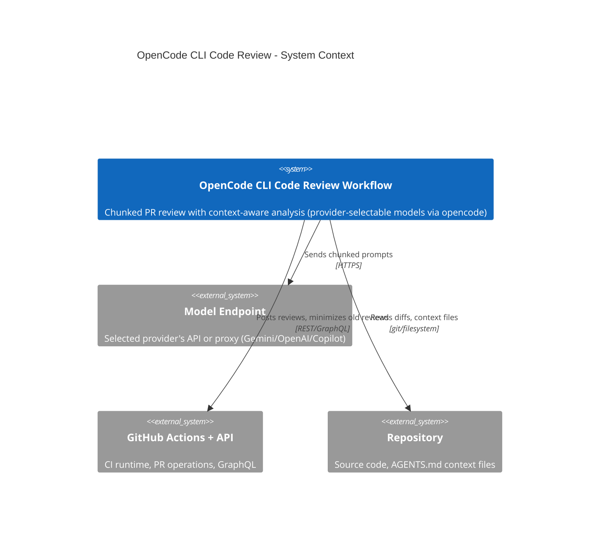

# OpenCode CLI Code Review

Automated PR code review using chunked processing, context-aware analysis, and provider-selectable models (Gemini / Copilot / OpenAI / Anthropic, chosen by `OPENCODE_REVIEW_REPORT_PROVIDER`) served through the `opencode` CLI. Updated: 2026-06-26. Maintainer: Platform Engineering.

**Skill layout, env-var provenance, the full LADR history (Date/Context/supersede chains), and confirmed false-positive PR references live in the sibling `AGENTS.md`** — load it when updating this skill or auditing past decisions. This file (`SKILL.md`) is the runtime contract: current-state instructions, the active LADRs as rules (Decision + Consequences), and Key Behaviors.

## Required Environment Variables

opencode reads these from the process environment via the `{env:…}` placeholders in `assets/opencode.json`. The config holds the provider *shape* only — never the secret values.

| Variable | Purpose | CI source | Local source |
|----------|---------|-----------|--------------|
| `OPENCODE_REVIEW_REPORT_PROVIDER` | Selects the active provider: `GEMINI` (default), `COPILOT`, `OPENAI`, `ANTHROPIC`, `OPENCODE-GO-OPENAI`, `OPENCODE-GO-ANTHROPIC`, or `OPEN_ROUTER`. `lib/resolve-provider.sh` maps it to the provider-id + gateway creds | GitHub **Variable**, default `GEMINI` | `--provider` arg / shell, default `GEMINI` |
| `OPENCODE_REVIEW_REPORT_GEMINI_URL` / `OPENCODE_GEMINI_API_KEY` | Gateway base URL + bearer token for the `gemini` provider | URL → GitHub **Variable**; key → **Secret** | exported in shell |
| `OPENCODE_REVIEW_REPORT_COPILOT_URL` / `OPENCODE_COPILOT_API_KEY` | Gateway URL + key for the `github-copilot` provider | URL → **Variable**; key → **Secret** (only if used) | exported in shell |
| `OPENCODE_REVIEW_REPORT_OPENAI_URL` / `OPENCODE_OPENAI_API_KEY` | Gateway URL + key for the `openai` provider | URL → **Variable**; key → **Secret** (only if used) | exported in shell |
| `OPENCODE_ANTHROPIC_API_KEY` | Key for the `anthropic` provider — direct Anthropic API (`@ai-sdk/anthropic`). Serves `claude-opus-4-8`, `claude-sonnet-4-6`, `claude-haiku-4-5`. **No URL var** — base `https://api.anthropic.com` is hardcoded in `opencode.json` (fixed public endpoint, LADR-040) | key → **Secret** (only if used) | exported in shell |
| `OPENCODE_GO_OPENAI_API_KEY` | Key for the `go-openai` provider — OpenCode's [OpenCode Zen](https://opencode.ai/docs/go/) gateway, OpenAI-compatible surface (`@ai-sdk/openai-compatible`). Serves `deepseek-v4-flash`, `deepseek-v4-pro`, `glm-5.1`. **No URL var** — base `https://opencode.ai/zen/go/v1` is hardcoded in `opencode.json` (fixed public endpoint) | key → **Secret** (only if used) | exported in shell |
| `OPENCODE_GO_ANTHROPIC_API_KEY` | Key for the `go-anthropic` provider — same Zen gateway, Anthropic-compatible surface (`@ai-sdk/anthropic`). Serves `minimax-m3`, `minimax-m2.7`, `qwen3.7-plus`, `qwen3.6-pro`. Same hardcoded base; same Zen key as the OpenAI surface works | key → **Secret** (only if used) | exported in shell |
| `OPENCODE_OPENROUTER_API_KEY` | Key for the `openrouter` provider — the OpenRouter aggregator (`@openrouter/ai-sdk-provider`). Serves vendor-prefixed slugs (`deepseek/deepseek-v4-pro`, `qwen/qwen3.7-plus`, `z-ai/glm-5.1`, `minimax/minimax-m3`, …; no Anthropic/OpenAI models). **No URL var** — base `https://openrouter.ai/api/v1` is hardcoded in `opencode.json` (fixed public endpoint, LADR-039) | key → **Secret** (only if used) | exported in shell |
| `OPENCODE_REVIEW_REPORT_MODEL_PRIMARY` | Primary deep chunk-review model (LADR-002) | GitHub **Variable**, default `gemini-3.1-pro-preview`; `workflow_dispatch` `model` input overrides, and the `model_preset` dropdown overrides everything (provider + all three tiers) | `--model` arg |
| `OPENCODE_REVIEW_REPORT_MODEL_SECONDARY` | Second (and last) review model — fallback if primary fails | GitHub **Variable**, default `gemini-2.5-pro` | script default |
| `OPENCODE_REVIEW_REPORT_MODEL_ORCHESTRATOR` | Cheap model for semantic grouping + aggregation + summary (LADR-022); falls back to the resolved review model | GitHub **Variable**, default `gemini-3-flash-preview` | script default |
| `OPENCODE_ANALYSE_PROVIDER` | Provider used by `pipeline-ai-analyse.yml` for autonomous low/medium fixes. Defaults to `OPENCODE_REVIEW_REPORT_PROVIDER`, then `GEMINI`. Lets analyse use a cheaper/different provider than the review gate. | GitHub **Variable** | n/a |
| `OPENCODE_ANALYSE_MODEL` | Primary model used by `pipeline-ai-analyse.yml` for autonomous low/medium fixes; defaults to `OPENCODE_REVIEW_REPORT_MODEL_PRIMARY`. Must belong to `OPENCODE_ANALYSE_PROVIDER`. | GitHub **Variable** | n/a |
| `OPENCODE_ANALYSE_MODEL_FALLBACK` | Optional fallback model for `pipeline-ai-analyse.yml`; when set, must belong to `OPENCODE_ANALYSE_PROVIDER`. Blank means no analyse fallback. | GitHub **Variable** | n/a |
| `OPENCODE_ANALYSE_MAX_INCREMENTAL` | Max consecutive incremental review cycles since the latest full review before autonomous fixes stop; default `3` | GitHub **Variable** | n/a |
| `OPENCODE_ANALYSE_GH_TOKEN` | Optional PAT the analyse workflow prefers for the auto-fix `git push`, to avoid `GITHUB_TOKEN`-authenticated PR updates when a user token is available; falls back to `GITHUB_TOKEN` when unset | GitHub **Secret** | n/a |
| `OPENCODE_REVIEW_REPORT_HEALTH_TIMEOUT` | Seconds `lib/opencode-health.sh` waits for `opencode serve` to come up + answer `/global/health` (default 30) | optional | optional |
| `OPENCODE_REVIEW_REPORT_MAX_FILE_COUNT` | Max changed-file count (post-exclusion) before the PR is blocked with a REQUEST_CHANGES "too many files" review instead of being reviewed (LADR-032); non-integer/≤0 falls back to 100 | GitHub **Variable**, default `100` | n/a (CI gate only) |
| `OPENCODE_REVIEW_REPORT_DISABLE_AGENTS_MD_CHECK` | Disables the full-review AGENTS.md / README.md / SKILL.md documentation validation gate when set to `1`/`true`/`yes` (case-insensitive); unset or `0` preserves the default validation | GitHub **Variable**, default `0`; `disable_agents_md_check` workflow input overrides | n/a (CI gate only) |
| `OPENCODE_REVIEW_REPORT_PROVIDER_ID` | **Derived** by `lib/resolve-provider.sh` — the opencode.json provider key the model is prefixed with (`gemini` / `github-copilot` / `openai` / `anthropic` / `go-openai` / `go-anthropic` / `openrouter`); consumed by `lib/opencode-with-fallback.sh` | resolver step → `$GITHUB_ENV` | exported by `local-review.sh` |
| `OPENCODE_REVIEW_REPORT_GATEWAY_URL` / `OPENCODE_GATEWAY_API_KEY` | **Derived** — the selected provider's creds copied to generic names for the credential presence check (health is checked separately + provider-agnostically via the opencode server, so there is no per-provider gateway health URL/auth) | resolver / Install Dependencies → `$GITHUB_ENV` | exported by `local-review.sh` |
| `OPENCODE_REVIEW_REPORT_DISABLE_CLAUDE_CODE` | GitHub **Variable** — overrides the disable flag for Claude Code support. If unset/empty, defaults to `1` (disabled). Set to `0` to re-enable `.claude` support | GitHub **Variable** (default `1`) | shell export (default `1`) |
| `OPENCODE_DISABLE_CLAUDE_CODE` | Derived from `OPENCODE_REVIEW_REPORT_DISABLE_CLAUDE_CODE` (default `1`) — disables all `.claude` support in opencode to prevent conflicts with Claude Code's `.claude` directory features. Set in the workflow `env:` block and exported by `opencode-health.sh` / `opencode-with-fallback.sh` | derived | derived |

**Secrets vs Variables**: gateway **API keys** are credentials → **Secrets** (never Variables — those are plaintext and printable in logs). Gateway **URLs**, the provider selector, and model ids are non-sensitive config → **Variables**, so they can be retuned without editing the workflow. Each model `vars.*` has a literal default so an unset Variable never blanks the model.

**Non-GEMINI fail-fast**: the model-chain defaults are Gemini IDs. For any non-GEMINI provider you MUST set the three `OPENCODE_REVIEW_REPORT_MODEL_*` to that provider's models — `gpt-5.5` / `gpt-5.4` / `gpt-5.4-mini` (Copilot/OpenAI), `claude-opus-4-8` / `claude-sonnet-4-6` / `claude-haiku-4-5` (Anthropic), `deepseek-v4-pro` / `deepseek-v4-flash` / `glm-5.1` (`OPENCODE-GO-OPENAI`), `qwen3.7-plus` / `minimax-m2.7` (`OPENCODE-GO-ANTHROPIC`), or the vendor-prefixed `deepseek/deepseek-v4-pro` / `qwen/qwen3.7-plus` / `z-ai/glm-5.1` (`OPEN_ROUTER`); `lib/resolve-provider.sh` aborts the run if a `gemini*` or `claude*` model leaks through to the wrong provider, or the selected provider's creds are missing. The analyse workflow applies the same rule by aliasing `OPENCODE_ANALYSE_PROVIDER` / `OPENCODE_ANALYSE_MODEL` / optional `OPENCODE_ANALYSE_MODEL_FALLBACK` into the shared resolver before running the edit-only agent. (Also do not mix surfaces: an OpenAI-surface model id won't resolve on `go-anthropic` and vice-versa; a Claude model id won't resolve on `go-openai` or `openrouter`.)

**Local runs** use the same provider mechanism as CI. The skill-level `--local` switch selects this path and maps to `local-review.sh`; do not pass `--local` through to the script. Bare `--local` is fully specified: run `scripts/local-review.sh` with no extra arguments, reviewing HEAD/current branch against `main`, not posting to GitHub, using `OPENCODE_REVIEW_REPORT_PROVIDER` if set and otherwise `GEMINI`, and using script model defaults unless explicit `--model` / model env vars are supplied. Do NOT ask which PR, provider, post mode, or base to use unless the user explicitly requests a non-default. `local-review.sh` accepts `--provider`/`OPENCODE_REVIEW_REPORT_PROVIDER`, harvests every provider's credentials from the shell rc files (URL + key for Gemini/Copilot/OpenAI; API key only for Anthropic, the two OpenCode Go surfaces, and OpenRouter, whose base URLs are hardcoded) (so the non-interactive skill subagent sees them), sources `lib/resolve-provider.sh` to pick + validate the selected pair, and runs the provider-agnostic opencode health check (`lib/opencode-health.sh`: `opencode serve` + `/global/health`). GHA Variables are CI-only; locally the primary review model is the `--model` arg and the secondary/orchestrator fall back to script defaults (which must be overridden for non-GEMINI providers). If required provider credentials are unavailable, let the script fail with its actionable prerequisite error rather than asking preflight questions.

## TL;DR

GitHub Actions workflow that reviews PRs in chunks through the `opencode` CLI transport — provider-selectable via `OPENCODE_REVIEW_REPORT_PROVIDER` (`GEMINI` / `COPILOT` / `OPENAI` / `ANTHROPIC` / `OPENCODE-GO-OPENAI` / `OPENCODE-GO-ANTHROPIC` / `OPEN_ROUTER`) — loads project-specific `*AGENTS.md` context files, and posts structured reviews with priority categorization — incremental reviews MUST never approve PRs (only full reviews can).

## Non-Negotiables

- **Incremental reviews MUST NEVER approve PRs** — only full reviews can approve (LADR-004)
- **Three-dot notation (`...`) for diffs** — symmetric difference, never two-dot
- **Never fetch or sync main branch** in the workflow
- **Context file updates must be atomic** — workflow YAML and this SKILL.md committed together
- **`ai-workflow-rules.instructions.md` is excluded from Gemini context** — that file is for coding AI (Claude Code), not review AI (Gemini)
- **Verify refactor suggestions are not already applied** — before recommending a syntactic refactor (primary constructor, record types, collection expressions `[...]`, `GetRequiredService<T>()` vs `GetService`, null-coalescing assignment, `using` declarations, file-scoped namespaces), check the current class/method signature or declaration line via `read_file`. Do NOT suggest a pattern already in use.
- **Source-of-truth precedence: diff + LADR/spec over PR-body intent** — when the PR description (including AI Review Notes "Focus Areas" / "Known Issues" wording) conflicts with the current diff against base or with an LADR / `*_AGENTS.md` in the loaded context, the diff and LADR are ground truth. PR-body text inevitably goes stale across follow-up commits and design changes. Do NOT mass-flag the code as wrong because it contradicts an outdated PR-body claim — flag the description as stale at **Low** instead. If an LADR documents the chosen approach (Decision / Alternatives Considered / Implementation notes), the implementation is by definition intentional — see DR-014 in `.agents/skills/code-review-standards/SKILL.md`.

## System Context

An automated code review system that reviews pull requests using the selected provider's models (Gemini / Copilot / OpenAI, via `OPENCODE_REVIEW_REPORT_PROVIDER`) through the `opencode` CLI transport. Reviews are processed in chunks to avoid memory issues, with intelligent grouping by business context (semantic) or directory structure (fallback). Each chunk loads relevant `*AGENTS.md` context files from parent directories. Results are aggregated into a two-part output: executive summary (always visible) and detailed chunk analysis (collapsible).

## Architecture Decisions (Lightweight ADRs)

The LADRs are the **decisions the model must follow** — they are the rules, not the history. Full Date/Status/Context/Supersede chains, confirmed-FP PR references, and the historical "Why superseded" notes live in `AGENTS.md` (editor's companion); what survives here is the rule the model must apply at review time.

### LADR-001: Chunked Review Processing

- **Status**: Accepted
- **Decision**: Split diffs into chunks (<100KB each) grouped by directory, each as a separate model API call, with final aggregation.
- **Consequences**: Memory-efficient and scalable; multiple API calls increase cost; needs cross-chunk holistic analysis (now runs for every PR per LADR-030).
- **See also**: LADR-010 (adaptive split on large dirs), LADR-011 (semantic grouping for 15+ files), LADR-030 (holistic aggregation now unconditional).

### LADR-002: Two-Tier Review Model Chain

- **Status**: Accepted
- **Decision**: Deep chunk-review chain is two-tier: `OPENCODE_REVIEW_REPORT_MODEL_PRIMARY` (default `gemini-3.1-pro-preview`) → `OPENCODE_REVIEW_REPORT_MODEL_SECONDARY` (default `gemini-2.5-pro`). No third tier — a degraded Flash review is worse than an honest "models down". If BOTH review models fail the startup probe, soft-fail per LADR-021. Models come from GitHub **Variables** (literal defaults); `workflow_dispatch` input overrides the primary. The startup probe tests only these two review models (the orchestrator is not probed — LADR-022). Error detection includes quota/rate-limit patterns.
- **Consequences**: High reliability for the substantive review; slightly longer startup due to model testing. Independent of the orchestrator tier, which can be retuned without touching the review chain.

### LADR-003: Context-Aware Review with On-Demand File Access

- **Status**: Accepted
- **Decision**: Use `--yolo` flag (legacy: gemini-cli) → now realized as the `review` agent's read/grep/glob/list/external_directory allow-list (LADR-025/029). Pass file paths only, instruct the model to READ files before flagging Critical/High issues.
- **Consequences**: No prompt size increase; reduced false positives; slightly slower when many files need verification.

### LADR-004: Incremental Reviews Must Never Approve

- **Status**: Accepted
- **Decision**: Incremental reviews MUST always use `--comment`, never `--approve`. Only full reviews can approve.
- **Consequences**: Prevents bypassing unresolved Critical/High issues; requires manual approval when incremental finds no new issues.

### LADR-005: Two-Part Aggregation Output

- **Status**: Accepted
- **Decision**: Split using `DETAILED_SECTION_MARKER` delimiter. Part 1 = executive summary (always visible). Part 2 = holistic cross-chunk analysis (collapsible with chunk details).
- **Consequences**: Clean overview for decision-makers; requires the model to follow the two-part format.

### LADR-006: Test File Pairing with Implementation Files

- **Status**: Accepted
- **Decision**: Map test files to implementation files (`.NET: *Test.cs→*.cs`, `Frontend: *.spec.ts→*.ts`) and group them in the same chunk.
- **Consequences**: Tests reviewed alongside code they validate; slightly larger chunks.

### LADR-007: Markdown-Based Separator Instead of JSON

- **Status**: Accepted
- **Decision**: Use markdown with `DETAILED_SECTION_MARKER` delimiter, parsed with `sed`/`grep`.
- **Consequences**: Reliable parsing; less structured than JSON but works well for LLM outputs.

### LADR-009: Selective Concurrency

- **Status**: Accepted
- **Decision**: Only `pull_request` events share concurrency group `ai-review-{pr_number}`. Other events (`issue_comment`, `workflow_dispatch`) use unique `{run_id}-{run_attempt}` per run.
- **Consequences**: Automated reviews always complete; manual triggers run independently; rapid commits still cancel each other.

### LADR-010: Adaptive Chunk Splitting by Directory Depth

- **Status**: Accepted
- **Decision**: After initial grouping, calculate cumulative diff size per group. If exceeding 100KB, re-group by next directory level, up to 5 iterations. Single-file groups kept as-is.
- **Consequences**: Prevents API failures on large groups; uses natural directory structure; adds minor `git diff | wc -c` overhead.

### LADR-011: Semantic Business Context Grouping via LLM

- **Status**: Accepted
- **Decision**: LLM pre-processing groups files by business context for PRs with 15+ files. 60-second timeout, strict validation (every file exactly once), falls back to directory grouping on failure. Includes "logic moved" detection: when code is removed from one file and similar code added in another, both are grouped together.
- **Consequences**: Cross-cutting features reviewed together for medium-to-large PRs; small PRs (<15 files) skip the extra semantic-grouping API call (~10-30s saved) and use cheaper directory grouping. Non-deterministic grouping above the threshold; LADR-010 applies as safety net.

### LADR-012: Confidence Tagging and Verification-Incomplete Suppression

- **Status**: Accepted
- **Decision**: (1) Chunk prompts instruct the model to suppress findings for files not in the chunk at Critical/High/Medium — only Low (informational) allowed. (2) Every finding must be tagged `[VERIFIED]` (code seen in diff or via `read_file`) or `[SPECULATIVE]` (inferred from partial context). (3) Aggregation prompt preserves tags and prevents elevating speculative findings.
- **Consequences**: Reduces false positives from partial-context inference; enables downstream auto-downgrading of speculative findings; adds ~2 tokens per finding for the tag.

### LADR-013: Migration/Schema Chunk Detection

- **Status**: Accepted
- **Decision**: Detect chunks containing `*.sql`, `*_Migration.cs`, or `*/Migrations/*.cs` files and route them to a migration-focused prompt. Migration detection takes priority over doc-only detection in the three-way branch.
- **Consequences**: Migration PRs get actionable feedback on rollback paths and data safety. Standard code review items (performance, security, test coverage) are intentionally replaced — if a chunk mixes migration and application code, migration review applies.

### LADR-015: Strengthened Critical/High Verification and Diff Integrity Checks

- **Status**: Accepted
- **Decision**: Two changes: (a) Chunk prompt now requires Critical/High verification to confirm the flagged symbol exists in the **current file state** via `read_file`, not just in the diff hunk. (b) Per-file diff integrity check warns the model when a file's diff exceeds `MAX_CHUNK_SIZE`, instructing it not to raise Critical/High without `read_file` verification. Additionally, `/ai-review:analyse` auto-recommends skip for `[SPECULATIVE]`-tagged findings. Extended by **DR-015** (this repo's PR #36 review 4473891333): the same `[VERIFIED]` discipline applies to **platform/framework-behavior claims** — if a finding depends on a claim about how an external platform behaves (GHA contexts/triggers, npm/registry, git, SDK contracts), that claim must itself be verified via `webfetch` of official docs or the finding must be tagged `[SPECULATIVE]`. Seeing the code in the diff does NOT verify the platform claim; known traps (e.g., `github.event_name` is never `"workflow_call"` in a reusable workflow; GHA `branches/tags/paths` filters are globs, not regex) are listed inline in the MANDATORY WORKFLOW for Critical/High.
- **Consequences**: Reduces false positives from stale diff context, large/truncated diffs, and fabricated platform semantics; adds minor per-file size check overhead and one optional `webfetch` round-trip on the uncommon path where the model wants Critical/High on a platform-behavior basis (it can always downgrade to `[SPECULATIVE]` at no cost); speculative findings no longer require manual triage.

### LADR-016: Release Branch Sync Review Mode

- **Status**: Accepted
- **Decision**: Detect sync branches by head ref prefix (case-insensitive). Pass `REVIEW_MODE=sync` to chunk and aggregation scripts. Sync mode narrows chunk prompts to merge conflict errors, cross-PR breaking combinations, config drift, and migration ordering conflicts. Aggregation holistic analysis is similarly narrowed. Severity threshold raised: only Critical and High used, everything else is Low (informational).
- **Consequences**: Sync PRs get focused, actionable reviews instead of noise. Trade-off: genuine issues in already-reviewed code won't be caught (acceptable because original PR review should have caught them).

### LADR-019: No `read_file` Access at Aggregation Step

- **Status**: Accepted
- **Decision**: Strip `read_file` invitations from the aggregation prompt template. The prompt instructs the model that file-system verification is not its job (the read tools the default agent exposes are simply left unused for the summary step). Confidence-tag promotion (`[SPECULATIVE]` → `[VERIFIED]`) is removed from the aggregation responsibilities — chunk reviews own it.
- **Consequences**: Fewer agentic round-trips at aggregation. Quality preserved because the *verification* layer is unchanged — chunk reviews still do the file-state checks per LADR-015. Trade-off: if a chunk review missed a verification opportunity, the aggregation can no longer rescue it. Acceptable: missing verification at chunk level is a chunk-review prompt bug to fix at that layer, not papered over downstream.

### LADR-020: Skip Integration / DI / Test-Coverage Sections on Small PRs

- **Status**: Accepted
- **Decision**: Gate the Integration / DI / Test Coverage sections of the holistic prompt on `REVIEW_TYPE=full AND TOTAL_CHUNKS > 2`. Combined into a single guarded block (previously two adjacent `if` statements with identical condition).
- **Consequences**: Smaller prompt and faster aggregation on small PRs. For 3+ chunk PRs the sections still run, because cross-chunk integration/DI consistency is a genuine concern when changes span many files. No loss of coverage on 1-2 chunk PRs because the underlying chunk review already evaluated those concerns on the changed files.

### LADR-021: All-Models-Failed Posts Request-Changes Instead of Failing Workflow

- **Status**: Accepted
- **Decision**: On all-models-failed, the model-test step sets `all_models_failed=true` and completes successfully; a dedicated step posts a `--request-changes` review naming the failed models and linking the workflow logs, and all downstream side-effect steps are gated to no-op on this path. The job exits green.
- **Consequences**: Quota / API-key incidents surface as a request-changes review (the existing "Failed → request-changes" branch of the decision matrix in Key Behaviors) rather than a red workflow check. Re-running once the upstream issue is resolved (via `/ai-review`) clears the request-changes state through a fresh full review. Trade-off: a green workflow check no longer guarantees a Gemini review ran — reviewers must read the posted review body to see whether substantive findings or an infrastructure failure produced the request-changes verdict.

### LADR-022: Explicit Orchestrator Model for Non-Analytical Calls

- **Status**: Accepted
- **Decision**: Replace the `auto` derivation with an explicit, independently-tunable `OPENCODE_REVIEW_REPORT_MODEL_ORCHESTRATOR` (default `gemini-3-flash-preview`, a GitHub Variable). All non-chunk-review calls run on it. Its fallback is the **resolved review model** (the chunk chain's winner), so if the orchestrator is down the summary still runs on a known-healthy model. The orchestrator is intentionally **not** probed at startup (its fallback is already proven by the LADR-002 probe).
- **Consequences**: Lower per-PR cost without changing review quality (analysis stays on the Pro review chain). The `**Model:**` field shows the resolved review model. Deterministic — no reliance on a proxy router to interpret `auto`. Orchestrator and review tiers tune independently.

### LADR-023: opencode as Transport for Gemini Models

- **Status**: Accepted
- **Decision**: Use `opencode` as the CLI transport (provider-agnostic). Gemini *models* are unchanged — the LADR-002 two-tier chain and LADR-022 orchestrator are preserved at the call site. The provider is declared in `assets/opencode.json` as `@ai-sdk/google` named `gemini` with `apiKey={env:OPENCODE_GEMINI_API_KEY}`; the gateway `baseURL` is **injected at install time** from `OPENCODE_REVIEW_REPORT_GEMINI_URL` (LADR-034), not committed (DR-009). The `gemini` provider registers four physical model ids (`gemini-3.1-pro-preview`, `gemini-2.5-pro`, `gemini-3-flash-preview`, `gemini-2.5-flash`); every call site passes an explicit model id. Chunk review runs on the locked-down `review` agent (LADR-029).
- **Consequences**: Posted review surfaces the chunk-review model id in `**Model:**`; LADR-015 file-state verification works via the `review` agent's read tool. The workflow filename is `pipeline-code-review-report.yml` (the comment trigger is `/ai-review`).

### LADR-025: Allow `external_directory` reads (headless `--yolo` equivalent)

- **Status**: Accepted
- **Decision**: Add a top-level `"permission": { "external_directory": "allow" }` block to `assets/opencode.json` — the headless equivalent of `--yolo` for the one gate that was failing (`read`/`grep`/`glob` already default to `allow`). `setup-opencode-config.sh`'s self-heal `is_ours` predicate was widened to treat `permission` as part of our managed-config shape. The review pipeline only reads — never edits or runs bash — so allowing reads is safe.
- **Consequences**: Chunks reliably load context files; LADR-015 verification reads work; clean PRs can resolve to APPROVE again. Trade-off: the model may read any in-repo path during a review — acceptable (same effective access as the prior `--yolo`). `external_directory: allow` is also set on the locked-down `review` agent (LADR-029).

### LADR-026: Env-Selected Provider (GEMINI / COPILOT / OPENAI)

- **Status**: Accepted
- **Decision**: Promote the providers from config-only to runtime-selectable via the `OPENCODE_REVIEW_REPORT_PROVIDER` Variable (default `GEMINI`). `lib/resolve-provider.sh` is the single source of truth: it maps the selector → `OPENCODE_REVIEW_REPORT_PROVIDER_ID` (the opencode provider key prefixed onto the model), copies the selected provider's URL/key into generic `OPENCODE_REVIEW_REPORT_GATEWAY_URL`/`_API_KEY` (for the credential presence check), and **fails fast** when the selected provider's creds are missing or the `OPENCODE_REVIEW_REPORT_MODEL_*` chain doesn't match the provider's model family (GEMINI → `gemini-*`, others → `gpt-*`). All call sites prefix `${OPENCODE_REVIEW_REPORT_PROVIDER_ID}/<model>`; the workflow exports all three credential pairs at job scope; `local-review.sh` harvests all three pairs and sources the same resolver.
- **Consequences**: One gate, any of three providers, switchable by a Variable + that provider's URL/key/model Variables — no workflow edit. opencode is genuinely provider-agnostic transport: the endpoint may be a LiteLLM proxy or a native API. Trade-off: the model-chain defaults are Gemini IDs, so a non-GEMINI run MUST set `OPENCODE_REVIEW_REPORT_MODEL_*` to that provider's models or the resolver aborts (intentional, prevents confusing downstream `opencode run` failures).

### LADR-027: OpenCode Go Providers — split by SDK surface (`go-openai` + `go-anthropic`)

- **Status**: Accepted
- **Decision**: Split OpenCode Go into **two** providers rather than one, each with its own `npm` + `baseURL` + credential namespace:
  - **`go-openai`** — `npm: "@ai-sdk/openai-compatible"`, `baseURL: "https://opencode.ai/zen/go/v1"` (hardcoded), `apiKey={env:OPENCODE_GO_OPENAI_API_KEY}`. Models: `deepseek-v4-flash`, `deepseek-v4-pro`, `glm-5.1`.
  - **`go-anthropic`** — `npm: "@ai-sdk/anthropic"`, `baseURL: "https://opencode.ai/zen/go/v1"` (hardcoded), `apiKey={env:OPENCODE_GO_ANTHROPIC_API_KEY}`. Models: `minimax-m3`, `minimax-m2.7`, `qwen3.7-plus`, `qwen3.6-pro`.

  Both `baseURL`s are the shared base `https://opencode.ai/zen/go/v1` — the respective SDK appends `/chat/completions` vs `/messages` to reach the two documented endpoints. The base is a **fixed public endpoint, hardcoded** (not env-driven) — OpenCode Go is a single SaaS gateway with no per-deployment URL to retune, so there is **no `OPENCODE_GO_*_URL` Variable**; only the API key (Secret) is configurable, and the same OpenCode Zen key works for both surfaces. Two selectors map in: `OPENCODE_REVIEW_REPORT_PROVIDER=OPENCODE-GO-OPENAI` → provider-id `go-openai`, `OPENCODE-GO-ANTHROPIC` → `go-anthropic` (resolved in `lib/resolve-provider.sh`, the workflow `OPENCODE_REVIEW_REPORT_PROVIDER_ID` map + bootstrap creds case, `local-review.sh` cred harvest). The model-family fail-fast still applies (non-GEMINI must not carry a `gemini*` id).
- **Consequences**: Two switchable providers covering both OpenCode Go surfaces; no workflow edit to enable (key = Secret, models = Variables — no URL to set). A run picks ONE surface — its model chain must be all-OpenAI-surface or all-Anthropic-surface ids (mixing won't resolve).

### LADR-028: Health via the opencode server (`/global/health`), not per-provider gateway probes

- **Status**: Accepted
- **Decision**: Replace all per-provider gateway probes with a single provider-agnostic check against opencode itself. New `lib/opencode-health.sh` runs `opencode serve` (which prints `opencode server listening on http://127.0.0.1:<port>`), parses that URL, polls `<url>/global/health` until 200, then tears the server down. Identical for every provider, so `resolve-provider.sh` no longer derives `OPENCODE_GATEWAY_HEALTH_URL` / `OPENCODE_GATEWAY_AUTH_STYLE`, and `OPENCODE_API_HEALTH_OVERRIDE` is removed. Wired in: the workflow runs it as a non-blocking step (`|| true`) right after opencode is installed + configured; `local-review.sh` runs it (fatal) after `setup-opencode-config.sh`. The resolver still resolves + presence-checks the provider's URL/key (`OPENCODE_REVIEW_REPORT_GATEWAY_URL`/`_API_KEY`).
- **Consequences**: One health path for all providers; adding a provider/surface needs no health-branch edit. Trade-off: `/global/health` confirms opencode is up but does NOT validate the upstream gateway's reachability or the API key — so (a) the local preflight no longer pre-empts a private-network/VPN hang (the process-group `timeout` shim still bounds hangs during real calls, LADR-024), and (b) a present-but-invalid key surfaces only at the real model call ("Assert Review Model Selection Works" in CI). Both are acceptable: the health step is a smoke test, and the functional model-call gate is unchanged.

### LADR-029: Run chunk review on a locked-down `review` agent (`--agent review`)

- **Status**: Accepted
- **Decision**: Stop using the default `build` agent for reviews. Define a custom **`review`** agent in `assets/opencode.json` (`mode: primary`, **no `model` field** so `--model` still wins — verified: `--agent review --model X` reports `> review · X`, the precedence trap LADR-023 hit with `build`'s pinned model does not apply) with `skill`/`task`/`edit`/`write`/`bash` disabled (both via the deprecated `tools` map *and* `permission: deny`, belt-and-suspenders) and `read`/`grep`/`glob`/`list`/`external_directory`/`webfetch`/`websearch` allowed (LADR-025 access preserved). `bash` is denied specifically so a prompt-injected PR diff cannot run arbitrary commands on the runner; `webfetch`/`websearch` stay enabled so the review model can verify references during review. `opencode-with-fallback.sh` now passes `--agent review` and, additionally, captures stdout and **returns non-zero when output is < 200 bytes**, so an exit-0-but-empty result advances the fallback chain (matching the empty-output floor in `review-in-chunks.sh`) instead of short-circuiting as a hollow success. The empty-chunk failure marker wording was corrected to name agent tool-misfire as a cause, not only provider failure.
- **Consequences**: The review model can no longer self-activate this (or any vendored) skill — the `.github` chunk reviews as text. Reviews remain read-only (no new write/bash/skill surface; arguably *tighter* than `build`). Aggregation also runs through `--agent review` (it only reads stdin + markdown). Trade-off: `assets/opencode.json` now carries a managed `agent` block — `setup-opencode-config.sh`'s `is_ours` self-heal predicate already keys on provider shape, so a personal config without `review` will be left intact with the standard warning (CI always overwrites). Reviewing this repo's own PRs is the canonical trigger, so keeping the `review` agent is required for the gate to certify its own changes.

### LADR-030: Holistic Aggregation Runs for Every PR (incl. Single-Chunk)

- **Status**: Accepted
- **Decision**: Remove the single-chunk short-circuit from `aggregate-reviews.sh`. The holistic / high-level aggregation LLM call now runs for every PR regardless of chunk count, producing the full `## 📋 Overall Summary`, `## ✅ Positive Highlights`, `## 🔍 Issues Summary`, `## 📝 Suggested Fixes`, `## 🎯 Recommendation`, and `## 🔄 Holistic Cross-Chunk Analysis` sections. The prompt phrasing adapts to chunk count (a 1-chunk PR is described as "reviewed in a single chunk", not "multiple chunks"). The two safety properties the short-circuit used to enforce are unchanged because they already live downstream and are chunk-count-agnostic: (1) the fail-closed net (per LADR-031, an out-of-band `chunk_<n>.failed` flag file) catches any chunk that could not be reviewed; (2) the workflow forces incremental reviews to `--comment`/never-`APPROVE` (LADR-004). The empty/tiny-output aggregation fail-safe (REQUEST_CHANGES on <50-byte summary) also applies to single-chunk PRs. The LADR-020 guard (skip Integration/DI/Test-Coverage holistic sections when `TOTAL_CHUNKS <= 2`) still suppresses cross-chunk-only sections that add nothing for one chunk.
- **Consequences**: Every PR — including the common small/single-chunk case — now gets a real aggregated high-level report. Cost is a single extra Flash-tier call (~30 s) per single-chunk PR; acceptable given LADR-022. The deterministic programmatic decision of the short-circuit is replaced by the LLM's policy-driven recommendation, identical to how multi-chunk PRs already resolve — with the same fail-closed and incremental guards intact.

### LADR-031: Out-of-Band Chunk-Failure Signal (flag file, not marker-text grep)

- **Status**: Accepted
- **Decision**: Signal chunk failure **out-of-band**. `review-in-chunks.sh` writes a zero-importance flag file `ci_temp/reviews/chunk_<n>.failed` (alongside `chunk_<n>.md`) at both failure sites (empty/tiny <200-byte output, and non-zero/timeout exit). `aggregate-reviews.sh` fail-closes on the **existence of any `chunk_*.failed` flag** (`ls ci_temp/reviews/chunk_*.failed`), never on grepping review text. The human-readable `## ⚠️ Review Failed for Chunk:` marker is still written into the chunk body so failures remain visible in the posted review — but it is presentation only, not the control signal. A flag file cannot be quoted into existence by review content, so doc/skill files may mention the marker string freely. Per-chunk flag files (not a shared append) keep the parallel chunk loop race-free.
- **Consequences**: The gate can review its own repo without false REQUEST_CHANGES from quoted markers. The signal is robust to any review content. Trade-off: the failure marker and the flag are now two separate writes that must stay in sync — both failure branches in `review-in-chunks.sh` must drop the flag (covered; a missing flag would silently *under*-report a failure, so the marker write and flag write sit adjacent at each site). Flag files live only in `ci_temp/` and never reach the posted review or git.

### LADR-032: Max-file-count gate + `OPENCODE_*` → `OPENCODE_REVIEW_REPORT_*` env rename

- **Status**: Accepted
- **Decision**: (a) Add an upper file-count bound. A new **Block PR if Too Many Files Changed** step runs right after **Generate PR Diff**: if the post-exclusion `files_changed` exceeds `OPENCODE_REVIEW_REPORT_MAX_FILE_COUNT` (repo/org **Variable**, default `100`; invalid/non-positive values fall back to 100), it posts a `--request-changes` review ("too many files to review — split the PR / raise the Variable") and emits `exceeded=true`. Every review-chain step (`Validate`-block, `Skip Review Due to Blocking`, chunked review, aggregation, minimize, post-review) gains `&& steps.file_count_gate.outputs.exceeded != 'true'`, so the gate short-circuits without double-posting or fail-closing. `initialize_opencode` runs before the diff is known, so opencode still installs — accepted as minor. (b) Rename every non-key config var `OPENCODE_*` → `OPENCODE_REVIEW_REPORT_*` (provider selector, model chain, gateway URLs, CLI version, health timeout, chunking threshold, derived provider-id/gateway-url). **API-key Secrets keep their names** (`OPENCODE_*_API_KEY`) — they're provider credentials, not review-report-specific config — as does the derived `OPENCODE_GATEWAY_API_KEY`.
- **Consequences**: Oversized PRs fail fast with actionable guidance instead of a costly low-quality review; the limit is tunable per repo. Operational cost of the rename: the repo/org GitHub **Variables** must be renamed to the `OPENCODE_REVIEW_REPORT_*` names or the gate reads them empty and falls back to defaults (Secrets unaffected). Historical changelog/LADR references to old/removed var names are left intact as record.

### LADR-033: Eval Harness for the Chunk-Review Model (Precision + Recall vs a Labeled Corpus)

- **Status**: Accepted
- **Decision**: Add an opt-in eval harness under `scripts/eval/` that scores the chunk-review LLM on two axes against a labeled corpus, driving the **real** `review-in-chunks.sh` per fixture (so prompt/LADR/model changes are regression-tested, not a reimplemented prompt) and reusing the CI transport verbatim (`lib/resolve-provider.sh` + `lib/setup-opencode-config.sh` + `lib/opencode-health.sh` + the two-tier `lib/opencode-with-fallback.sh` — **no new transport**).
  - **Precision (must-NOT-flag)**: one+ fixture per DR-001…DR-014. The reviewer must not re-raise a known false positive at Critical/High/Medium (Low/none allowed). **Zero tolerance** — any such flag fails the run, because every DR is a confirmed FP. This bar is intentionally **stricter than the production gate's blocking threshold** (the gate blocks only on `[VERIFIED]` Critical/High — LADR-012/015): a re-raised DR at Medium is still review noise on a confirmed FP, so the eval fails on it too.
  - **Recall (must-catch)**: synthesized fixtures with a seeded real defect the reviewer should flag at ≥ its labeled severity; the run fails below a configurable catch-rate threshold (`EVAL_RECALL_THRESHOLD`, default 80%).
  - A "flag" = a `[VERIFIED]` Critical/High (Medium for precision) finding; `[SPECULATIVE]`/"None found" never count (LADR-012 grammar). Each fixture runs in a throwaway git sandbox (before→after commits) with the canonical DR standards (`.github/instructions/code-review-standards.instructions.md` + a DR-012…014 supplement) placed at their production dot-paths so the reviewer reads the **same** context production injects via `MANDATORY_CONTEXT_FILES`.
  - **Triggers** (real paid calls): `eval/local-evals.sh` locally; `workflow_dispatch`; and a **post-merge canary** — `push` to `main` **path-filtered** to the review-pipeline files that change the eval outcome (`.agents/skills/ai-review-report/**`, `.github/instructions/code-review-standards.instructions.md`, `.github/workflows/llm-eval-harness.yml`). Deliberately **never on `pull_request`** (it never blocks a PR) and **never in the default bash-test path**. The default-path-safe test is `eval/test-evals.sh` (stubbed model via the `EVAL_SELFTEST` seam — corpus walk, scoring, gating, exit codes; no calls). `EVAL_SAMPLES>1` runs each fixture N times (precision = worst-case, recall = majority).
  - **Triage archive**: when `EVAL_ARTIFACT_DIR` is set, `run-evals.sh` copies each fixture's concatenated review to `<id>.review.md` (and infra-fail run logs to `<fixture>.lastlog`); the CI workflow sets it under `ci_temp/eval-artifacts/` and uploads it via `actions/upload-artifact` with `if: always()` (the eval step exits non-zero on a regression). Inspect those reviews to confirm a FAIL is a genuine model re-raise vs a fixture-hygiene artifact.
- **Consequences**: Prompt/model/LADR changes can be regression-tested before they reach production instead of being caught by adding yet another DR. Workflow↔script path coupling now also covers `scripts/eval/` (the dispatch workflow invokes it by hardcoded path). Cost is bounded by being manual/opt-in. **Out of scope** (possible follow-up): evals for the orchestrator-tier calls (semantic grouping, aggregation summary — LADR-022), which are classification/cosmetic, not blocking.

### LADR-034: Per-Provider Gateway `baseURL` Injected at Install Time

- **Status**: Accepted
- **Decision**: `lib/setup-opencode-config.sh` injects each env-driven provider's `options.baseURL` into the installed `~/.config/opencode/opencode.json` from `OPENCODE_REVIEW_REPORT_
_URL` when that var is non-empty (`gemini`/`github-copilot`/`openai`). Empty/unset → no `baseURL` (native SDK base). The two OpenCode Go providers are never injected — their base is the hardcoded Zen endpoint (LADR-027). Done dynamically, not as a static `{env:…}` placeholder (an unset placeholder would yield an empty-string `baseURL`); the committed `opencode.json` stays `baseURL`-free by design (DR-009).
- **Consequences**: Setting `OPENCODE_REVIEW_REPORT_
_URL` routes that provider through the gateway (e.g. a LiteLLM proxy) with no `opencode.json` edit; clearing it reverts to the native base. Applies uniformly to Copilot/OpenAI.
- **See also**: LADR-027 (OpenCode Go fixed Zen base, never injected), LADR-028 (`/global/health` doesn't validate the gateway/key, so a misroute surfaces only at the model call), DR-009.

### LADR-035: Hard Chunk-Prompt Size Enforcement

- **Status**: Accepted (hardens LADR-010; extends LADR-015)
- **Decision**: Three layered controls in `review-in-chunks.sh`: (1) when the adaptive split's deeper-directory regroup of an oversized group yields ≤1 distinct group (all files in one directory, or one semantic group), the file list is **halved** into `${group}@1`/`${group}@2` instead — converging under the existing 5-iteration loop (LADR-010); (2) each file's diff inside a chunk prompt is capped at `MAX_FILE_DIFF_SIZE` (= `MAX_CHUNK_SIZE`, 100KB) — an oversized diff is **TRUNCATED** to the cap, with the LADR-015 integrity warning reworded to say so and an inline omitted-bytes marker; (3) the total diff per chunk prompt is capped at `MAX_PROMPT_DIFF_SIZE` (200KB) — once exhausted, remaining files get a **DIFF OMITTED** paragraph directing the model to `read_file`, never their diff. The single-file "cannot split further" branch is unchanged — the prompt-builder caps are its backstop.
- **Consequences**: No changeset shape can build an unbounded chunk prompt and time out into a forced fail-closed block. Truncated/omitted diffs degrade to on-demand `read_file` reading — safe because the `review` agent has read access (LADR-025/029) and Critical/High already requires `read_file` verification (LADR-015). Regression-tested by `scripts/test-chunk-prompt-budget.sh`.

### LADR-036: Review-Coverage Gaps Never Block + Visible Fail-Closed Override

- **Status**: Accepted (enforces LADR-012 at the aggregation layer; makes LADR-031's override transparent)
- **Decision**: Two changes in `aggregate-reviews.sh`. (1) The aggregation prompt carries a MANDATORY **"Review-Coverage Gaps Are NOT Code Issues"** rule: a file absent from every review chunk, a failed/timed-out chunk, or a PR-author focus area the model could not verify is a coverage gap — 🔵 Low `[SPECULATIVE]` only, never Critical/High/Medium, never counted in the Recommendation's Step-1 issue counts (the LADR-031 fail-closed net already handles failed chunks mechanically; re-flagging double-counts), even when the author's AI Review Notes ask for focus there. The FULL-review "Missing implementations" holistic bullet is scoped to the diffs the chunk reviews actually saw. (2) `FAILED_CHUNK_COUNT` is computed from the LADR-031 `chunk_*.failed` flag files **before** the posted body is assembled; when >0 the body header carries a "**Review coverage incomplete:** N of M chunks failed" banner stating the review is posted as REQUEST CHANGES (fail-closed) regardless of the Recommendation section, and the end-of-script fail-closed override reuses the same count. Override semantics unchanged: any failed chunk still forces `request_changes`.
- **Consequences**: The aggregation model can no longer promote "file X was not present in any chunk" to a blocking High, and a fail-closed override is never invisible — the posted body and the posted state always agree. Failure detection stays flag-file-only (LADR-031); the fail-closed stance is unweakened — the override is now *visible* and *rarer* (LADR-035 removes the timeout class), not gone.

### LADR-037: Reusable-Workflow Channel via `$REVIEW_SKILL_DIR` Indirection

- **Status**: Accepted
- **Decision**: The gate workflow is callable cross-repo via `on.workflow_call` (string inputs `pr_number`/`model`/`model_preset` — the caller template owns the `choice` dropdown — plus `runner`, `tools_ref`, and `mandatory_context_files`/`agents_md_exempt_paths` overrides); every `github.event.inputs.*` expression became `inputs.*`. All nine script invocations route through **`$REVIEW_SKILL_DIR`**, set by the "Locate review skill scripts" step: the literal `.agents/skills/ai-review-report` when the skill exists in the checkout (in-repo / copy-install — that literal is the README installer's rewrite anchor and must stay literal), else a side `actions/checkout` of `generic-automation-and-it/smooth-ai-report-review` at `.smooth-ai-review-tools/`, pinned to `inputs.tools_ref || github.workflow_sha || 'main'` (`github.workflow_sha` = the called workflow file's commit in this repo; on GHES the property is absent → fallback applies). Scripts need no changes — internal resolution is `$BASH_SOURCE`-based; CWD paths (`ci_temp/`, `MANDATORY_CONTEXT_FILES`) stay aimed at the workspace under review. Secrets: `on.workflow_call.secrets` declares all seven `OPENCODE_*_API_KEY` keys (`required: false`) so callers can pass them either way — same-org callers via `secrets: inherit`, cross-org callers by explicit mapping (GitHub honors `inherit` only same-org/enterprise; a cross-org `inherit` fails at startup as a "workflow file issue"). The caller template maps them explicitly so it works in both. `vars.*` resolves against the caller repo/org.
- **Consequences**: Three coexisting consumption modes (in-repo, copy-install, `uses: …@v1`) run the same workflow file; the local skill tree always wins, so vendored customizations are honored. The caller template `.docs/examples/code-review-caller.yml` duplicates the `model_preset` dropdown — extend it together with the preset env mapping. The README installer's perl rewrite carries `unless m{\.smooth-ai-review-tools}` so it cannot corrupt the side-checkout literal.

### LADR-038: npm/opencode Plugin Channel — Skills Linked into `.agents/skills/`

- **Status**: Accepted
- **Decision**: The repo root doubles as the npm package `@generic-automation-and-it/smooth-ai-review`, an opencode plugin (`opencode-plugin.js`, export `SmoothAiReviewSkills`) that consumers enable with one `opencode.json` line: `"plugin": ["@generic-automation-and-it/smooth-ai-review"]`. opencode auto-installs it at startup; the plugin links each skill from the package cache into the consuming worktree's `.agents/skills/<name>` — the same path contract the gate's locate step and all skill docs use — as junction-type directory symlinks (no admin rights on Windows). A real directory at the destination (vendored/copy-install) is never overwritten; stale links are re-pointed; link paths are excluded locally via `.git/info/exclude`; any failure warns without breaking opencode startup. The package's `files` whitelist ships the skills **without** `scripts/eval/`. It is hosted on the **GitHub Packages npm registry** (`publishConfig` + root `.npmrc`): publishing needs only the run-scoped `GITHUB_TOKEN` (`packages: write`) — no npm.com org or token Secret — at the cost that consumers need a one-time `read:packages` PAT in their user `~/.npmrc` even though the package is public. Publishing runs on every push to `main`, by `workflow_dispatch`, and on semver tags (`vX.Y.Z`; the floating `v1` tag never publishes). There is deliberately **no `paths` filter**. The workflow enforces checked-in `package.json` == `.claude-plugin/plugin.json`; semver tag releases additionally require the tag version to match and publish that exact version. Non-tag runs patch both manifests at workflow runtime to `major.minor.${GITHUB_RUN_NUMBER}` (for example `1.0.<run_number>`) before the duplicate-version check and publish, so every main/manual run can produce a unique immutable npm version without committing a version bump. Already-published versions are detected and skipped because npm cannot republish an identical version. The first publish lands private and is flipped to public once in the org Packages settings.
- **Consequences**: opencode users get a no-vendor skills channel (opencode has no skill marketplace and no extra-search-path config — a startup plugin is the only option). Skills may only be discovered from the session after the links first appear — document "restart opencode once after first install". Neither this nor the Claude Code plugin installs the CI gate. Eval work still requires a clone.

### LADR-039: OpenRouter provider (`openrouter`) — aggregator with a hardcoded base

- **Status**: Accepted
- **Decision**: Add OpenRouter as a sixth provider, selected by `OPENCODE_REVIEW_REPORT_PROVIDER=OPEN_ROUTER` → provider-id `openrouter`. Declared in `assets/opencode.json` with `npm: "@openrouter/ai-sdk-provider"`, `baseURL: "https://openrouter.ai/api/v1"` (**hardcoded**), `apiKey={env:OPENCODE_OPENROUTER_API_KEY}`. Like OpenCode Go (LADR-027), OpenRouter is a single public aggregator with no per-deployment URL to retune, so there is **no `OPENCODE_REVIEW_REPORT_OPENROUTER_URL` Variable** — only the API-key Secret — and it is **not** in `setup-opencode-config.sh`'s `_inject_base_urls` set (LADR-034). The API key is supplied via the same `{env:…}` placeholder mechanism as every other provider; OpenCode's `/connect`/`auth.json` flow is deliberately not used (it is interactive, not headless-CI-friendly). Wired into the same five touchpoints as any provider: `resolve-provider.sh` case (fixed-url shape), `setup-opencode-config.sh`'s `is_ours` provider-key set (now six providers) + warning text, the workflow `env:` key + `PROVIDER_ID` map + Install-Dependencies bootstrap `case`, and `local-review.sh`/eval cred harvest. Models are real OpenRouter slugs carrying a `vendor/` prefix (`deepseek/deepseek-v4-pro`, `qwen/qwen3.7-plus`, `z-ai/glm-5.1`, `minimax/minimax-m3`, plus programming-collection picks); **Anthropic and OpenAI models are intentionally excluded** (use the dedicated providers). opencode prefixes the provider-id and splits on the first `/`, so `openrouter/<vendor>/<model>` resolves; the resolver's gemini-guard only rejects `gemini*`-prefixed ids, so vendor-prefixed slugs pass. Four `model_preset` dropdown options route to it (DeepSeek V4 Pro, Qwen3.7 Plus, GLM-5.1, MiniMax M3).
- **Consequences**: One key unlocks a broad multi-vendor catalogue without per-vendor accounts. The fixed-base rule grows from one exception (OpenCode Go) to two — the root `AGENTS.md` Non-Negotiable was updated accordingly. A run picks OpenRouter's model family via the three `OPENCODE_REVIEW_REPORT_MODEL_*` Variables (vendor-prefixed) or a preset; defaults are Gemini ids, so the non-GEMINI fail-fast applies as for any other provider.
- **See also**: LADR-027 (the other fixed-base provider), LADR-034 (why OpenRouter is excluded from baseURL injection), LADR-026 (the env-selected-provider mechanism).

### LADR-042: Autonomous low/medium `ai-analyse` auto-fix loop

- **Status**: Accepted
- **Decision**: Add `.github/workflows/pipeline-ai-analyse.yml`, triggered by `workflow_run` on the gate name `OpenCode Review Report` (only when that run's `conclusion == 'success'`) or manually via `workflow_dispatch` (`pr_number` required, `max_incremental` optional cap override), to process only the latest gate-authored 🟡 Medium and 🔵 Low findings. The guard skips forks, requires at least one medium/low finding, and stops after `OPENCODE_ANALYSE_MAX_INCREMENTAL` consecutive incremental reviews since the latest full review (the sole loop bound — no `[ai-analyse]` commit sentinel; a no-edit cycle ends the loop early). The analyse job checks out the same-repo PR head, initializes opencode through the existing shared libs, aliases `OPENCODE_ANALYSE_PROVIDER` / `OPENCODE_ANALYSE_MODEL` / optional `OPENCODE_ANALYSE_MODEL_FALLBACK` into the shared provider resolver, inlines `.agents/skills/ai-analyse/SKILL.md`, runs `opencode-with-fallback.sh` with `OPENCODE_AGENT=analyse`, commits any edits with `[ai-analyse]` and no `/ai-review`, prefers the optional `OPENCODE_ANALYSE_GH_TOKEN` Secret for the auto-fix push (falling back to `GITHUB_TOKEN`), then posts a new summary comment through `ai-review/scripts/copilot-review.sh summary`.
- **Consequences**: Low/medium-only review cleanup can run without a human while Critical/High remains human-owned. When maintainers provide `OPENCODE_ANALYSE_GH_TOKEN`, follow-up PR updates are pushed with that user token instead of the repository `GITHUB_TOKEN`; repositories that do not set it keep the previous fallback behavior. The `workflow_run.workflows` value is name-coupled to the gate's `name:` field, so a gate rename requires an analyse workflow edit. The model surface is edit-only (`analyse` agent: read/list/grep/glob/edit allowed; skill/task/bash/web denied), and headless skill loading stays deterministic because the skill body is inlined rather than invoked through opencode's `skill` tool.
- **See also**: LADR-029 (locked-down agents), LADR-037 (tooling side checkout), `ai-analyse/SKILL.md`.

### LADR-043: Privileged trigger hardening and trusted tooling

- **Status**: Accepted
- **Decision**: `/ai-review` `issue_comment` triggers are accepted only from trusted repository associations (`OWNER`, `MEMBER`, `COLLABORATOR`). For fork PRs, the review workflow still checks out the PR head for read-only review context, but `Locate review skill scripts` must ignore any `.agents/skills/ai-review-report` tree in that checkout and fetch the pinned `.smooth-ai-review-tools` side checkout instead. The `workflow_run` analyse job must not persist checkout credentials and must push deterministic edits with an explicit masked token only in the commit step. Same-repo review and analyse PRs may continue to use local vendored tooling so this repo can self-review workflow/script changes and consuming repos can intentionally test copy-installed customizations.
- **Consequences**: A drive-by commenter cannot spend model credentials or cause a privileged run. A maintainer can still request a fork review, but attacker-controlled PR files cannot replace the shell scripts that run with the workflow's secrets and write-capable review token. The autonomous `workflow_run` path no longer exposes persisted checkout credentials to the PR checkout. Trade-off: fork PRs cannot test changes to the review tooling itself through privileged paths; those changes must be reviewed from a same-repo review run or after being merged into the trusted tooling source.
- **See also**: LADR-029 (review agent denies bash/edit), LADR-037 (tooling side checkout), GitHub Actions secure-use guidance for privileged workflows handling untrusted PR content.

## Key Behaviors

- **Review action decision matrix**: Full review + no issues → approve | Full + Critical/High → request-changes | Incremental + any result → comment (never approve) | Failed → request-changes
- **Context file discovery**: For each changed file, `find-context-files.sh` walks UP the directory tree collecting `*AGENTS.md` files (excluding `TEMPLATE_*`), then appends the explicit `MANDATORY_CONTEXT_FILES` list configured in the workflow `env:` (e.g. root `AGENTS.md`, `PROJECT_SETUP_AGENTS.md`, `code-review-standards/SKILL.md`, `TOOL_SETUP_AGENTS.md`, scoped backend rules). It does NOT auto-include arbitrary dot-prefixed paths (`.agents/rules/*`, `.docs/*`) — only discovered `*AGENTS.md` plus that explicit list. The per-chunk walk terminates before the repo root, so a root-level `AGENTS.md` is picked up only via `MANDATORY_CONTEXT_FILES`
- **File exclusion**: Auto-generated files (lock files, `*.Designer.cs`) filtered via `review-config.json` before chunking
- **Minimize previous reviews**: On full reviews only, uses GitHub GraphQL `minimizeComment` mutation to hide outdated AI reviews as "OUTDATED"
- **Blocking review detection**: Incremental reviews skip when `github-actions[bot]` has `CHANGES_REQUESTED`; full reviews always run (can clear blocking state)
- **Full review triggers**: trusted PR comment `/ai-review` (`OWNER`/`MEMBER`/`COLLABORATOR`) | commit message `/ai-review` | workflow dispatch | first review on PR
- **Autonomous analyse trigger (LADR-042)**: `pipeline-ai-analyse.yml` is triggered by `workflow_run` after `OpenCode Review Report` completes successfully. It never touches fork PRs, only processes trusted medium/low sections, can use `OPENCODE_ANALYSE_PROVIDER` / `OPENCODE_ANALYSE_MODEL` independently of the review report gate, and bounds the loop with the `OPENCODE_ANALYSE_MAX_INCREMENTAL` cap (no commit sentinel).
- **Privileged trigger tooling hardening (LADR-043)**: Fork PR reviews fetch pinned `.smooth-ai-review-tools` instead of executing any in-checkout skill tree; same-repo review and analyse PRs keep local-tooling precedence; analyse checkout credentials are not persisted and the push uses an explicit masked token. See LADR-043 above for the full decision and consequences.
- **Draft PRs — automatic triggers skip, manual triggers allowed**: `pull_request` events on draft PRs are skipped via the job-level `github.event.pull_request.draft == false` guard. `ready_for_review` fires the review when the draft is marked ready. `/ai-review` comments and `workflow_dispatch` intentionally do NOT check draft state — they are explicit human overrides for early feedback on a draft. Do not extend the draft guard to those paths.
- **`model_preset` dispatch dropdown (one-click provider+model switch)**: `workflow_dispatch` exposes a `model_preset` `choice` input (default `(repository default)` = no override). The twelve non-default options map to a provider + a single model, resolved entirely in the job `env:` block: *Anthropic Claude Opus 4.8* → `ANTHROPIC`/`claude-opus-4-8`; *Anthropic Claude Sonnet 4.6* → `ANTHROPIC`/`claude-sonnet-4-6`; *Anthropic Claude Haiku 4.5* → `ANTHROPIC`/`claude-haiku-4-5`; *OpenAI GPT-5.5* → `OPENAI`/`gpt-5.5`; *OpenCode DeepSeek V4 Pro* → `OPENCODE-GO-OPENAI`/`deepseek-v4-pro`; *OpenCode GLM-5.1* → `OPENCODE-GO-OPENAI`/`glm-5.1`; *OpenCode MiniMax m3* → `OPENCODE-GO-ANTHROPIC`/`minimax-m3`; *OpenCode Qwen3.7 Plus* → `OPENCODE-GO-ANTHROPIC`/`qwen3.7-plus`; *OpenRouter DeepSeek V4 Pro* → `OPEN_ROUTER`/`deepseek/deepseek-v4-pro`; *OpenRouter Qwen3.7 Plus* → `OPEN_ROUTER`/`qwen/qwen3.7-plus`; *OpenRouter GLM-5.1* → `OPEN_ROUTER`/`z-ai/glm-5.1`; *OpenRouter MiniMax M3* → `OPEN_ROUTER`/`minimax/minimax-m3`. A chosen preset sets `OPENCODE_REVIEW_REPORT_PROVIDER` + `_PROVIDER_ID` and pins **all three** model tiers (`_MODEL_PRIMARY`/`_SECONDARY`/`_ORCHESTRATOR`) to the one model — taking **precedence over** the free-text `model` input and the `OPENCODE_REVIEW_REPORT_*` Variables (it is the first `||` term in each expression). No new step: `resolve-provider.sh` and all consumers read the resulting job-scope env vars, and its model-family fail-fast accepts every preset id. The preset still requires that provider's API-key Secret. Adding/renaming an option requires editing the `options` list AND the five `env:` expressions (PROVIDER, PROVIDER_ID, three model tiers) in the same commit — they are coupled by the literal option strings — plus the duplicated dropdown in `.docs/examples/code-review-caller.yml`. **The dropdown is intentionally not exhaustive** — it covers the most-requested models per provider; the free-text `model` input (`workflow_dispatch`) and the `OPENCODE_REVIEW_REPORT_MODEL_*` Variables cover every other model in `opencode.json` (e.g. `go-anthropic`'s `minimax-m2.7`/`qwen3.6-pro` and OpenRouter's `deepseek/deepseek-v3.2`, `qwen/qwen3.7-max`, `qwen/qwen3.6-max-preview`, `minimax/minimax-m2.7`, `xiaomi/mimo-v2.5`, `tencent/hy3-preview`, `stepfun/step-3.7-flash`, `nvidia/nemotron-3-ultra-550b-a55b` are reachable without their own preset entry).
- **Max-file-count gate (LADR-032)**: A PR whose post-exclusion changed-file count exceeds `OPENCODE_REVIEW_REPORT_MAX_FILE_COUNT` (default 100) is too large to review reliably. The **Block PR if Too Many Files Changed** step (right after **Generate PR Diff**) posts a `--request-changes` review asking the author to split the PR (or raise the Variable) and emits `exceeded=true`; the whole AI review chain short-circuits on that output. Do not attempt to review an oversized changeset.
- **Machine-readable action**: Aggregation outputs `MACHINE_READABLE_ACTION:` field; fallback parses actual content from Critical/High sections filtering out "None found"
- **AGENTS.md drift detection (HIGH priority)**: When a PR modifies behavior documented in a nearby `*_AGENTS.md` file (Key Behaviors, Architecture Decisions, System Context diagrams, ER diagrams, sequence diagrams) but does NOT update the AGENTS.md, flag as HIGH. Stale context causes future AI agents to write code against outdated assumptions. Check: new external dependencies without C4Context update, changed handler flows without sequence diagram update, added/removed entity relationships without ER diagram update, modified key behaviors without Key Behaviors section update.
- **AGENTS.md template sections are optional**: Per `.agents/rules-scoped/_context-doc/knowledge-conventional-contexts-quality.instructions.md`, all sections except Changelog MUST be omitted if they would be empty or "N/A". Do NOT flag missing System Context, Quality Constraints, or Migration Plans — omission is intentional and correct. C4 diagrams are only required for services/workers with external integrations; libraries, config docs, and reference files correctly omit them.
- **Chunk review focus order (code chunks)**: Correctness/logic → Concurrency/thread-safety → Security → API contract breaking changes → Error handling → Performance → Test coverage → Readability → Clean Code principles → Project standards → Cross-file consistency
- **Migration/schema chunk detection**: Chunks containing `*.sql`, `*_Migration.cs`, or `*/Migrations/*.cs` files receive a migration-focused prompt (reversibility, existing data handling, nullable column safety, index impact, forward/backward compatibility, rollback strategy). Takes priority over doc-only detection. See LADR-013.
- **Documentation-only chunk detection**: Chunks containing only documentation files (`.md`, `.yml`, `.yaml`) receive a lighter review prompt focused on factual accuracy, template compliance, drift detection, and consistency — code review priorities (correctness, security, performance) are replaced. Severity threshold is raised: only factual inaccuracies that would cause incorrect AI-generated code warrant Critical/High.
- **Skip Areas enforcement**: Items listed under "Skip Areas" in PR author's AI Review Notes are out-of-scope for Critical, High, and Medium classifications — flag at Low Priority at most.
- **Diff + LADR/spec beats PR-body intent**: When PR description wording (Focus Areas, Known Issues, intent claims) conflicts with the current diff against base OR with an LADR / `*_AGENTS.md` in the loaded context, treat the diff and LADR as ground truth. PR-body text becomes stale across follow-up commits; do not mass-flag code as wrong because it contradicts an outdated description. Flag the description as stale at Low instead. If an LADR's Decision / Alternatives Considered / Implementation notes records the chosen approach, the implementation is by definition intentional — do not flag at Critical/High. Self-consistency check: if your own per-chunk review confirms an LADR is correct ("perfectly reflects the codebase", "documents this correctly"), you cannot raise the same chosen approach as Critical elsewhere in the same review. See DR-014 in `.agents/skills/code-review-standards/SKILL.md`.
- **Confidence tagging**: Every finding must be tagged `[VERIFIED]` (reviewer saw code in chunk diff or via `read_file`) or `[SPECULATIVE]` (inferred from partial context). Tag is placed immediately after the priority emoji. Aggregation preserves tags and must not elevate `[SPECULATIVE]` findings to Critical/High. `/ai-review:analyse` auto-recommends skip for `[SPECULATIVE]`-tagged findings. **Platform-behavior claims** — a finding that depends on a claim about how an external platform or framework behaves (GHA contexts/triggers, npm/registry, git, SDK contracts) — must verify that claim via `webfetch` of official docs or be tagged `[SPECULATIVE]`; seeing the code in the diff does NOT verify the platform claim. See DR-015.
- **Critical/High symbol verification**: Before flagging a Critical or High issue, the model must use `read_file` to confirm the flagged symbol/pattern exists in the **current file state** — not just in the diff hunk. Multi-commit PRs may show removals in diff context that were already applied in earlier commits on the same branch. For findings that rest on **platform behavior** (e.g. "this expression is empty in context X", "this trigger never fires"), the model must verify the behavior via `webfetch` of official docs before flagging Critical/High or downgrade to `[SPECULATIVE]`. See DR-015.
- **Mode-aware regression analysis — trace pre-PR behaviour in every execution mode before flagging a deleted `throw`/guard as a regression**: When a PR deletes a `throw`, early-return, or guard clause that was conditional on a feature flag, configuration value, or mode selector, do NOT flag it as a regression without first tracing the pre-PR behaviour **in every execution mode the code supported**. If the deleted branch was already dead code (unreachable or bypassed) in the mode that survives the PR, there is no regression — the PR is simply removing dead code alongside the mode it belonged to. Signal: PR description mentions "remove mode", "deprecate flag", "single worker", or the diff deletes both a flag property AND the branches gated on it. See DR-013 in `.agents/skills/code-review-standards/SKILL.md`.
- **EF Core expression tree navigation — do not flag NRE**: Navigation property access inside EF Core `.Select()`, `.Where()`, `.OrderBy()` lambdas is compiled into an expression tree and translated to SQL (LEFT/INNER JOIN with NULL propagation) — it is NOT executed as runtime C#. Do NOT flag NRE risk or suggest `?.` on navigation properties inside these lambdas. Signal: method returns `IQueryable<T>` or ends with `.ToListAsync()`. Materialized code (after `.ToList()`, `.FirstOrDefault()`, `.AsEnumerable()`) is runtime C# and NRE rules apply normally. See DR-012 in `.agents/skills/code-review-standards/SKILL.md`.
- **Diff integrity warning + hard truncation (LADR-015/035)**: When a single file's diff exceeds the effective per-file cap (`MAX_FILE_DIFF_SIZE` = 100KB, or whatever is left of the chunk's diff budget), the prompt includes the diff TRUNCATED to that cap plus a warning instructing the model not to raise Critical/High issues for that file without `read_file` verification of current file state, followed by an inline `[... diff truncated: N bytes omitted ...]` marker. Once the chunk's total diff budget (`MAX_PROMPT_DIFF_SIZE`, 200KB) is exhausted, remaining files get a `DIFF OMITTED` paragraph with the same `read_file` requirement instead of any diff. The diff is never appended unbounded.
- **Verification-incomplete suppression**: If a file was not included in a review chunk (not in "Files in this chunk"), the reviewer must NOT flag concerns about that file at Critical/High/Medium. Only Low (informational) is allowed for unreviewed files.
- **Semantic grouping "logic moved" detection**: When semantic grouping detects code removed from one file and similar code added in another (e.g., validation moved from backend to frontend), both files are grouped in the same chunk for holistic review.
- **Prompt requirements**: PR metadata in expertise statement, AI Review Notes from PR description included, priority categorization mandatory, "None found" for empty categories, suggested fixes with before/after code
- **Runner requirement**: Runs on `ubuntu-latest` (GitHub-hosted). opencode is provider-agnostic transport, so this requires the selected provider's endpoint (`OPENCODE_REVIEW_REPORT_<PROVIDER>_URL` — a LiteLLM proxy or a native API: Google Gemini, OpenAI, Copilot) to be reachable from GitHub-hosted runners — i.e. publicly routable over HTTPS, not private-network/VPN-only. If a private-network endpoint is ever used, switch `runs-on` back to `self-hosted` (the job is network-bound — chunked to <100KB/call — so plain `self-hosted` suffices, not `self-hosted-high-memory`). `gh` CLI is pre-installed on `ubuntu-latest` and must NOT be installed/updated in the workflow.
- **opencode transport (LADR-023/024/026/027/029/034/039/040)**: All model calls go through `opencode run --agent review --model ${OPENCODE_REVIEW_REPORT_PROVIDER_ID}/<model>` (provider-id resolved by `lib/resolve-provider.sh` from `OPENCODE_REVIEW_REPORT_PROVIDER`, default `gemini`; `ANTHROPIC` → `anthropic`, `OPENCODE-GO-OPENAI` → `go-openai`, `OPENCODE-GO-ANTHROPIC` → `go-anthropic`, `OPEN_ROUTER` → `openrouter`, e.g. `anthropic/claude-opus-4-8`, `go-anthropic/qwen3.7-plus`, or `openrouter/deepseek/deepseek-v4-pro` — opencode splits the provider-id on the first `/`, so the vendor-prefixed OpenRouter slug after it resolves intact). The `review` agent has no pinned model, so `--model` still wins (LADR-029). Prompts are fed via stdin redirection (`< chunk_N_prompt.txt`). The `opencode-with-fallback.sh` helper takes an explicit chain per call site: chunk review = `PRIMARY_REVIEW → SECONDARY_REVIEW` (LADR-002); orchestrator (semantic grouping, aggregation) = `ORCHESTRATOR → resolved review model` (LADR-022). An empty fallback slot is skipped. The `review` agent exposes read/grep/glob/list/external_directory/webfetch/websearch while skill/task/edit/write/bash are disabled (LADR-025/029), and `opencode.json` sets `permission.external_directory: allow`, so the prompt's `read_file` context-loading + LADR-015 verification reads of in-repo dot-paths succeed in headless mode (the diff is inline as a fallback). Empty/tiny chunk output (<200 bytes) is detected and replaced with a `## ⚠️ Review Failed for Chunk:` marker so silent opencode failures surface in the posted PR review body, plus an out-of-band `chunk_<n>.failed` flag file that drives the fail-closed decision (LADR-031). **Per-provider gateway routing (LADR-034)**: `lib/setup-opencode-config.sh` injects `options.baseURL` into the installed `opencode.json` from `OPENCODE_REVIEW_REPORT_
_URL` when that var is non-empty (`gemini`/`github-copilot`/`openai`; the two OpenCode Go providers, OpenRouter, and the direct Anthropic provider keep their hardcoded bases) — an empty/unset URL leaves the provider on its native SDK base, so fronting Gemini with a LiteLLM proxy needs only the URL Variable + a proxy API key.
- **Release branch sync review mode**: Branches matching `chore/bnk[uir]-001-sync-*` (case-insensitive) trigger sync mode (`REVIEW_MODE=sync`). Chunk prompts focus on merge conflict errors, cross-PR breaking combinations, config/env drift, and migration ordering conflicts. Holistic aggregation is similarly narrowed. Style, test coverage, performance, and documentation issues are explicitly excluded. Severity threshold: only Critical, High, and Low (informational) — no Medium. See LADR-016.
- **Local CLI execution**: `local-review.sh` wraps the CI scripts for local use. Bare skill-level `--local` means "run `scripts/local-review.sh` now with no extra arguments": review HEAD/current branch against `main`, do not post, use `OPENCODE_REVIEW_REPORT_PROVIDER` if set else `GEMINI`, and use script model defaults unless the user provided overrides. Do not ask follow-up questions for those defaults. Supports optional `--pr NUMBER` (fetches PR metadata via `gh`), `--base BRANCH`, `--model MODEL`, `--provider PROVIDER`, and `--post` (posts review to PR; requires `--pr`). Uses the same provider mechanism as CI (LADR-026/027): accepts `--provider`/`OPENCODE_REVIEW_REPORT_PROVIDER`, harvests every provider's credentials from the shell rc files (URL+key for Gemini/Copilot/OpenAI; API key only for the two OpenCode Go surfaces — their base URL is hardcoded) (so the non-interactive skill subagent sees them), resolves + validates the selected pair via `lib/resolve-provider.sh`, installs the config, and runs the provider-agnostic opencode health check (`lib/opencode-health.sh`: `opencode serve` + `/global/health`, LADR-028). NOTE: that health check confirms opencode is up but does NOT verify the upstream gateway is reachable, so it no longer pre-empts a private-network/VPN hang — the process-group `timeout` shim still bounds any hang during the actual model calls. Requires `opencode` CLI (LADR-023; install via `curl -fsSL https://opencode.ai/install | bash`) and `jq`. macOS users need `gsed` (`brew install gnu-sed`); a process-group-killing `timeout` shim is provided automatically. Output saved to `.context/ai-review/<timestamp>/final_review.md`.
- **Holistic aggregation runs for every PR (LADR-030)**: The full holistic / high-level aggregation LLM call runs regardless of chunk count — single-chunk PRs are no longer short-circuited. Every PR gets the aggregated `## 📋 Overall Summary`, `## ✅ Positive Highlights`, `## 🔍 Issues Summary`, `## 📝 Suggested Fixes`, `## 🎯 Recommendation`, and `## 🔄 Holistic Cross-Chunk Analysis`. The prompt phrasing adapts to chunk count (a 1-chunk PR is described as "reviewed in a single chunk", not "multiple chunks"). The decision is the LLM's policy-driven recommendation (same path as multi-chunk PRs), and remains protected by the chunk-count-agnostic guards: the fail-closed net (out-of-band `chunk_<n>.failed` flag files, LADR-031), the workflow's incremental→`--comment`/never-`APPROVE` rule (LADR-004), and the empty/tiny-summary REQUEST_CHANGES fail-safe. LADR-020 still suppresses the Integration/DI/Test-Coverage holistic sub-sections when `TOTAL_CHUNKS <= 2`.
- **Review-coverage gaps never block (LADR-036)**: At aggregation, "a file was not included in any review chunk", "a chunk failed or timed out", and "I could not verify the author's focus area" are review-coverage gaps, not code defects — reported as 🔵 Low `[SPECULATIVE]` only, never listed under Critical/High/Medium, and never counted in the Recommendation's issue counts. Failed chunks are handled mechanically by the fail-closed net (LADR-031); a model-raised blocking finding for the same gap would double-count it. Applies even when the PR author's AI Review Notes ask for focus on the unverifiable file/area.
- **Fail-closed override is visible (LADR-036)**: When any `chunk_*.failed` flag exists, the posted body header carries a "⚠️ Review coverage incomplete: N of M chunks failed" banner explaining the review is posted as REQUEST CHANGES (fail-closed) regardless of the Recommendation section — the body and the posted state never contradict. The banner and the override read the same `FAILED_CHUNK_COUNT` (flag files only, never review-text grep — LADR-031). Do NOT weaken the override itself: any failed chunk still forces `request_changes`.
- **Orchestrator model for non-analytical calls (LADR-022)**: Any call that is not a chunk review runs on `OPENCODE_REVIEW_REPORT_MODEL_ORCHESTRATOR` (default `gemini-3-flash-preview`), falling back to the resolved review model if the orchestrator is down. Applies to: semantic grouping (`review-in-chunks.sh`) and the aggregation summary (`aggregate-reviews.sh`, which now runs for every PR per LADR-030). The orchestrator is an explicit, independently-tunable env var — the old `get_aggregation_model()` derivation and the `auto` logical name were removed. Chunk review keeps the two-tier review chain (LADR-002). The `**Model:**` field in the posted review shows the resolved review model — the orchestrator is an implementation detail. The orchestrator is not probed at startup (its fallback is already proven by the review probe). Supersedes LADR-018 Flash-tier derivation.
- **No `read_file` at aggregation (LADR-019)**: Aggregation prompt explicitly tells the model not to perform file-system verification. Symbol verification belongs to the chunk-review step (per "Critical/High symbol verification" Key Behavior and LADR-015). Aggregation abstains by prompt instruction — the default agent's read tools are deliberately left unused for the summary step.
- **All-models-failed soft-fail (LADR-021)**: If the startup probe finds both review models unavailable (quota / API key / region — the orchestrator is not probed), the model-test step sets `all_models_failed=true` and completes successfully instead of `exit 1`. A dedicated step posts a `--request-changes` review identifying the failed models and linking the workflow logs, then the job exits green. All downstream review steps short-circuit via `steps.gemini_model_test.outputs.all_models_failed != 'true'`. Reviewers see the request-changes verdict on the PR (consistent with the "Failed → request-changes" branch of the decision matrix) rather than a red workflow check.
- **Trim holistic sections on small PRs (LADR-020)**: Integration / Dependency Injection / Test Coverage Analysis sections of the holistic prompt are only included when `REVIEW_TYPE=full AND TOTAL_CHUNKS > 2`. These are intra-chunk concerns — chunk reviews already evaluate them per chunk; re-asking the aggregation model on 1-2 chunk PRs is duplicate work.
- **Script paths flow through `$REVIEW_SKILL_DIR` (LADR-037)**: The workflow never hardcodes a script path at the call site — the "Locate review skill scripts" step resolves `$REVIEW_SKILL_DIR` to the in-checkout skill tree when present, else to the `.smooth-ai-review-tools/` side checkout (reusable-workflow mode, ref-locked to the called workflow's ref / `tools_ref`). Renaming anything under `scripts/` breaks all three consumption modes; the locate step's two literals must stay literal (installer rewrite anchor / side-checkout path).
- **Eval harness — regression-test the chunk-review model (LADR-033)**: `scripts/eval/` scores the chunk-review LLM on precision (must-NOT-flag = DR-001…014, zero-tolerance) + recall (must-catch = seeded defects, configurable catch-rate threshold) by driving the **real** `review-in-chunks.sh` per fixture and reusing the CI transport (no new transport). A "flag" = a `[VERIFIED]` Critical/High (Medium for precision) finding; `[SPECULATIVE]`/"None found" never count (LADR-012 grammar). Each fixture is a git sandbox with the canonical DR standards placed at their production dot-paths so the reviewer sees the same context production injects. **Paid calls** (`eval/local-evals.sh`, `workflow_dispatch`, or the post-merge canary on `push` to `main` path-filtered to the review-pipeline files) — **never on `pull_request`**, never blocks a PR. The default-path-safe test is `eval/test-evals.sh` (stubbed via the `EVAL_SELFTEST` seam). Orchestrator-tier evals are out of scope (follow-up).

## Changelog

> Historical record moved to `references/CHANGELOG.md` (per Agent Skills progressive-disclosure best practice — load only when updating this skill). LADR history with full Date/Status/Context/Supersede chains and env-var provenance for the coder are in `AGENTS.md` (sibling file, load when modifying this skill or its scripts).
