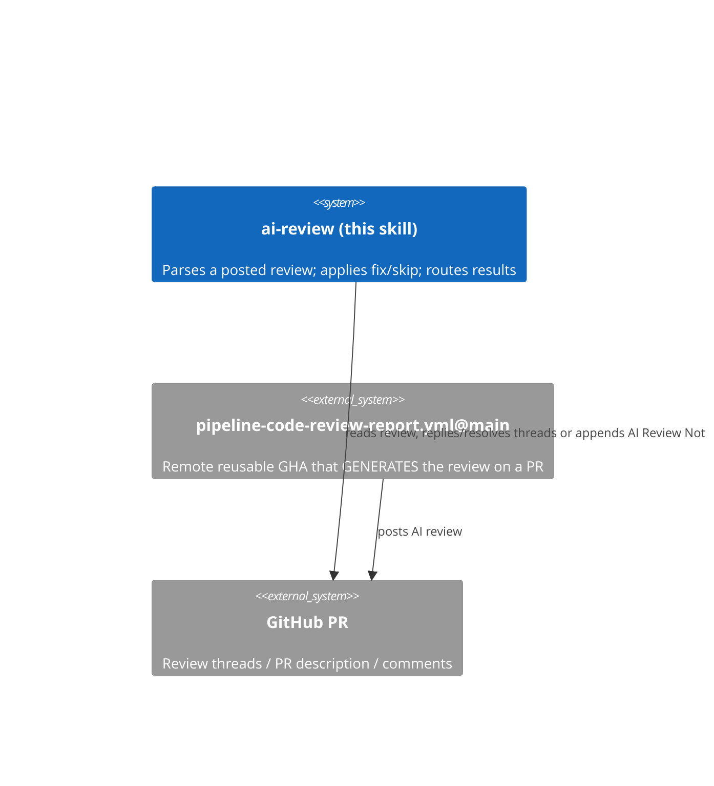

# ai-review — Maintenance Context

## TL;DR

Vendored copy of the `/ai-review` consumer skill from `generic-automation-and-it/smooth-ai-report-review`. It *parses* an AI PR review and applies per-issue fix/skip decisions; it does **not** generate the review. Treat this directory as a mirror of upstream — fixes belong upstream, not here.

## Non-Negotiables

- **Do not hand-edit the skill logic here to fix bugs.** This is a downstream copy. Changes made locally diverge from upstream and are lost on the next sync. File the fix in the upstream repo, then re-copy.
- **Only the `ai-review` consumer skill is installed.** The review *generator* (`ai-review-report` skill + its scripts) is intentionally NOT copied — it runs remotely via the reusable GitHub Actions workflow (`.github/workflows/pipeline-code-review-report.yml`, which `uses:` the upstream `pipeline-code-review-report.yml@main`). Do not copy the generator tree in to "complete" the install.
- **Script-path duality:** `SKILL.md` references `.agents/skills/ai-review/scripts/copilot-review.sh` for this copy-install. The `${CLAUDE_PLUGIN_ROOT}/...` variant in `SKILL.md` applies only when the skill runs from the upstream Claude Code plugin (`smooth-ai-review`) — not here. Keep the copy-install path permitted in `.agents/settings.json`.

## System Context

Two halves, deliberately split: the remote GHA produces the review report on a PR; this local skill consumes it. The user drives the consumer with `/ai-review <pr>` (analyse) then `/ai-review <pr> 1=fix 2=skip` (execute).

## Key Behaviors

- **Mode auto-detect:** any `N=fix`/`N=skip` arg → execute; otherwise analyse. Analyse always STOPS and never auto-executes.
- **Source routing:** auto-detects Copilot vs other via `copilot-review.sh detect <pr>`. Copilot → reply/resolve each linked review thread + post a summary comment. Other → append the fix/skip table to the PR description's AI Review Notes (append, never overwrite).
- **All deterministic GitHub plumbing** (detect/threads/reply/resolve/summary) lives in `scripts/copilot-review.sh`; the skill keeps only the judgment (parsing + fix/skip + reply text).

## Changelog

| Date | Change | Ref |
|:-----|:-------|:----|
| 2026-06-20 | Vendored `/ai-review` consumer skill from smooth-ai-report-review; generator kept remote via thin caller workflow. | |
