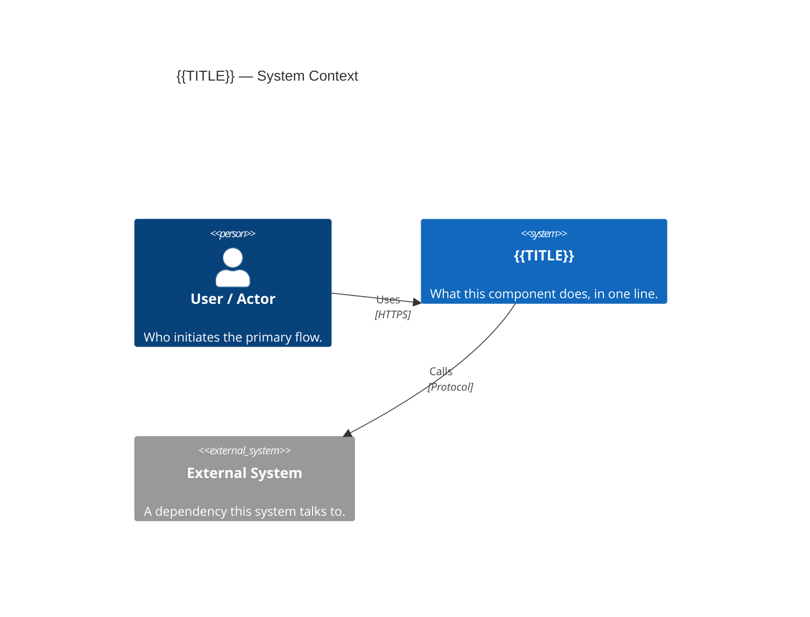
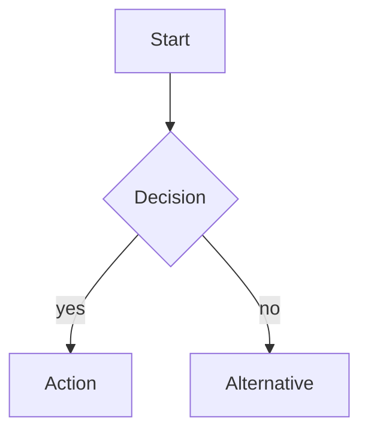
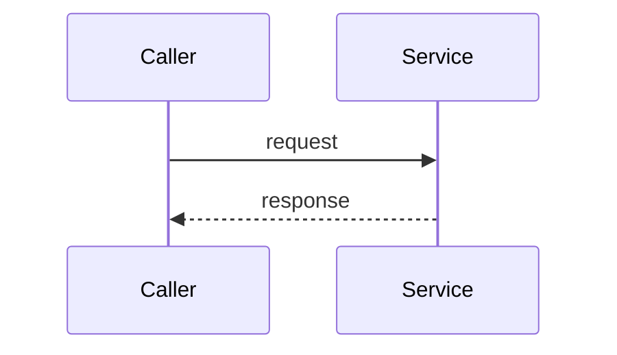
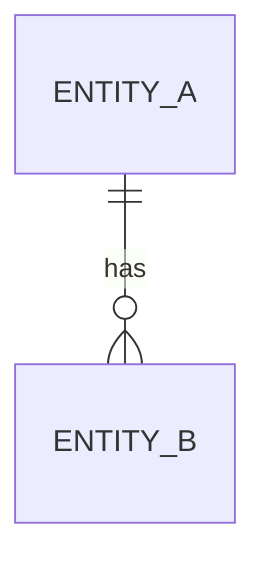
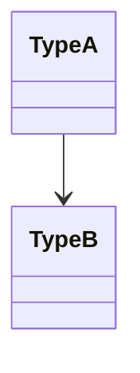

# Diagrams — {{TITLE}}

The **C1 System Context** below is the mandatory floor for every HLD. Add further diagrams
only where they earn their place (see the skill's `references/diagram-selection.md`); each
addition gets its own `## ` section here (or its own file in this folder) and a one-line
rationale.

## System Context (C1)

<2–4 sentences: what this system is and its immediate external dependencies.>



<!--
Recommended additional diagrams — keep only those that add understanding, delete the rest:

## Container View (C2)        — when the system splits into >1 deployable/runtime unit
```mermaid
C4Container
    title {{TITLE}} — Containers
    ...
```

## Flow — <named flow>        — process/decision flows; a path through the system


## Sequence — <named flow>    — interactions with 3+ steps OR side effects (email, queue, external call)


## Data Model               — 3+ related entities with non-obvious relationships


## Domain Types             — key classes/types and their relationships

-->
