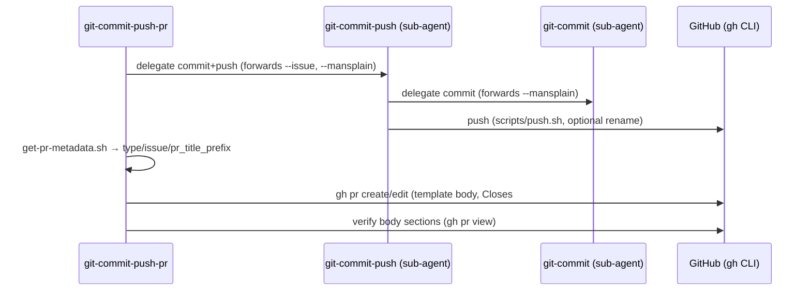

# git-commit-push-pr — AGENTS.md

## TL;DR

Top of the git skill chain; PRs are **draft by default**, titles follow `<type>[{ticket}]: <description>`, and the branch name is the single source for the issue number (via `scripts/get-pr-metadata.sh`).

## System Context

## Non-Negotiables

- **PR body is ALWAYS the repo template** (`.github/pull_request_template.md`) — no custom formats; updates are full replacements that must preserve the existing AI Review Notes section.
- **Never guess a ticket number.** Empty `issue` from the metadata script on a ticketless branch means: skip the `Closes #` link gracefully, don't invent one.

## Key Behaviors

- `scripts/get-pr-metadata.sh` parses the branch per git-policy and returns `pr_title_prefix` (`<type>[<issue>]` / `<type>[NO-TICKET]`); an **empty `type` signals a non-conforming branch**, which is the trigger to derive the type from commits instead. The legacy version of this script used the retired `Bugfix`/`Hotfix`/JIRA-ticket vocabulary — don't reintroduce it.
- PR titles become squash-commit messages on `main`; that's why the title gate is stricter than the commit gate.

## Changelog

| Date | Change | Ref |
|:-----|:-------|:----|
| 2026-06-12 | Initial version. `get-pr-metadata.sh` rewritten to current convention and wired into SKILL.md; `push.sh` relocated to git-commit-push; redundant gh-CLI reference section removed. | |
