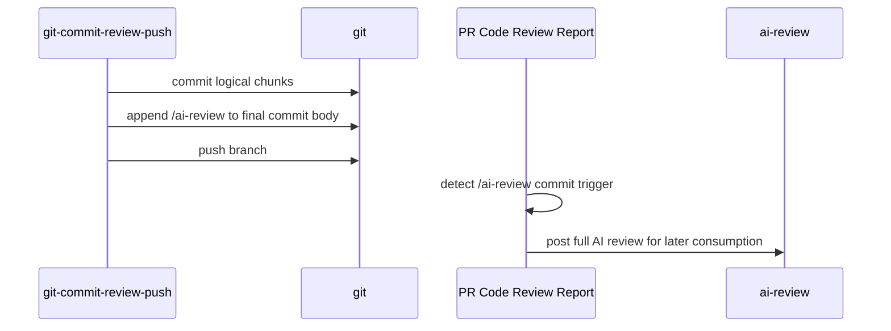

# git-commit-review-push — AGENTS.md

## TL;DR

Vendored copy of the upstream `git-commit-review-push` skill from `generic-automation-and-it/smooth-ai-report-review`. It commits logical conventional chunks, appends `/ai-review` to the final commit body, and pushes so the PR receives a full review from the report workflow.

## Non-Negotiables

- Treat `SKILL.md` and `agents/openai.yaml` as upstream mirrors. Fix behavior upstream, then re-copy here.
- Keep `/ai-review` as the final line of the final commit message body. The report workflow relies on that trigger to force a full review.
- Do not turn this into a PR-management skill. It intentionally stops after commit and push; `git-commit-push-pr` owns PR creation/update.

## System Context

## Key Behaviors

- Conventional commit subjects stay clean; the review trigger belongs only in the body of the last chunk commit.
- `--issue <number>` may rename the branch before push using the same type vocabulary as the git policy.
- A pushed `/ai-review` trigger complements the local `ai-review` consumer skill: the workflow generates a full review, then `/ai-review <pr>` can parse and execute fix/skip decisions.

## Changelog

| Date | Change | Ref |
|:-----|:-------|:----|
| 2026-07-05 | Reordered sections to match the AGENTS.md hook and quality-rule requirement: `Non-Negotiables` now appears before `System Context`. | |
| 2026-07-05 | Vendored `git-commit-review-push` from smooth-ai-report-review and documented its `/ai-review` full-review trigger relationship. | |
| 2026-07-06 | Re-vendored from upstream: added step 4 (verify `/ai-review` is the last non-empty line of the final commit body and amend if missing, with merge-commit and trailer-safe handling) and `Bash(git log:*)` to the allowed tools. | |
