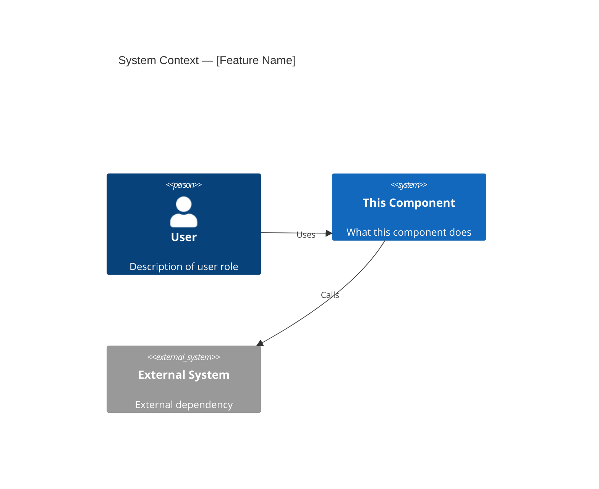
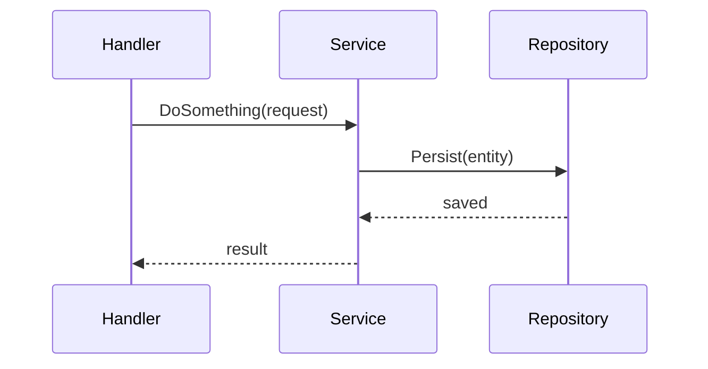
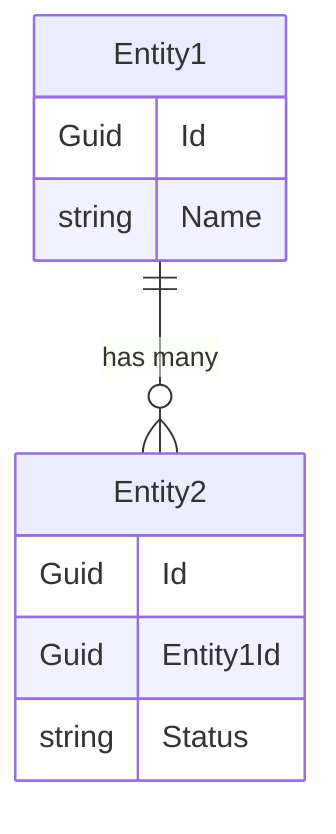

# AGENTS.md — \[Feature/Context Name\]

## TL;DR

\[One line: what this does and its most important constraint or behavior.\]

## Non-Negotiables

\[Safety guardrails, forbidden patterns, things an AI agent must never do. Only include items an AI coder would plausibly get wrong. Omit this section if nothing qualifies.\]

- \[Forbidden pattern or required invariant\]

## System Context

\[2–4 sentences describing what this component does and how it fits into the broader system.\]

Include the applicable diagram type(s) below. Omit any that do not apply.

**C4Context** — use for services/workers/modules with external integrations (APIs, databases, queues, third-party systems):

**sequenceDiagram** — use for handlers/services/workflows with 3+ steps or any side effects (emails, SignalR, external API calls, queue messages):

**erDiagram** — use for DbContext files, repositories, or services that operate on 3+ related entities with non-obvious relationships:

## Architecture Decisions

### LADR-001: \[Decision Title\]

- **Date**: \[YYYY-MM-DD\]
- **Status**: \[Proposed/Accepted/Deprecated\]
- **Context**: \[Why this decision was needed\]
- **Decision**: \[What was decided\]
- **Consequences**: \[What this means for the system\]

## Key Behaviors

\[Non-obvious behaviors, edge cases, and cross-cutting concerns not apparent from source code. Omit this section if nothing qualifies.\]

- \[Behavior or edge case\]

## Test References

\[Backend only. Test tier (L0/L1) and sub-folder path within test projects. Omit if no tests exist.\]

- L0 unit tests: `test/[TestProject]/[SubFolder]/`
- L1 integration tests: `test/[TestProject]/[SubFolder]/`

## Quality Constraints

\[Feature-specific non-functional requirements beyond the project-wide baseline. Only include constraints that would change how code is written. Omit if none exist.\]

- \[Constraint\]

## Migration Plans

\[Planned migrations, deprecations, or technical debt that affects how new code should be written. Include what's changing, the target state, and what to avoid building on. Omit if none exist.\]

- \[Migration or deprecation item\]

## Changelog

| Date | Change | Ref |
|:-----|:-------|:----|
| \[YYYY-MM-DD\] | \[What changed\] | \[Ticket/PR\] |
