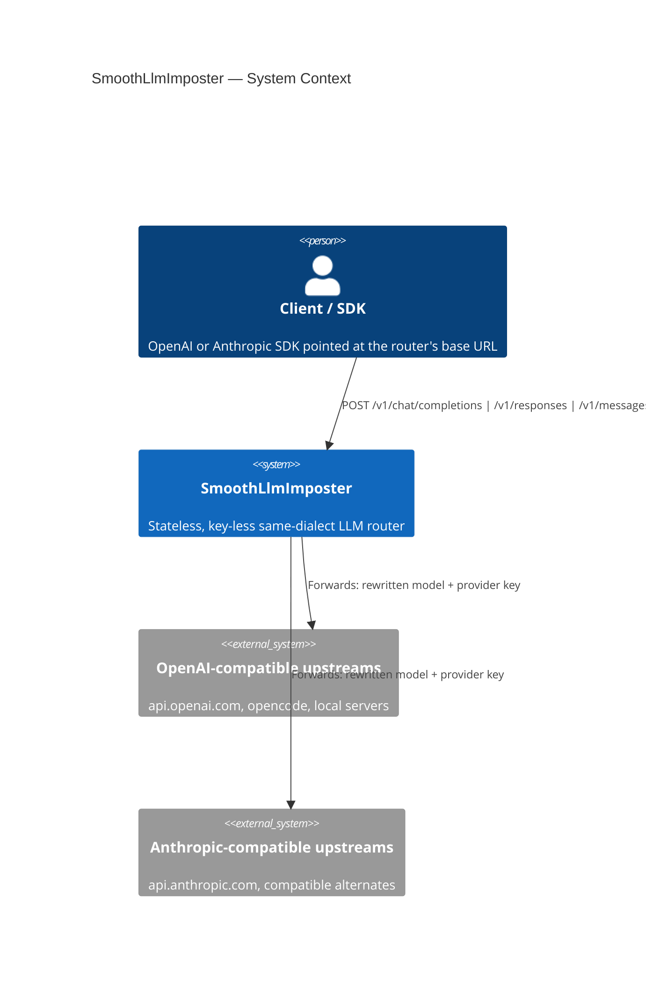
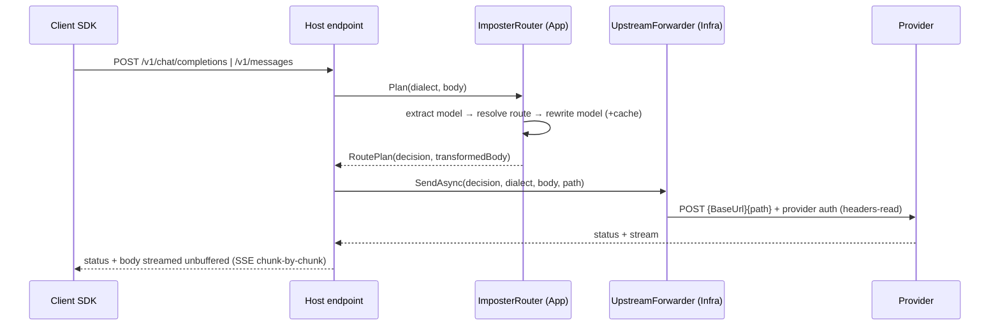
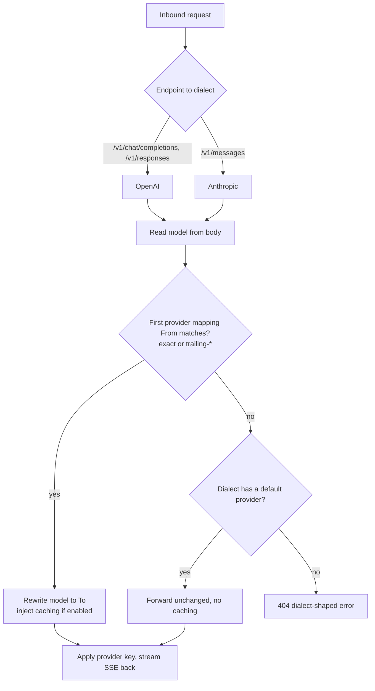

# HLD 001 — LLM Imposter Routing

Status: Accepted · 2026-06-14

## Problem

Teams want to transparently redirect specific model calls to alternate, cheaper, or local upstreams
without changing client code or storing credentials — and have the router add prompt caching that the
target upstream doesn't apply itself. This is a sibling of the Smooth Claude Proxy, with three key
differences: it stores no keys, it accepts **both** OpenAI and Anthropic dialects, and routing is a
configurable array of per-provider model mappings rather than one fixed route.

## Solution overview

A stateless ASP.NET Core minimal-API service. Inbound dialect is determined by the endpoint
(`/v1/chat/completions`, `/v1/responses` → OpenAI; `/v1/messages` → Anthropic). For each request the
router reads `model`, selects the first matching provider mapping (config order), rewrites the model,
optionally injects caching, applies the provider's configured key, and streams the upstream response back
unbuffered. Unmatched models pass through to the dialect's default provider unchanged. Routing is
**same-dialect only** — there is no OpenAI⇄Anthropic body translation.

## System context



## Request flow



## Routing decision



## Configuration

- Bound from the `Imposter` section; **environment variables override `appsettings.json`** (env wins),
  e.g. `Imposter__Providers__1__ApiKey=sk-...`.
- A **provider** = `Name` + `Api` (dialect) + `BaseUrl` (server root, no `/v1`) + `ApiKey` + `IsDefault`,
  holding nested `Models[]` of `{ From, To, Caching }`. `From` supports exact + trailing-`*` wildcard.
- Keys are configuration-only and never persisted. Startup validation (`ValidateOnStart`) rejects unknown
  dialects, non-absolute base URLs, duplicate names, malformed mappings, and >1 default per dialect.

```jsonc
"Imposter": { "Providers": [
  { "Name": "openai-official", "Api": "openai", "BaseUrl": "https://api.openai.com", "ApiKey": "", "IsDefault": true },
  { "Name": "opencode-go", "Api": "openai", "BaseUrl": "https://opencode.example", "ApiKey": "",
    "Models": [ { "From": "gpt5.4", "To": "opencode/grok-code", "Caching": true } ] },
  { "Name": "anthropic-official", "Api": "anthropic", "BaseUrl": "https://api.anthropic.com", "ApiKey": "", "IsDefault": true }
] }
```

## Architecture

Clean Architecture, no persistence: `Domain` (routing value objects + matcher) → `Application`
(`Features/Routing`: options, catalog, resolver, transformers, router, error factory) → `Infrastructure`
(`UpstreamForwarder` over `IHttpClientFactory`) → `Host` (endpoints + composition). Body transformation is
pure string-in/string-out in Application; all HTTP I/O is in Host; Infrastructure is `System.Net.Http` only.

## Architecture decisions (LADRs)

### LADR-001 — No Mediator / no FluentValidation request pipeline

- **Date / Status:** 2026-06-14 · Accepted
- **Context:** The backend rules mandate Mediator dispatch with a per-request FluentValidation pipeline.
  This path is a transparent streaming proxy over **opaque** JSON bodies — there is no typed request model
  to validate field-by-field, and routing bodies through Mediator adds indirection with no benefit.
- **Decision:** Keep the forwarding path out of Mediator. Apply fail-fast validation to **configuration**
  at startup (`ImposterOptionsValidator` + `ValidateOnStart`) instead of to requests.
- **Consequences:** A reviewer expecting the standard slice shape won't find it. Request-level malformations
  are surfaced as dialect-shaped 400s by the router, not by a validation pipeline.

### LADR-002 — Stateless, no EF Core / PostgreSQL

- **Date / Status:** 2026-06-14 · Accepted
- **Context:** The core differentiator from the Smooth Claude Proxy is "stores nothing, especially not
  keys". The template shipped an EF/Npgsql/Respawn/Aspire stack.
- **Decision:** Remove all persistence and the DB-backed test stack. Keys live only in config/env.
- **Consequences:** No `Persistence/`, no migrations, no DB component tests. Usage tracking / auditing, if
  ever needed, would be a new additive decision.

### LADR-003 — Infinite client timeout, no resilience handler

- **Date / Status:** 2026-06-14 · Accepted
- **Context:** SSE responses routinely exceed `AddStandardResilienceHandler` defaults, and retrying a
  partially-streamed POST would duplicate or corrupt output.
- **Decision:** The `imposter-upstream` named client uses `Timeout.InfiniteTimeSpan`; the request is bounded
  by the caller's `RequestAborted` token. No standard resilience handler is attached.
- **Consequences:** No automatic retry on transient upstream errors; transport failures map to a 502
  dialect-shaped envelope. Add targeted retry only on the pre-response (connect) phase if needed later.

### LADR-004 — Integration tests stub the outbound transport in-process

- **Date / Status:** 2026-06-14 · Accepted
- **Context:** The template's integration harness required Postgres + Redis + WireMock containers via
  Aspire — heavy and Docker-dependent for a stateless forwarder.
- **Decision:** Replace the `imposter-upstream` client's primary `HttpMessageHandler` with a capture stub,
  exercising the real endpoint→router→transformer→forwarder pipeline with zero containers.
- **Consequences:** Tests run anywhere with no Docker/DB. WireMock/Aspire scaffolding was removed.

## Out of scope (for now)

Cross-dialect translation, `count_tokens` interception, per-model response handlers, usage tracking, and
`/v1/models` passthrough. The transformer/forwarder seams leave room to add these.
