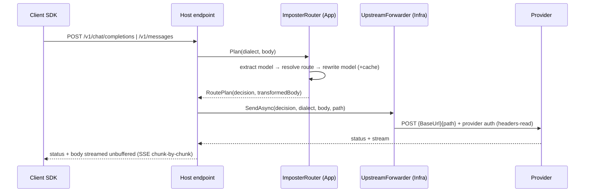

# Diagram — Request Flow

How a single request is planned, forwarded, and streamed back.

```mermaid
sequenceDiagram
    participant Client as Client SDK
    participant Endpoint as Host endpoint
    participant Router as ImposterRouter (App)
    participant Forwarder as UpstreamForwarder (Infra)
    participant Upstream as Provider
    Client->>Endpoint: POST /v1/chat/completions | /v1/messages
    Endpoint->>Router: Plan(dialect, body)
    Router->>Router: extract model → resolve route → rewrite model (+cache)
    Router-->>Endpoint: RoutePlan(decision, transformedBody)
    Endpoint->>Forwarder: SendAsync(decision, dialect, body, path)
    Forwarder->>Upstream: POST {BaseUrl}{path} + provider auth (headers-read)
    Upstream-->>Endpoint: status + stream
    Endpoint-->>Client: status + body streamed unbuffered (SSE chunk-by-chunk)
```
