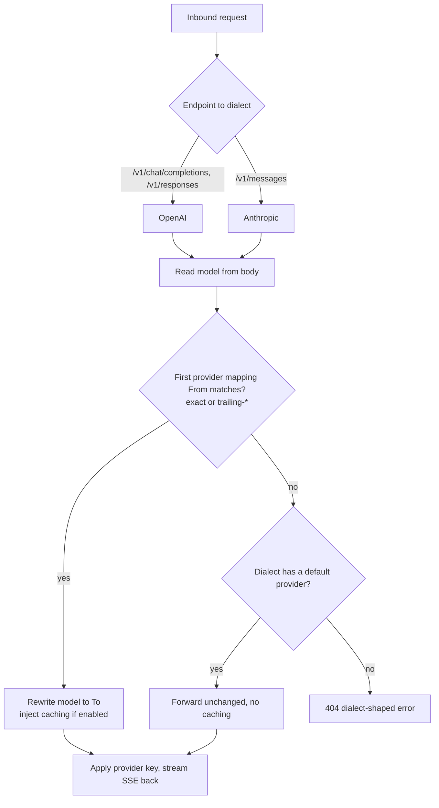

# Diagram — Routing Decision

Endpoint → dialect → first-match resolution → rewrite/passthrough/404.

```mermaid
flowchart TD
    A[Inbound request] --> B{Endpoint to dialect}
    B -->|/v1/chat/completions, /v1/responses| C[OpenAI]
    B -->|/v1/messages| D[Anthropic]
    C --> E[Read model from body]
    D --> E
    E --> F{First provider mapping From matches?<br/>exact or trailing-*}
    F -->|yes| G[Rewrite model to To<br/>inject caching if enabled]
    F -->|no| H{Dialect has a default provider?}
    H -->|yes| I[Forward unchanged, no caching]
    H -->|no| J[404 dialect-shaped error]
    G --> K[Apply provider key, stream SSE back]
    I --> K
```
