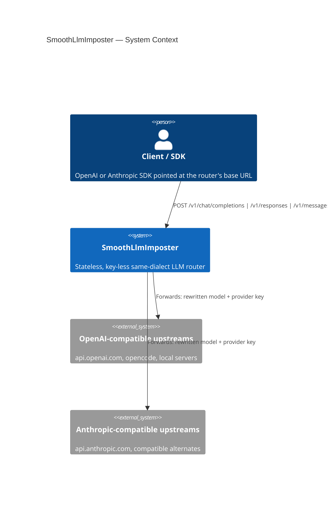

# Diagram — System Context

SmoothLlmImposter sits between OpenAI/Anthropic SDK clients and the configured upstreams.

```mermaid
C4Context
    title SmoothLlmImposter — System Context
    Person(client, "Client / SDK", "OpenAI or Anthropic SDK pointed at the router's base URL")
    System(imposter, "SmoothLlmImposter", "Stateless, key-less same-dialect LLM router")
    System_Ext(openai, "OpenAI-compatible upstreams", "api.openai.com, opencode, local servers")
    System_Ext(anthropic, "Anthropic-compatible upstreams", "api.anthropic.com, compatible alternates")
    Rel(client, imposter, "POST /v1/chat/completions | /v1/responses | /v1/messages")
    Rel(imposter, openai, "Forwards: rewritten model + provider key")
    Rel(imposter, anthropic, "Forwards: rewritten model + provider key")
```
