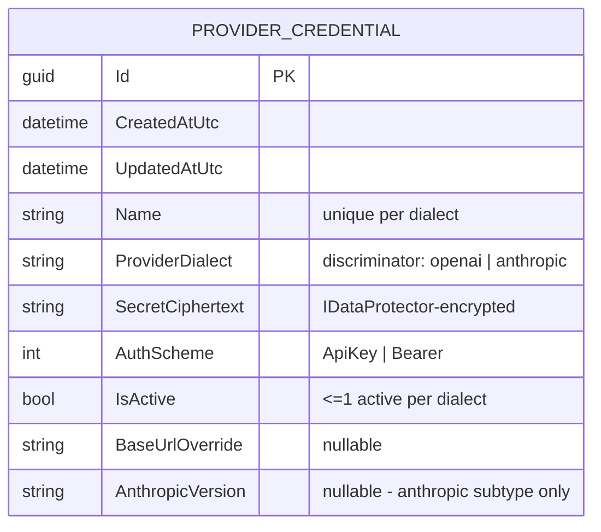

# Diagram — Credential ER

Table-per-hierarchy (TPH): one table, discriminator column `ProviderDialect`. The abstract root holds all
shared fields; subtypes add only dialect-specific columns (nullable in the shared table).

> There is a single physical table. `OpenAiCredential` and `AnthropicCredential` are EF Core TPH subtypes of
> the abstract `ProviderCredential : BaseEntity`; dialect-specific columns (e.g. `AnthropicVersion`) are
> nullable because they only apply to one discriminator value.
