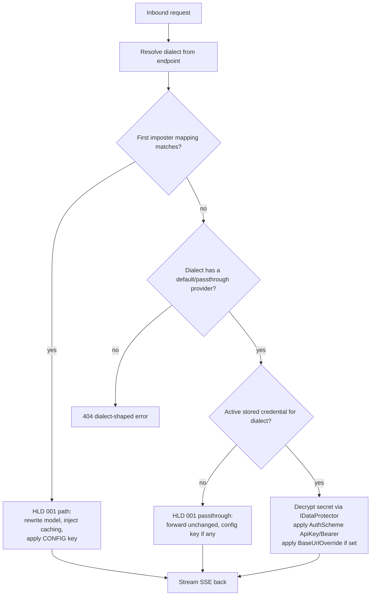

# Diagram — Credential Resolution

Where stored credentials enter the request flow. This extends HLD 001's routing decision at **one seam**:
the no-match / passthrough branch. The matched-imposter branch is identical to HLD 001.

> Decryption happens just-in-time at forward; the plaintext secret is never stored, logged, or returned by
> the admin API. The imposter branch (`yes` at the first decision) never consults PostgreSQL.
