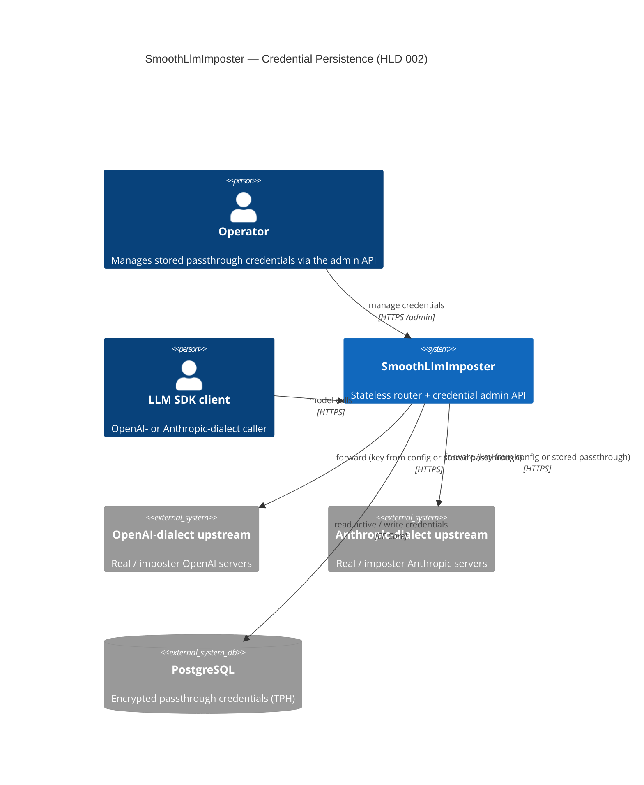

# Diagram — System Context

Adds a PostgreSQL store to the HLD 001 context. Upstream LLM providers are unchanged; the store holds
**only passthrough credentials**, encrypted at rest.

> The imposter (matched) path still draws keys from configuration only. PostgreSQL participates **only** in
> the passthrough/default path and the admin API.
