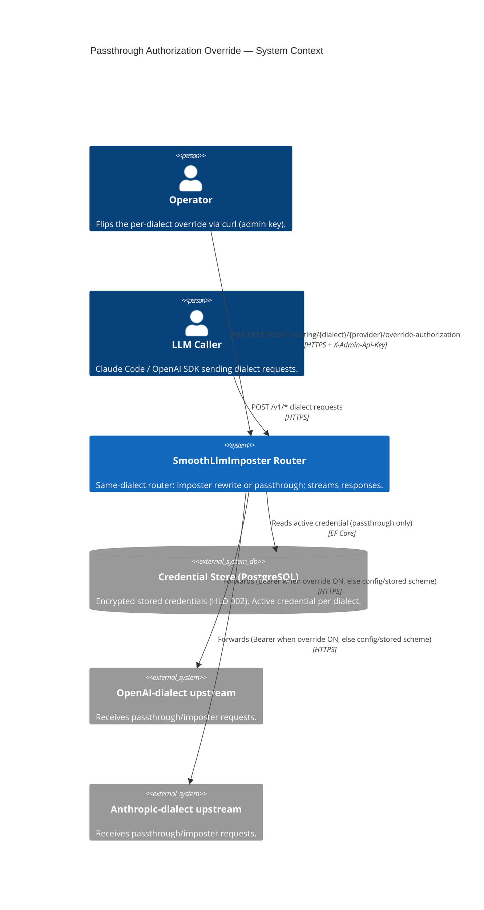
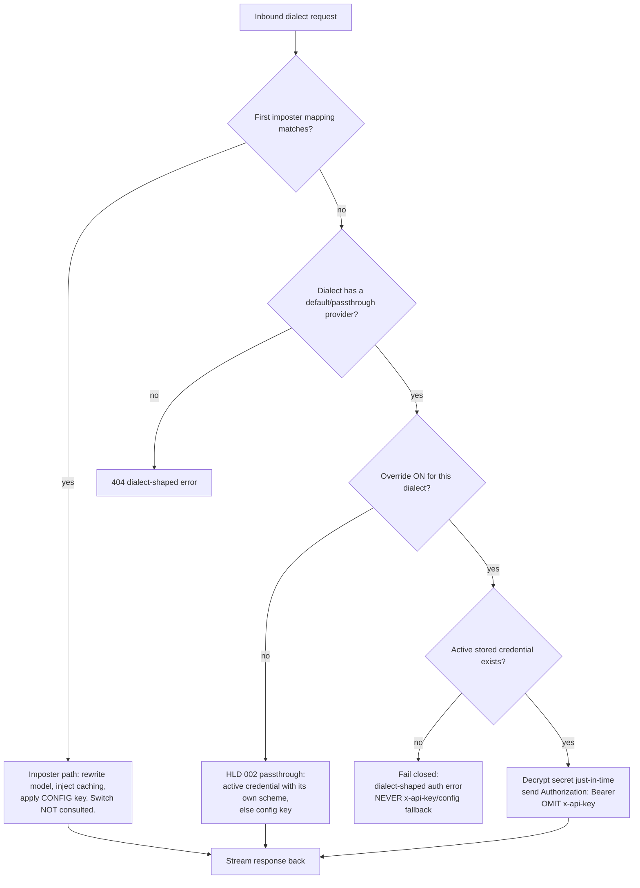

# Diagrams — Passthrough Authorization Override

Three diagrams, each earning its place:

- **System Context (C1)** — mandatory floor; shows the new operator control surface alongside the existing actors.
- **Flow** — *the* diagram to read: where the override gate sits on the passthrough branch and that imposter is untouched.
- **Sequence** — the toggle is a side-effecting interaction (in-memory state change) with a conditional `403`, plus the forced-`Bearer` forward; worth one ordered view.

No ER or class diagram: this design adds **no** entity or type to HLD 002's data model, so a data/domain diagram would only restate HLD 002.

## System Context (C1)

The router exposes key-less proxy endpoints to LLM callers and a separate admin-authorized control surface to
an operator. This HLD adds one operator control — the per-dialect authorization override — that influences how
the router presents credentials to upstreams on the **passthrough** path only. Stored credentials live in
PostgreSQL (HLD 002); the override switch itself is in-memory.



## Flow — Override-gated passthrough

Extends HLD 002's credential-resolution flow with one new gate on the **passthrough** branch. The
matched-imposter branch is identical to HLD 001/002 and never sees the switch.



## Sequence — Enable then forward

The toggle mutates in-memory state and may refuse with `403`; a subsequent passthrough request is forwarded
with a forced `Bearer` header. Participants are roles, not classes.

```mermaid
sequenceDiagram
    participant Op as Operator (curl)
    participant Ctrl as Override Control (admin-authed)
    participant Sw as Override Switch (in-memory)
    participant St as Credential Store
    participant Rt as Passthrough Forwarder
    participant Up as Upstream

    Op->>Ctrl: PUT /routing/anthropic/override-authorization (X-Admin-Api-Key)
    Ctrl->>St: Active credential for anthropic?
    alt no active credential
        St-->>Ctrl: none
        Ctrl-->>Op: 403 (cannot arm; switch stays OFF)
    else active credential exists
        St-->>Ctrl: present
        Ctrl->>Sw: set anthropic = ON
        Ctrl-->>Op: 200 (override ON)
    end

    Note over Op,Up: later — a passthrough (no-imposter-match) request arrives
    Rt->>Sw: override ON for anthropic?
    Sw-->>Rt: ON
    Rt->>St: active credential (decrypt secret)
    Rt->>Up: forward with Authorization: Bearer, no x-api-key
    Up-->>Rt: streamed response
```
