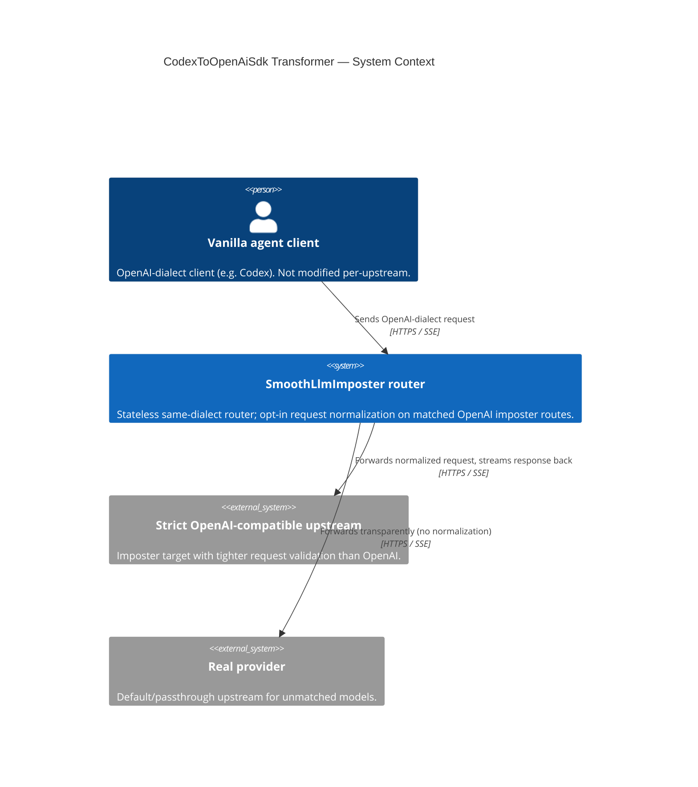
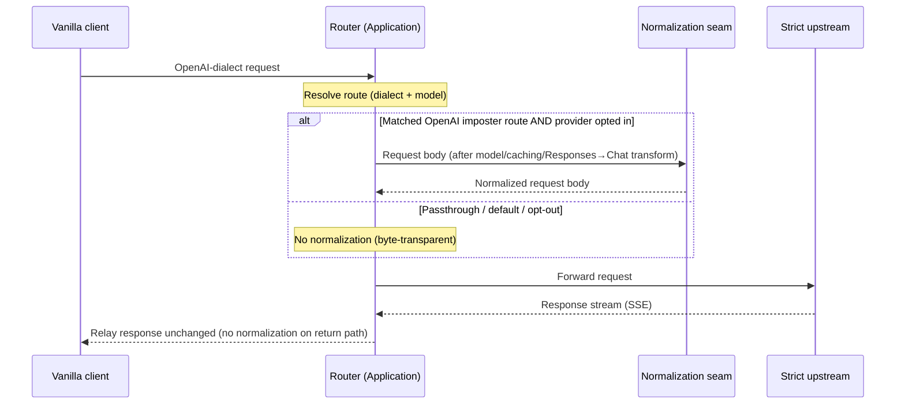

# Diagrams — CodexToOpenAiSdk Transformer

The **C1 System Context** below is the mandatory floor for every HLD. The request-flow sequence is
added because the *placement* of the normalization step and the request-only boundary are the
load-bearing ideas of this design — a flow makes that boundary legible in a way prose cannot.

## System Context (C1)

A vanilla OpenAI-dialect agent client calls the router. On a matched OpenAI imposter route, the
router may normalize the request before forwarding it to a strict OpenAI-compatible upstream; the
upstream's response is streamed back untouched. Unmatched/passthrough traffic is forwarded
transparently to the real provider. The normalization seam is internal to the router (not shown at
C1).

## Request flow — normalize in, relay out

Shows where normalization sits and the one-directional boundary: the request is reshaped before
forwarding; the response is relayed with no normalization step on the return path.

