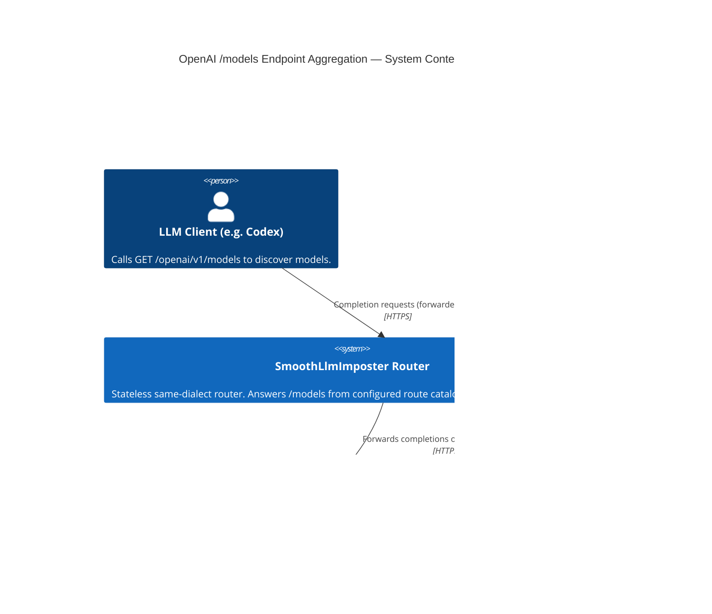
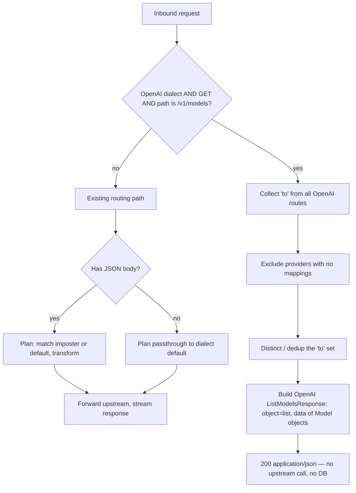

# Diagrams — OpenAI /models Endpoint Aggregation

The **C1 System Context** below is the mandatory floor for every HLD. The single supporting diagram
is a **request-decision flow**: this HLD introduces a new local-answer fork into an otherwise
transparent proxy, and that fork is the load-bearing idea worth showing end-to-end.

## System Context (C1)

An LLM client (e.g. Codex) points its OpenAI base URL at the router. For `GET /openai/v1/models`
the router answers **from its own configuration** — it does not call an upstream. All other OpenAI
traffic continues to forward to the configured upstream providers as before.

## Flow — `GET /openai/v1/models` decision

The handler recognizes exactly one case (OpenAI dialect + `GET` + post-prefix path `/v1/models`,
per LADR-03) and answers it locally; every other request falls through to the existing routing path
unchanged.

