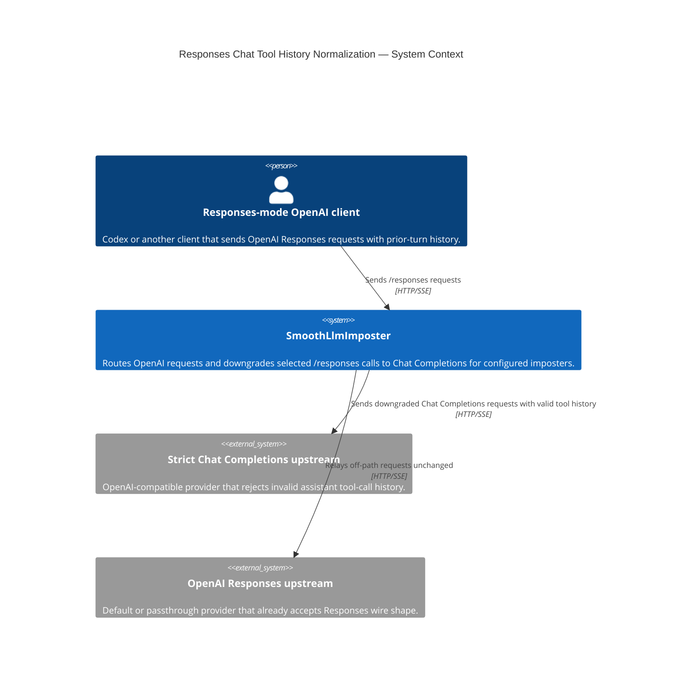
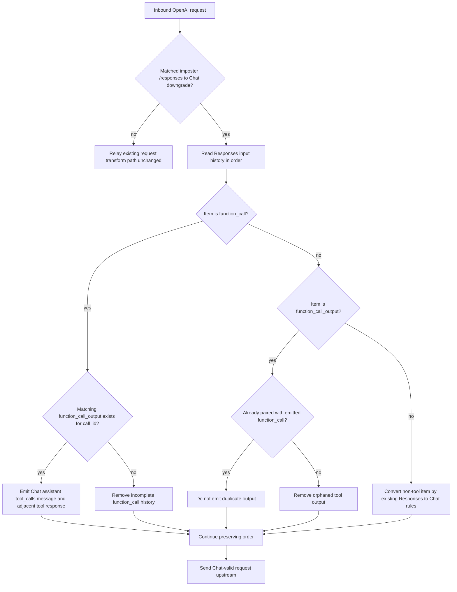

# Diagrams — Responses Chat Tool History Normalization

The C1 context shows the narrow system boundary. The request-history flow is included because the
load-bearing behavior is an ordered validation/removal path that the C1 cannot show.

## System Context (C1)

SmoothLlmImposter sits between a Responses-mode OpenAI client and an OpenAI-compatible Chat
Completions upstream. This HLD affects only the routed OpenAI imposter path where the proxy downgrades
a Responses request to Chat Completions; the upstream's strict Chat validator is the dependency that
forces the history normalization.

## Flow — Prior-Turn Tool History Downgrade

This flow earns its place because the design is about preserving only representable history while
removing invalid gaps before the strict upstream sees the Chat request.

