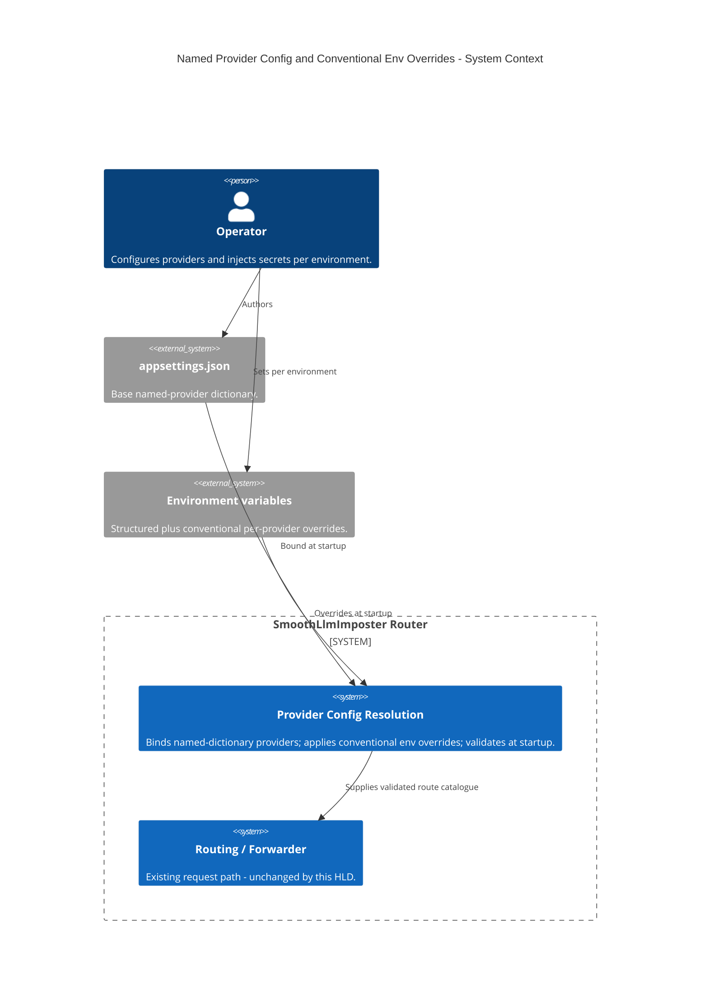
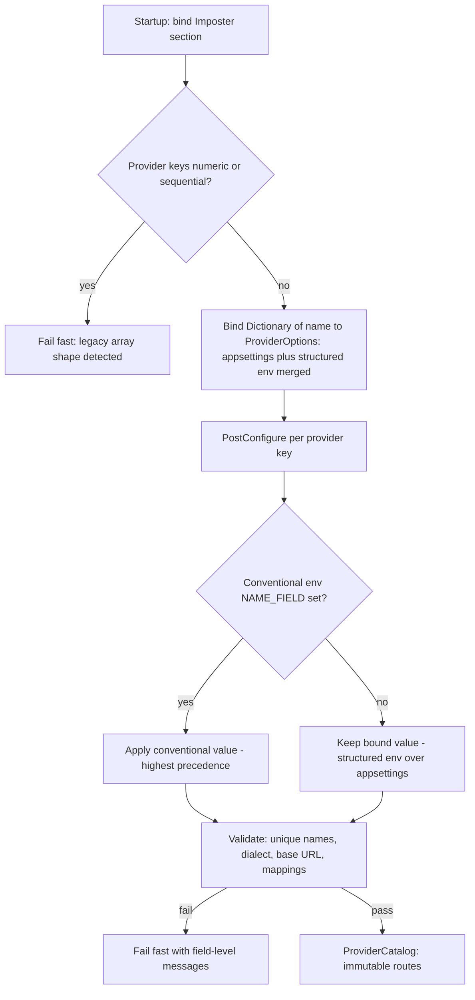

# Diagrams — Named Provider Config & Conventional Env Overrides

The **C1 System Context** below is the mandatory floor. One supporting diagram is added: the
**configuration resolution flow**, because the precedence pipeline (appsettings → structured env →
conventional env → validate) is the load-bearing behaviour of this HLD and is not obvious from the
context view alone.

## System Context (C1)

This HLD changes only how the router *loads* its provider configuration at startup — it does not
change the request path. The operator supplies provider config three ways (file, structured env,
conventional env); the router binds and validates it into the in-memory route catalogue used by the
existing forwarder. No new external dependency is introduced.

## Flow — Configuration resolution & precedence

How a single provider field's value is resolved at startup. The conventional var wins when present;
otherwise the bound value (structured env over appsettings) stands; legacy array shape fails fast.

