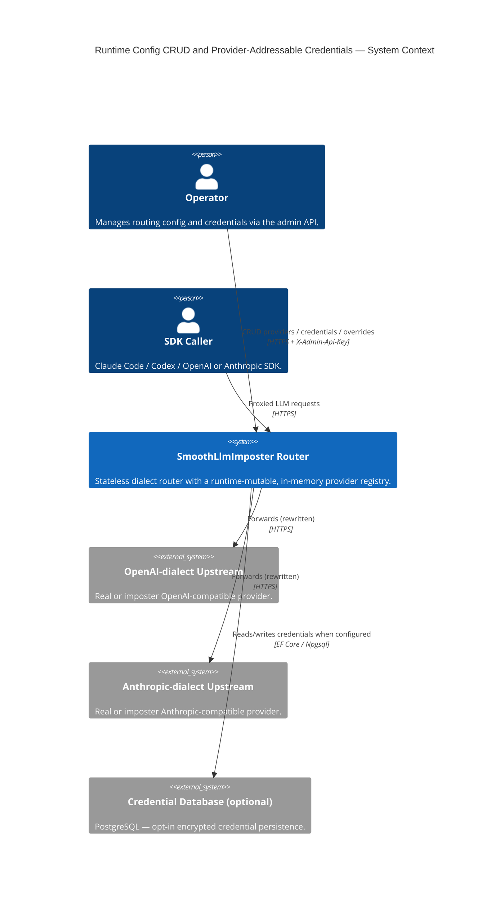
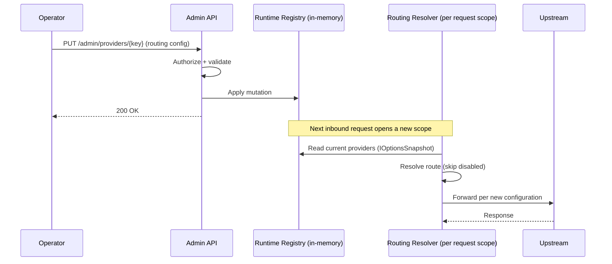
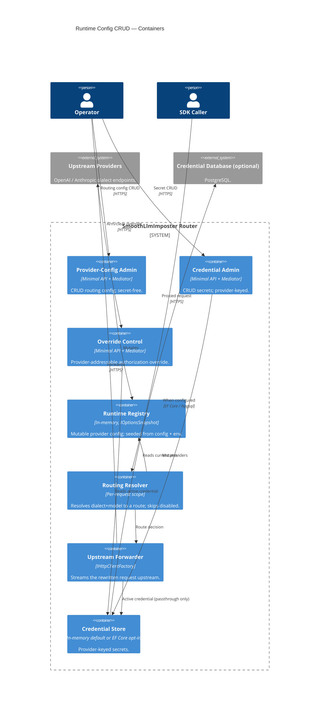

# Diagrams — Runtime Config CRUD & Provider-Addressable Credentials

The **C1 System Context** below is the mandatory floor. Two further diagrams earn their place: a **sequence**
showing how a runtime mutation becomes visible on the next proxied request (the crux of "on the fly"), and a
**container view** showing the two admin boundaries over one in-memory registry plus the optional credential
database.

## System Context (C1)

The router exposes OpenAI- and Anthropic-dialect proxy endpoints to SDK callers and an authenticated admin
surface to operators. Operators reshape routing and credentials at runtime; the registry is in-memory and
seeded from config + environment, with an optional database backend only for persisted credentials.

## Sequence — Runtime mutation becomes visible

A successful admin write mutates the in-memory registry; the next proxied request reads the current registry
through `IOptionsSnapshot` (re-evaluated per request scope) and resolves against the new configuration —
no restart, no cache-invalidation step.

## Container View (C2)

Two admin boundaries write one registry: provider-config (secret-free) and credentials (secret-only). The
resolution path reads the registry per request; the optional database backs only the credential store.

