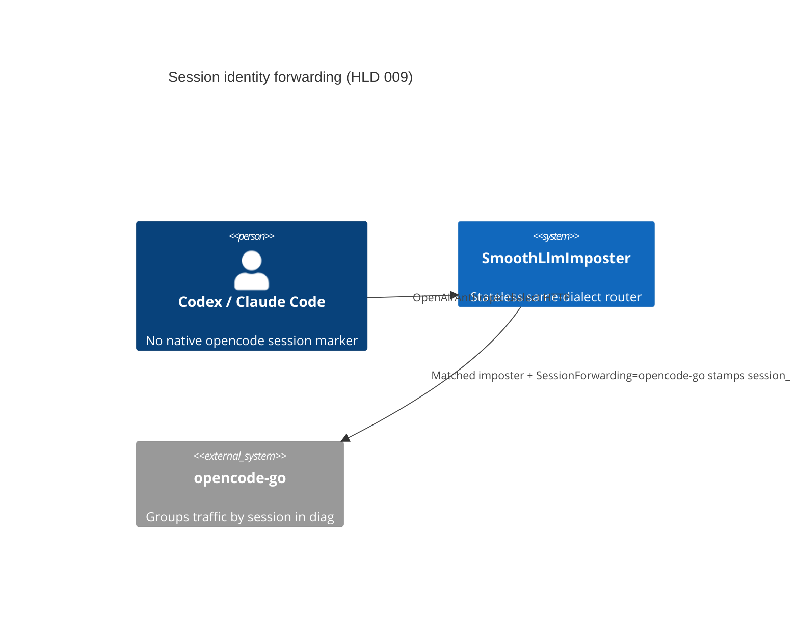
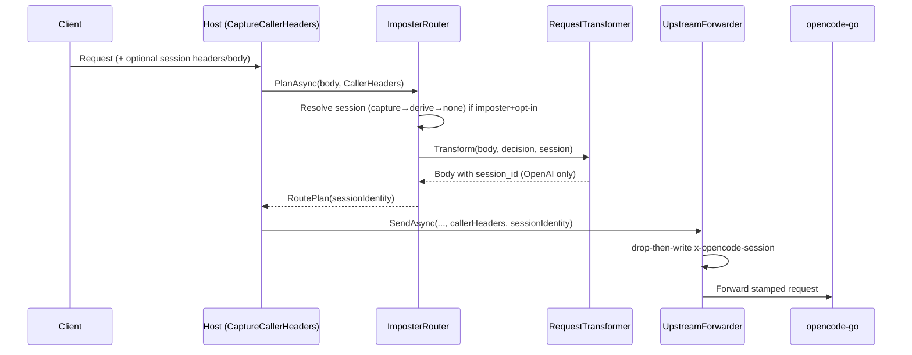

# C4 Context + session-forwarding request flow

```mermaid
C4Context
  title Session identity forwarding (HLD 009)

  Person(client, "Codex / Claude Code", "No native opencode session marker")
  System(router, "SmoothLlmImposter", "Stateless same-dialect router")
  System_Ext(opencode, "opencode-go", "Groups traffic by session in diag")

  Rel(client, router, "OpenAI/Anthropic dialect HTTP")
  Rel(router, opencode, "Matched imposter + SessionForwarding=opencode-go stamps session_id + x-opencode-session")
```

```mermaid
sequenceDiagram
  participant C as Client
  participant H as Host (CaptureCallerHeaders)
  participant R as ImposterRouter
  participant T as RequestTransformer
  participant F as UpstreamForwarder
  participant U as opencode-go

  C->>H: Request (+ optional session headers/body)
  H->>R: PlanAsync(body, CallerHeaders)
  R->>R: Resolve session (capture→derive→none) if imposter+opt-in
  R->>T: Transform(body, decision, session)
  T-->>R: Body with session_id (OpenAI only)
  R-->>H: RoutePlan(sessionIdentity)
  H->>F: SendAsync(..., callerHeaders, sessionIdentity)
  F->>F: drop-then-write x-opencode-session
  F->>U: Forward stamped request
```
