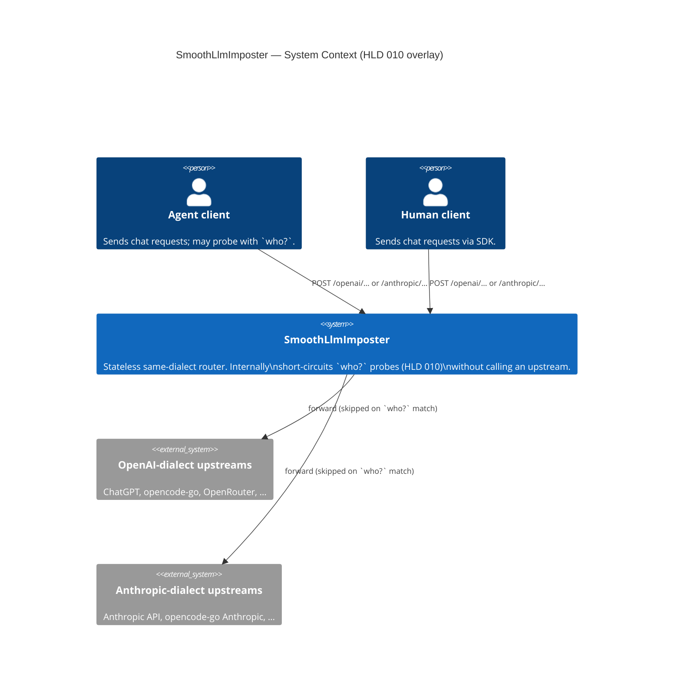
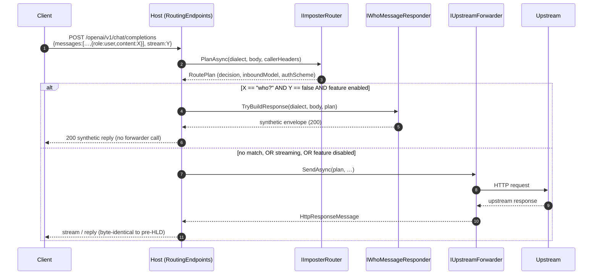
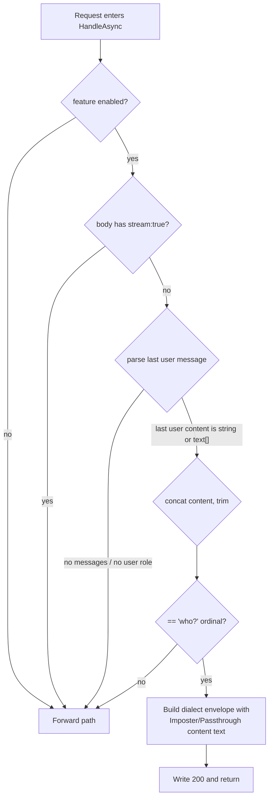

# Diagrams — Who-Message Introspection

## C1 — System Context

The probe does not introduce any new external system. The system context is identical to
HLD 001's; the short-circuit is internal to the proxy container. The diagram below
repeats C1 for completeness, with the probe's short-circuit noted as an internal
behavior of the proxy.

## Sequence — probe match vs. forward

Two scenarios on the same diagram. The `alt` block shows the short-circuit.

## Flowchart — decision gate

The responder's internal gate. Every "no" falls through to the forward path.

## Diagram selection rationale

Per `references/diagram-selection.md`:

- **C1 System Context** — included (mandatory floor). The probe adds no external
  dependency, so C1 is a re-statement of HLD 001's with a note.
- **Sequence** — included because the probe adds a new branch to the request flow;
  readers need to see where the short-circuit sits relative to the forwarder.
- **Flowchart** — included because the decision gate has 5 short-circuit predicates;
  a flowchart makes the "fail transparent" property visible at a glance.
- **Container / Component / ER / Class** — not included. The probe adds no new
  container, no new persistent entity, and no class hierarchy worth diagramming.
