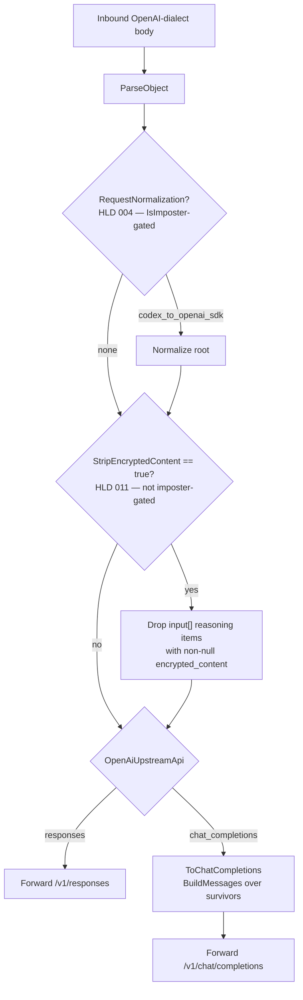
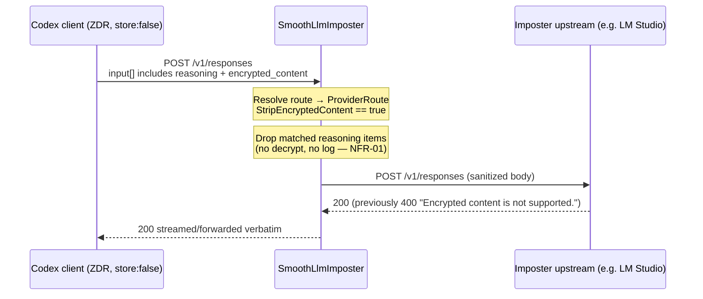

# Transform-stage ordering

The design fact worth a diagram is **where** the strip sits: after normalization, before
the `chat_completions` downgrade, so both upstream API shapes inherit it.

Two properties the ordering buys:

- The downgrade never needs ZDR awareness — by the time `ToChatCompletions` runs, matched
  items are already gone.
- The strip is reachable on the `responses` path, where `RequestNormalization` is forbidden
  by the validator. That is the whole motivating case (LADR-02).

## Request/response sequence

