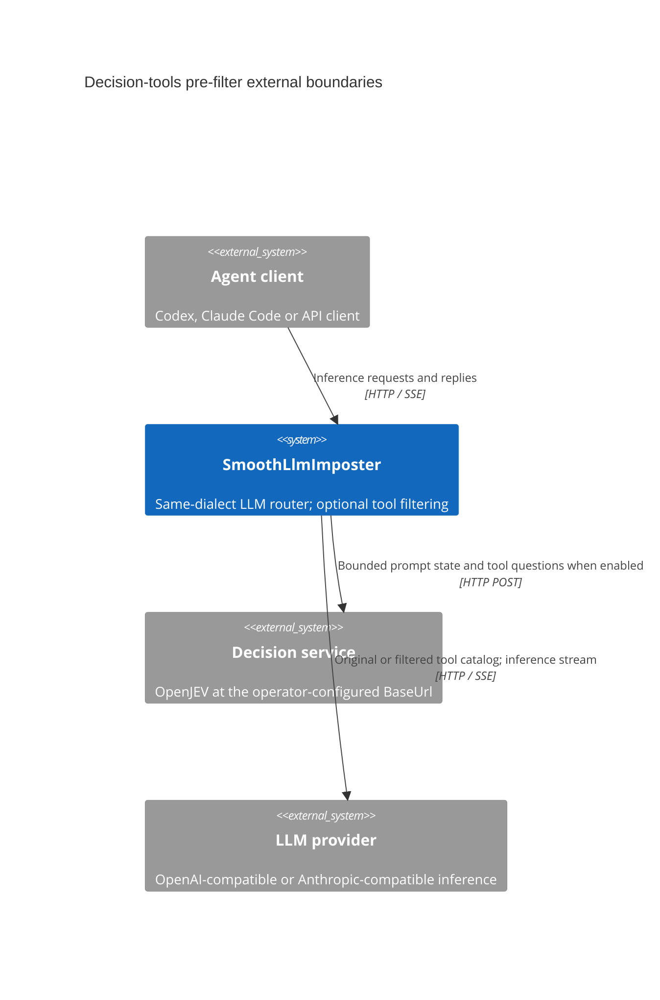

# System Context

```mermaid
C4Context
    title Decision-tools pre-filter external boundaries
    System_Ext(agent, "Agent client", "Codex, Claude Code or API client")
    System(router, "SmoothLlmImposter", "Same-dialect LLM router; optional tool filtering")
    System_Ext(decision, "Decision service", "OpenJEV at the operator-configured BaseUrl")
    System_Ext(upstream, "LLM provider", "OpenAI-compatible or Anthropic-compatible inference")
    Rel(agent, router, "Inference requests and replies", "HTTP / SSE")
    Rel(router, decision, "Bounded prompt state and tool questions when enabled", "HTTP POST")
    Rel(router, upstream, "Original or filtered tool catalog; inference stream", "HTTP / SSE")
```
