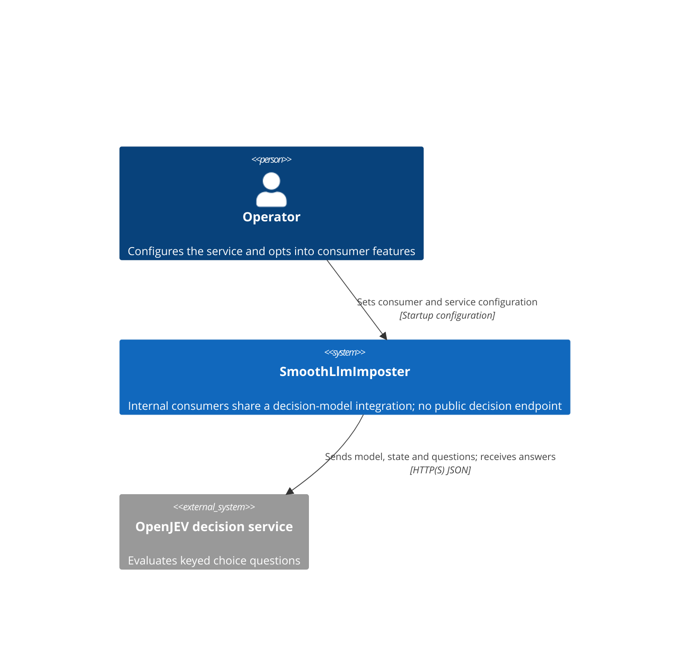

# Shared decision integration — system context

```mermaid
C4Context
    Person(operator, "Operator", "Configures the service and opts into consumer features")
    System(imposter, "SmoothLlmImposter", "Internal consumers share a decision-model integration; no public decision endpoint")
    System_Ext(decisions, "OpenJEV decision service", "Evaluates keyed choice questions")
    Rel(operator, imposter, "Sets consumer and service configuration", "Startup configuration")
    Rel(imposter, decisions, "Sends model, state and questions; receives answers", "HTTP(S) JSON")
```
