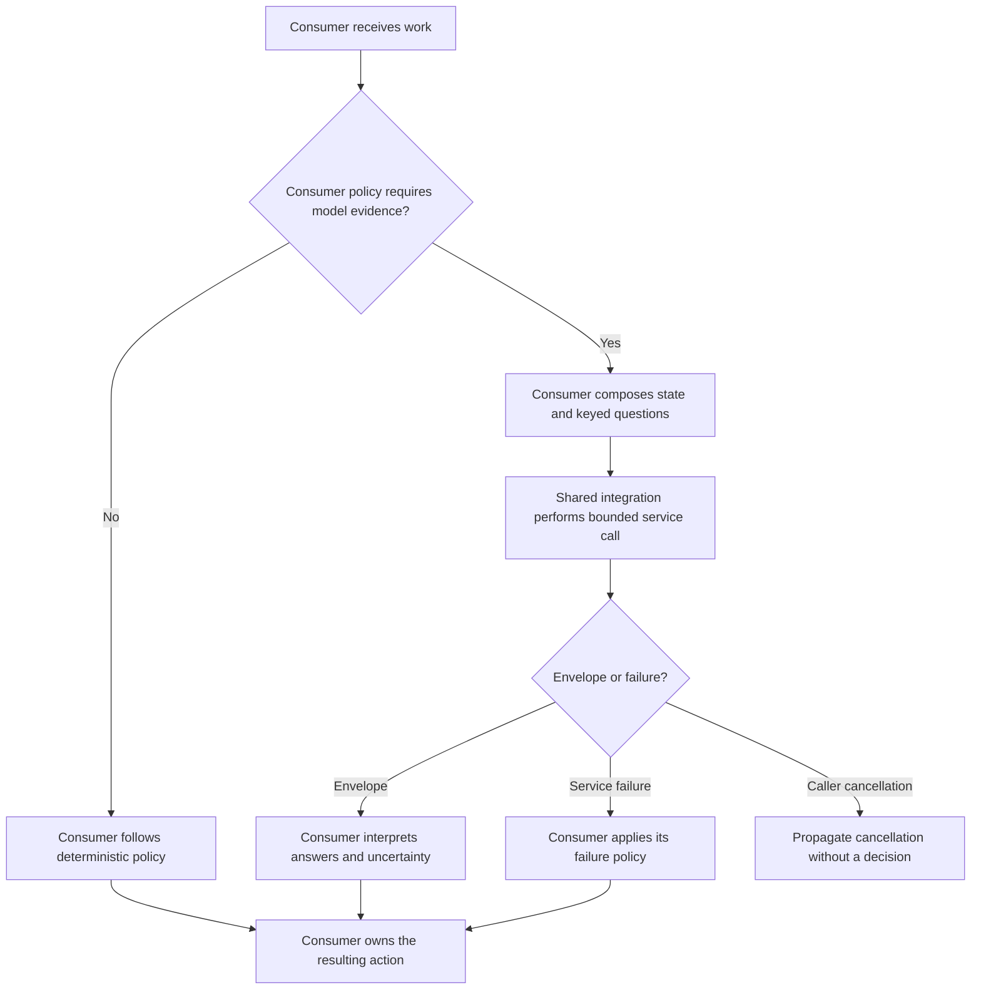

# Policy versus model evidence

```mermaid
flowchart TD
    request[Consumer receives work] --> eligible{Consumer policy requires model evidence?}
    eligible -->|No| deterministic[Consumer follows deterministic policy]
    eligible -->|Yes| questions[Consumer composes state and keyed questions]
    questions --> integration[Shared integration performs bounded service call]
    integration --> outcome{Envelope or failure?}
    outcome -->|Envelope| interpret[Consumer interprets answers and uncertainty]
    outcome -->|Service failure| fallback[Consumer applies its failure policy]
    outcome -->|Caller cancellation| cancel[Propagate cancellation without a decision]
    deterministic --> action[Consumer owns the resulting action]
    interpret --> action
    fallback --> action
```
