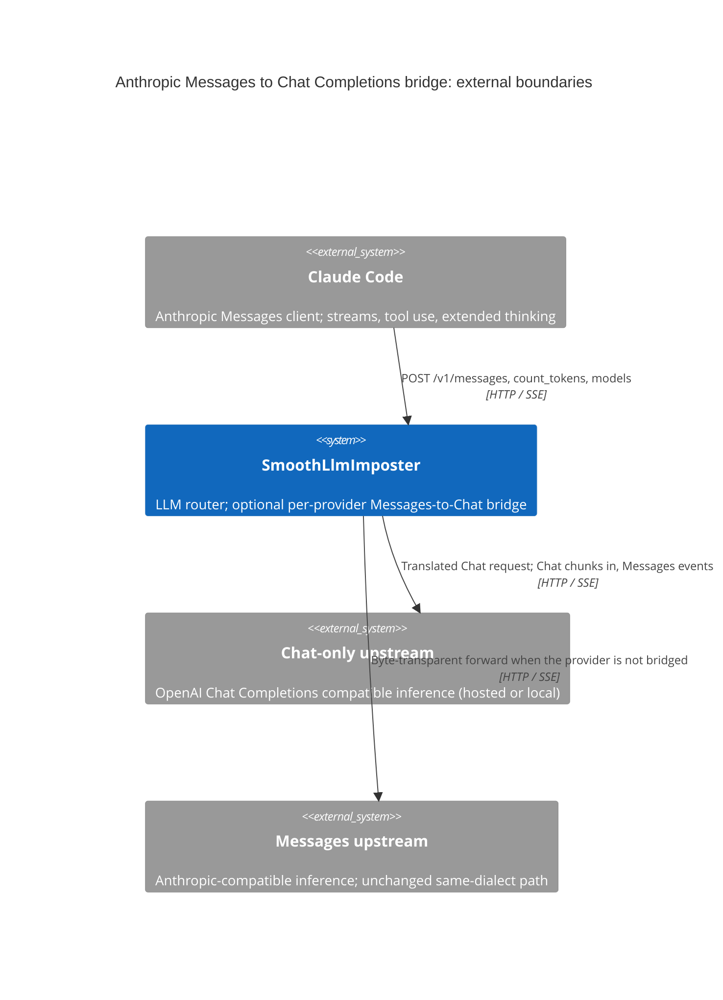

# System Context

```mermaid
C4Context
    title Anthropic Messages to Chat Completions bridge: external boundaries
    System_Ext(harness, "Claude Code", "Anthropic Messages client; streams, tool use, extended thinking")
    System(router, "SmoothLlmImposter", "LLM router; optional per-provider Messages-to-Chat bridge")
    System_Ext(chat, "Chat-only upstream", "OpenAI Chat Completions compatible inference (hosted or local)")
    System_Ext(native, "Messages upstream", "Anthropic-compatible inference; unchanged same-dialect path")
    Rel(harness, router, "POST /v1/messages, count_tokens, models", "HTTP / SSE")
    Rel(router, chat, "Translated Chat request; Chat chunks in, Messages events out", "HTTP / SSE")
    Rel(router, native, "Byte-transparent forward when the provider is not bridged", "HTTP / SSE")
```
