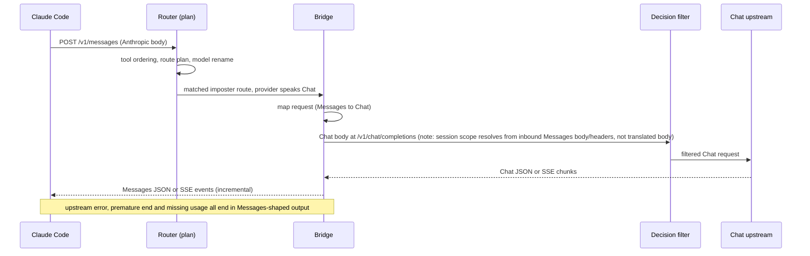

# Bridged Turn

Where the bridge sits in one `/v1/messages` request. Only the marked steps are new; everything else is the existing pipeline.

```mermaid
sequenceDiagram
    participant H as Claude Code
    participant R as Router (plan)
    participant B as Bridge
    participant F as Decision filter
    participant U as Chat upstream
    H->>R: POST /v1/messages (Anthropic body)
    R->>R: tool ordering, route plan, model rename
    R->>B: matched imposter route, provider speaks Chat
    B->>B: map request (Messages to Chat)
    B->>F: Chat body at /v1/chat/completions (note: session scope resolves from inbound Messages body/headers, not translated body)
    F->>U: filtered Chat request
    U-->>B: Chat JSON or SSE chunks
    B-->>H: Messages JSON or SSE events (incremental)
    Note over B,H: upstream error, premature end and missing usage all end in Messages-shaped output
```
