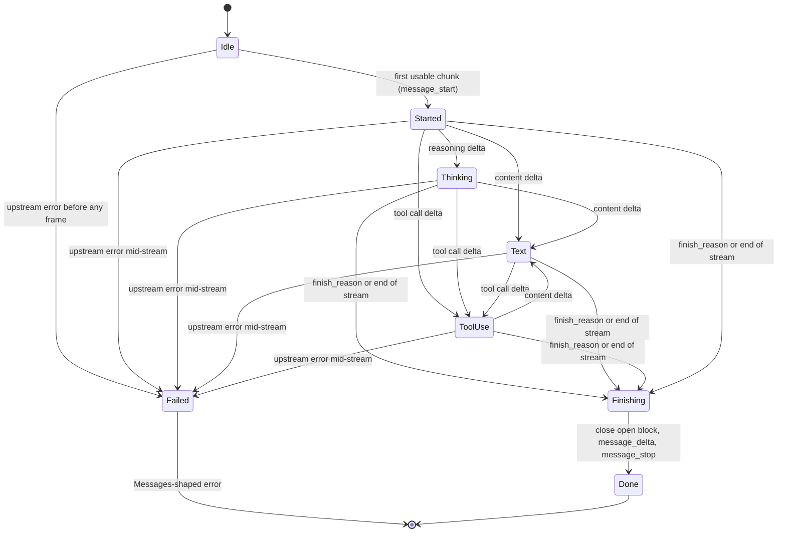

# Stream Translation States

Per-stream states of the Chat-chunk to Messages-event translation. Detailed rules live in [spec/03-stream-state-machine.md](../spec/03-stream-state-machine.md).

```mermaid
stateDiagram-v2
    [*] --> Idle
    Idle --> Started: first usable chunk (message_start)
    Started --> Thinking: reasoning delta
    Started --> Text: content delta
    Started --> ToolUse: tool call delta
    Thinking --> Text: content delta
    Thinking --> ToolUse: tool call delta
    Text --> ToolUse: tool call delta
    ToolUse --> Text: content delta
    Thinking --> Finishing: finish_reason or end of stream
    Text --> Finishing: finish_reason or end of stream
    ToolUse --> Finishing: finish_reason or end of stream
    Started --> Finishing: finish_reason or end of stream
    Finishing --> Done: close open block, message_delta, message_stop
    Idle --> Failed: upstream error before any frame
    Started --> Failed: upstream error mid-stream
    Thinking --> Failed: upstream error mid-stream
    Text --> Failed: upstream error mid-stream
    ToolUse --> Failed: upstream error mid-stream
    Failed --> [*]: Messages-shaped error
    Done --> [*]
```
