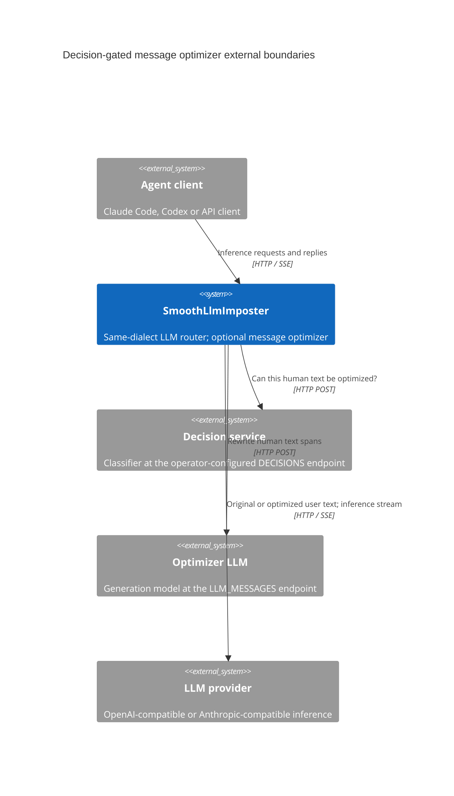

# System Context

The router gains two optional outbound dependencies, both operator-configured and off by default.

```mermaid
C4Context
    title Decision-gated message optimizer external boundaries
    System_Ext(agent, "Agent client", "Claude Code, Codex or API client")
    System(router, "SmoothLlmImposter", "Same-dialect LLM router; optional message optimizer")
    System_Ext(decision, "Decision service", "Classifier at the operator-configured DECISIONS endpoint")
    System_Ext(optimizer, "Optimizer LLM", "Generation model at the LLM_MESSAGES endpoint")
    System_Ext(upstream, "LLM provider", "OpenAI-compatible or Anthropic-compatible inference")
    Rel(agent, router, "Inference requests and replies", "HTTP / SSE")
    Rel(router, decision, "Can this human text be optimized?", "HTTP POST")
    Rel(router, optimizer, "Rewrite human text spans", "HTTP POST")
    Rel(router, upstream, "Original or optimized user text; inference stream", "HTTP / SSE")
```
