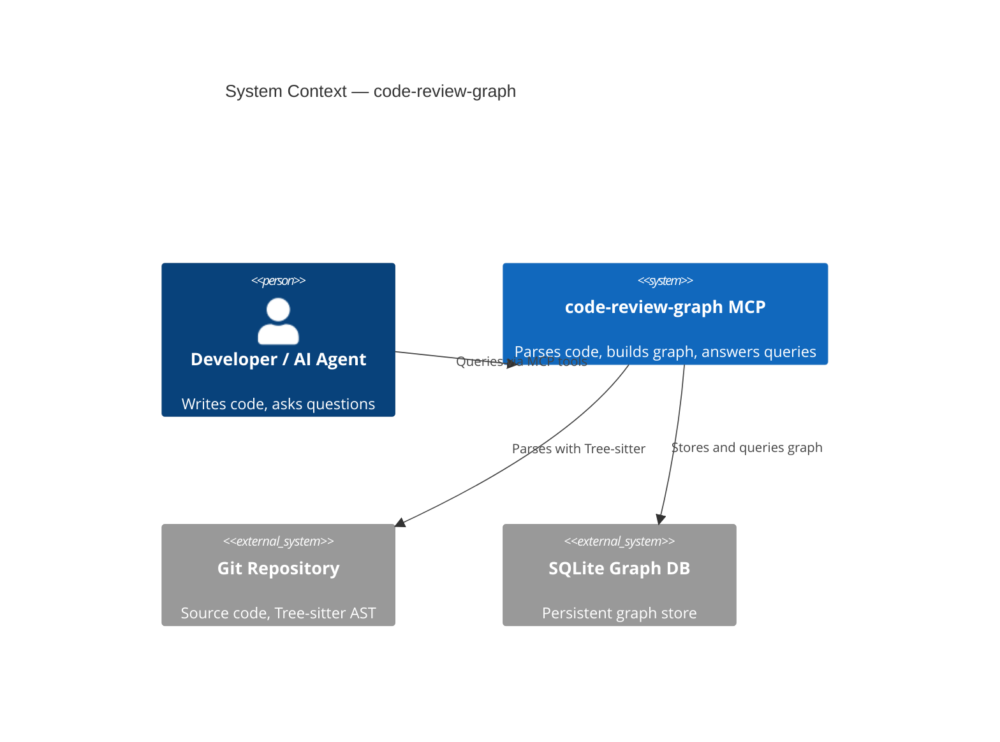

# CODE_REVIEW_GRAPH_AGENTS.md

## TL;DR

code-review-graph MCP tools provide a structural knowledge graph for token-efficient codebase exploration, impact analysis, and code review — use them before file/search tools.

## Non-Negotiables

- **Always use graph tools first** — `semantic_search_nodes_tool` or `query_graph_tool` before grep/find, `detect_changes_tool` for code review.
- The graph directory `.code-review-graph/` is gitignored — do not commit its contents.
- Fall back to file/search tools only when the graph doesn't cover what you need.

## System Context

The code-review-graph MCP server builds a Tree-sitter-parsed structural graph of the codebase. It provides community detection, execution flow tracing, and impact-radius analysis. The graph auto-updates on file changes via hooks.

## Key Behaviors

- **Auto-update**: The graph rebuilds incrementally on file changes via hooks. Manual rebuild: `build_or_update_graph_tool`.
- **Semantic search**: Requires embeddings. Run `embed_graph_tool` once after initial build. Local provider uses `all-MiniLM-L6-v2`.
- **Zero-node graph**: If the graph has no nodes, check Python — running under `python -I` drops user site-packages and causes silent probe failures. Use a dedicated venv with `sentence-transformers` installed for local embeddings.

## Quality Constraints

- Graph tools must beat file-search on token cost for structural queries. If a query returns too many results, narrow with `kind` or `limit` params rather than switching to grep.
- For code review, prefer `detect_changes_tool` over manual diff analysis — it maps git diffs to affected functions, flows, communities, and test coverage gaps.

## Changelog

| Date | Change | Ref |
|:-----|:-------|:----|
| 2026-07-30 | Initial — documents code-review-graph MCP tooling and usage conventions | #95 |
