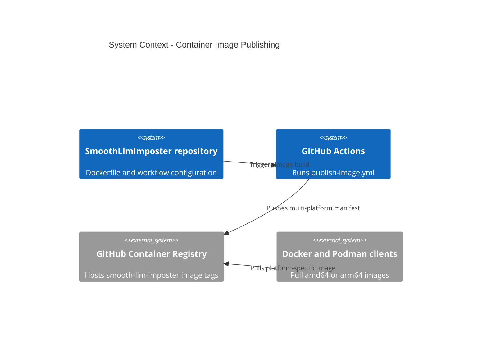

# GitHub Workflows Context

## TL;DR

GitHub workflow changes must preserve publishable CI behavior; container image tags must stay multi-architecture for both `linux/amd64` and `linux/arm64`.

## Non-Negotiables

- Do not remove QEMU from `publish-image.yml` while the Dockerfile runs `dotnet restore` or `dotnet publish` during target-platform builds.
- Do not narrow published GHCR tags to a single platform unless the setup docs and Docker/Podman guidance are updated in the same PR.
- Do not change the image owner/name away from `ghcr.io/generic-automation-and-it/smooth-llm-imposter` unless the repository remote or package ownership changes.

## System Context

The workflow publisher turns the repo-root Dockerfile into the GHCR package used by Docker and Podman setup docs. GitHub Actions runs the build on an amd64 runner, Buildx creates the multi-platform manifest, and QEMU enables the arm64 build steps that execute inside the SDK image.

## Architecture Decisions

### LADR-001: Publish GHCR Tags as Multi-Platform Manifests

- **Date**: 2026-07-04
- **Status**: Accepted
- **Context**: GitHub's hosted Linux runner is amd64, so a default Buildx publish creates an amd64-only image. Apple Silicon Docker and Podman clients request `linux/arm64/v8` by default and fail when a tag lacks an arm64 manifest.
- **Decision**: `publish-image.yml` must set up QEMU before Buildx and publish at least `linux/amd64,linux/arm64` for GHCR tags.
- **Consequences**: Container publishes may take longer, but one `latest`, semver, or `sha-*` tag works across x64 Linux hosts and Apple Silicon machines.

## Key Behaviors

- `sha-*`, `latest`, and semver tags should point at a manifest list that includes both required platforms for the same workflow run.
- Existing GHCR tags published before the multi-platform workflow change may remain amd64-only unless they are republished.
- If .NET SDK or ASP.NET runtime base images change, verify their manifests still include every platform requested by `publish-image.yml`.
- The generous job `timeout-minutes`, the BuildKit NuGet `--mount=type=cache` mounts in the Dockerfile, and the per-workflow/per-ref GHA cache `scope=` all exist to keep the QEMU-emulated `arm64` `dotnet restore`/`publish` (~5–10× slower than native) inside a green build — do not tighten or remove them without re-measuring an emulated cold-cache run.

## Changelog

| Date | Change | Ref |
|:-----|:-------|:----|
| 2026-07-04 | Created workflow context for multi-architecture GHCR publishing and QEMU/Buildx requirements. | #58 |
| 2026-07-04 | Recorded why the QEMU build's job timeout, Dockerfile NuGet cache mounts, and scoped GHA cache exist; bumped `setup-qemu-action` to v4. | #58 |
