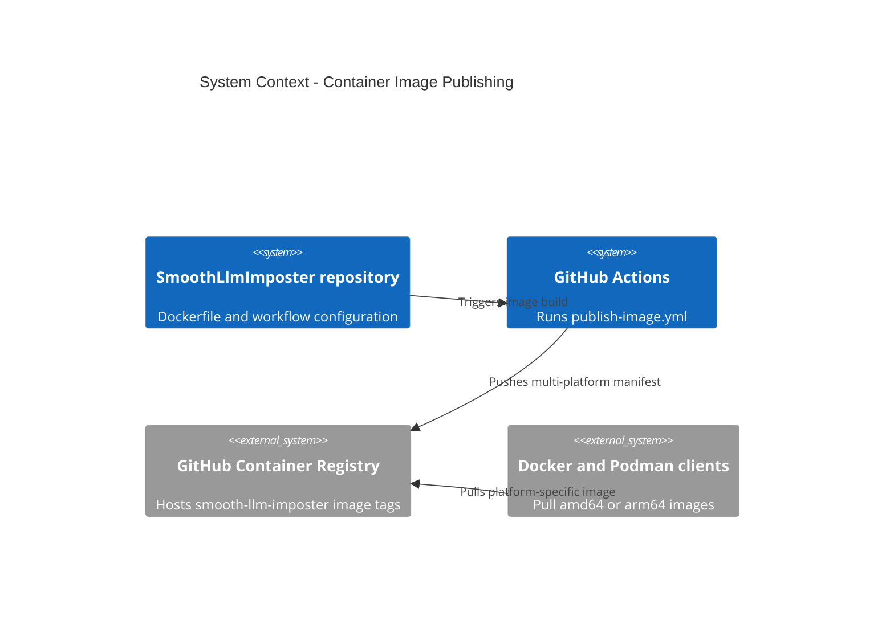

# GitHub Workflows Context

## TL;DR

GitHub workflow changes must preserve publishable CI behavior; container image tags must stay multi-architecture for both `linux/amd64` and `linux/arm64`. The OpenCode review workflow is a reusable-workflow caller; the autonomous analyse workflow is local because `workflow_run` must observe this repository's review gate run.

## Non-Negotiables

- Do not remove QEMU from `publish-image.yml` while the Dockerfile runs `dotnet restore` or `dotnet publish` during target-platform builds.
- Do not narrow published GHCR tags to a single platform unless the setup docs and Docker/Podman guidance are updated in the same PR.
- Do not change the image owner/name away from `ghcr.io/generic-automation-and-it/smooth-llm-imposter` unless the repository remote or package ownership changes.
- Keep `.github/workflows/pipeline-code-review-report.yml` named `OpenCode Review Report` unless `.github/workflows/pipeline-ai-analyse.yml` is updated in the same change; its `workflow_run.workflows` trigger is name-coupled to that exact string.
- Keep the review caller pinned to `generic-automation-and-it/smooth-ai-report-review/.github/workflows/pipeline-code-review-report.yml@v1` unless intentionally testing upstream `main` or pinning an exact SHA.
- Keep `/ai-review` `issue_comment` triggers limited to trusted commenters (`OWNER`, `MEMBER`, `COLLABORATOR`); this trigger can run with mapped secrets and write-capable review permissions.
- Do not persist checkout credentials in `pipeline-ai-analyse.yml`; its deterministic push must use the explicit masked-token remote, preferring `OPENCODE_ANALYSE_GH_TOKEN` and falling back to `GITHUB_TOKEN`.

## System Context

The workflow publisher turns the repo-root Dockerfile into the GHCR package used by Docker and Podman setup docs. GitHub Actions runs the build on an amd64 runner, Buildx creates the multi-platform manifest, and QEMU enables the arm64 build steps that execute inside the SDK image.

## Architecture Decisions

### LADR-001: Publish GHCR Tags as Multi-Platform Manifests

- **Date**: 2026-07-04
- **Status**: Accepted
- **Context**: GitHub's hosted Linux runner is amd64, so a default Buildx publish creates an amd64-only image. Apple Silicon Docker and Podman clients request `linux/arm64/v8` by default and fail when a tag lacks an arm64 manifest.
- **Decision**: `publish-image.yml` must set up QEMU before Buildx and publish at least `linux/amd64,linux/arm64` for GHCR tags.
- **Consequences**: Container publishes may take longer, but one `latest`, semver, or `sha-*` tag works across x64 Linux hosts and Apple Silicon machines.

## Key Behaviors

- `sha-*`, `latest`, and semver tags should point at a manifest list that includes both required platforms for the same workflow run.
- Existing GHCR tags published before the multi-platform workflow change may remain amd64-only unless they are republished.
- If .NET SDK or ASP.NET runtime base images change, verify their manifests still include every platform requested by `publish-image.yml`.
- `pipeline-code-review-report.yml` delegates review generation to the upstream reusable workflow, but this repo vendors `.agents/skills/ai-review-report/` so local review tooling and the analyse workflow can resolve shared scripts without a fallback checkout. Its `/ai-review` comment path is trusted-commenter-only.
- `pipeline-ai-analyse.yml` only processes same-repo PRs with a successful latest OpenCode review, extracts low/medium findings, can use `OPENCODE_ANALYSE_PROVIDER` / `OPENCODE_ANALYSE_MODEL` independently of the review gate, and lets the workflow own commit/push/comment side effects. The PR checkout has `persist-credentials: false`; the push step uses an explicitly masked token.
- The generous job `timeout-minutes` and the per-workflow/per-ref GHA cache `scope=` exist to keep the QEMU-emulated `arm64` `dotnet restore`/`publish` (~5–10× slower than native) inside a green build — do not tighten or remove them without re-measuring an emulated cold-cache run.
- The Dockerfile's BuildKit NuGet `--mount=type=cache,target=/root/.nuget/packages` only reuses packages **within a single build invocation** — the `type=gha` cache backend does not export `--mount=type=cache` contents, so there is no cross-run package reuse. Keep the mount (it is cheap and harmless), but do not add cross-run assumptions on top of it. Mount NuGet's global packages folder, not its scratch dir (`/tmp/NuGetScratch<user>` is user-suffixed and unused by `--no-restore` publish).
- **First-tag cold cache is intentional.** On the first build of a fresh `ref_name` (e.g. a new `v1.0.0` tag) `cache-from` has no matching scope entry, so Buildx cold-caches and starts exporting under the new scope on the next run. This is by design, not a config bug.

## Changelog

| Date | Change | Ref |
|:-----|:-------|:----|
| 2026-07-04 | Created workflow context for multi-architecture GHCR publishing (QEMU-before-Buildx, `setup-qemu-action` v4); recorded why the emulated-build job timeout, scoped GHA cache, and Dockerfile NuGet cache mount exist, and that first-tag cold cache is intentional. | #58 |
| 2026-07-04 | Added OpenCode analyse workflow context and recorded the review caller's `@v1` pin plus `OpenCode Review Report` name coupling. | |
| 2026-07-04 | Aligned with smooth-ai-report-review PR #58 security fix: trusted-comment `/ai-review`, no persisted analyse checkout credentials, explicit masked-token analyse push, and optional `OPENCODE_ANALYSE_GH_TOKEN`. | upstream #58 |
