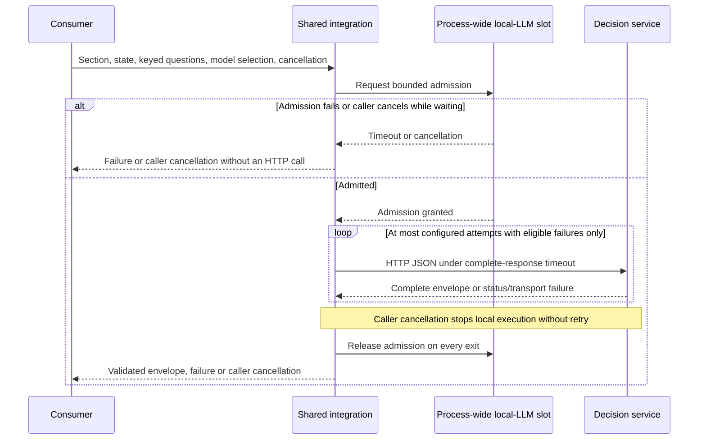

# One bounded decision call

```mermaid
sequenceDiagram
    participant Consumer
    participant Integration as Shared integration
    participant Gate as Process-wide local-LLM slot
    participant Service as Decision service
    Consumer->>Integration: Section, state, keyed questions, model selection, cancellation
    Integration->>Gate: Request bounded admission
    alt Admission fails or caller cancels while waiting
        Gate-->>Integration: Timeout or cancellation
        Integration-->>Consumer: Failure or caller cancellation without an HTTP call
    else Admitted
        Gate-->>Integration: Admission granted
        loop At most configured attempts with eligible failures only
            Integration->>Service: HTTP JSON under complete-response timeout
            Service-->>Integration: Complete envelope or status/transport failure
        end
        Note over Integration,Service: Caller cancellation stops local execution without retry
        Integration->>Gate: Release admission on every exit
        Integration-->>Consumer: Validated envelope, failure or caller cancellation
    end
```
