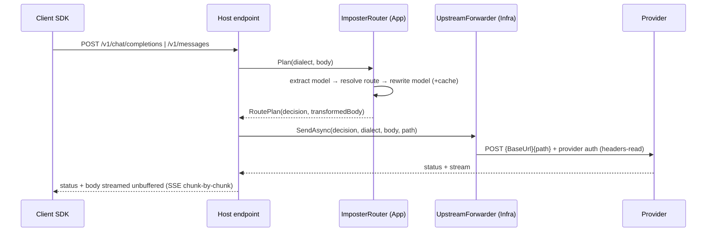

# Routing — Feature Context

## TL;DR

Stateless same-dialect LLM router: reads the inbound `model`, rewrites it to a configured upstream
("imposter") or passes through to the dialect's default provider, optionally injecting prompt caching,
and streams the response back. Keys come only from config/env and are never stored or logged.

## Non-Negotiables

- **Never persist, log, or echo `ApiKey` values.** They live only in `ImposterOptions` (config/env). Logs
  carry provider name + model names only. The inbound caller's own `Authorization`/`x-api-key` is **not**
  forwarded — the provider's configured key replaces it.
- **Same-dialect only.** Do not add OpenAI⇄Anthropic body translation here. An `openai` provider serves
  openai requests; an `anthropic` provider serves anthropic requests.
- **`BaseUrl` is the server root WITHOUT a version path** (`https://api.openai.com`, not `.../v1`). The
  inbound request path is appended verbatim. Adding `/v1` to config double-prefixes the path.
- **Do not add a standard resilience handler to the `imposter-upstream` client.** SSE streams outlive its
  timeouts and a half-streamed POST can't be replayed; the client uses an infinite timeout bounded by the
  caller's `CancellationToken`.
- **All body work stays string-in/string-out in Application; HTTP I/O stays in Host.** Infrastructure is
  `System.Net.Http` only. Don't leak `HttpContext` into Application/Infrastructure.

## System Context

Transparent insertion: a client SDK points its base URL at this service; the router reshapes dispatch and
forwards. Config (`Imposter` section) is the only input besides the request; env vars override
`appsettings.json` (env wins), e.g. `Imposter__Providers__1__ApiKey=sk-...`.



Config is provider-centric — model mappings nest **under** each provider:

```jsonc
"Imposter": { "Providers": [
  { "Name": "openai-official", "Api": "openai", "BaseUrl": "https://api.openai.com", "ApiKey": "", "IsDefault": true },
  { "Name": "opencode-go", "Api": "openai", "BaseUrl": "https://opencode.example", "ApiKey": "",
    "Models": [ { "From": "gpt5.4", "To": "opencode/grok-code", "Caching": true } ] },
  { "Name": "anthropic-official", "Api": "anthropic", "BaseUrl": "https://api.anthropic.com", "ApiKey": "", "IsDefault": true }
] }
```

## Architecture Decisions

**LADR-001 — No Mediator / no FluentValidation request pipeline.** *2026-06-14, Accepted.*
The project rules mandate Mediator + per-request FluentValidation. This path is a transparent streaming
proxy over **opaque** JSON bodies, not a CQRS use case — there is no typed request model to validate
field-by-field, and routing bodies through Mediator adds indirection with no benefit. Fail-fast validation
is applied to **configuration** at startup instead (`ImposterOptionsValidator` + `ValidateOnStart`).
Consequence: a reviewer expecting the standard slice shape won't find it; this is intentional.

**LADR-002 — Stateless, no EF Core/PostgreSQL.** *2026-06-14, Accepted.*
The service stores nothing (the core differentiator from the Smooth Claude Proxy is "no stored keys").
The template's EF/Npgsql/Respawn/Aspire test stack was removed. Consequence: no `Persistence/`, no
migrations, no DB-backed component tests.

**LADR-003 — Infinite client timeout, no resilience handler.** *2026-06-14, Accepted.*
SSE responses routinely exceed `AddStandardResilienceHandler` defaults, and retrying a partially-streamed
POST would duplicate/garble output. The named client uses `Timeout.InfiniteTimeSpan`; cancellation is the
caller's `RequestAborted`. Consequence: no automatic retry on transient upstream errors.

**LADR-004 — Integration tests stub the outbound transport in-process.** *2026-06-14, Accepted.*
Rather than the WireMock/Aspire container harness, integration tests replace the `imposter-upstream`
client's primary `HttpMessageHandler`, exercising the real endpoint→router→transformer→forwarder pipeline
(URL building, auth headers, transformed body) with zero containers. Consequence: tests run anywhere, no Docker.

## Key Behaviors

- **First match wins, in configuration order.** The resolver scans the dialect's providers top-to-bottom and
  returns the first `Models[].From` that matches; order providers/mappings from most to least specific.
- **`From` matching** is exact or single trailing-`*` wildcard, case-insensitive (`ModelMatcher`).
- **No match → default passthrough.** The dialect's `IsDefault` provider receives the request with the model
  unchanged and no caching. No match **and** no default → `RoutingException(404)`.
- **Caching is per-dialect** (only when `Caching: true`): Anthropic injects ephemeral `cache_control` on the
  `system` block (string `system` is converted to a one-element block array) and on the last content block of
  the last message; OpenAI sets `prompt_cache_key` to the **inbound** model name (stable per imposter model).
- **Errors are dialect-shaped** so client SDKs parse them natively — OpenAI `{error:{message,type}}`,
  Anthropic `{type:"error",error:{type,message}}`. Routing failures map to 400/404; upstream transport
  failures to 502.
- **`anthropic-version`** header defaults to `2023-06-01`, overridable per provider via `AnthropicVersion`.
- **At most one `IsDefault` per dialect** (startup-validated).

## Test References

- **L0** `Domain.UnitTest/Routing` — matcher, dialect parser.
- **L0** `Application.UnitTest/Routing` — resolver, transformers (cache injection), router, error factory, options validator.
- **L2** `Host.IntegrationTest` — full pipeline incl. SSE passthrough and env-over-appsettings override (in-process stub upstream).

## Changelog

| Date | Change | Ref |
|:-----|:-------|:----|
| 2026-06-14 | Initial routing feature: same-dialect router, config-driven imposters, per-dialect caching, SSE streaming. | — |
